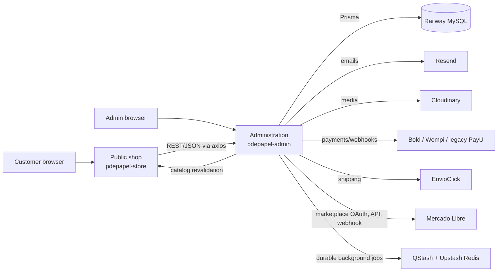
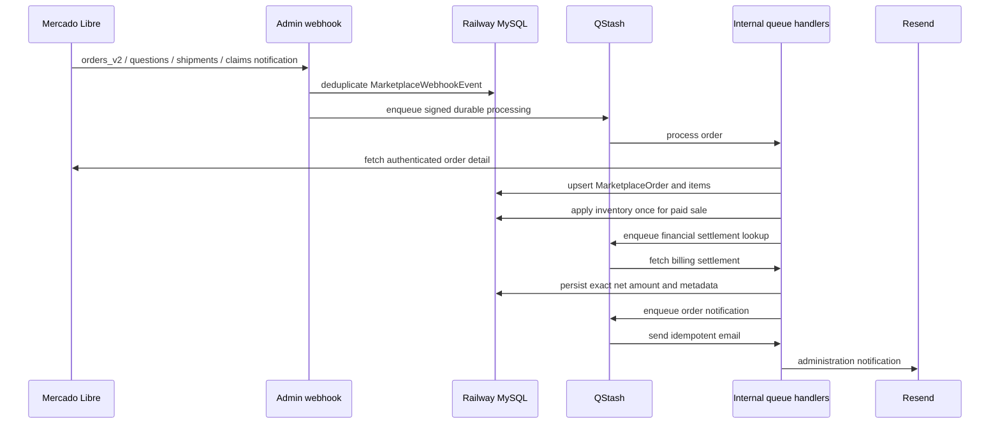

# P de Papel — Context for AI Agents

> **Purpose:** This is the durable handoff document for any AI agent working in this repository. Read it before changing code, environment configuration, the database, integrations, or deployment settings.
>
> **Do not put credentials, tokens, customer data, production database URLs, or private keys in this file.** Use the company password manager and the platform environment-variable settings instead.
>
> **Keep this document current.** After a material architecture, operational, migration, routing, payment, marketplace, or deployment change, update the relevant section in the same pull request or commit.

## 1. Business and product context

**P de Papel** is a Colombian e-commerce business focused on kawaii stationery, gifts, creative supplies, and accessories. The company serves customers in Colombia; customer-facing copy, navigation, SEO, product content, and routes must therefore be Spanish-first.

Business priorities:

- Make inventory trustworthy across the online shop, in-person sales, fairs, surprise capsules, and Mercado Libre.
- Preserve a polished, playful, accessible kawaii customer experience without sacrificing clarity, contrast, performance, or mobile usability.
- Keep financial and tax reports auditable: online orders, fair sales, marketplace sales, and supplier purchases need distinct and correct records.
- Avoid coupling customer-facing payment language to a specific provider. The preferred public label is **`Pago en línea`**; payment-provider icons may remain where they already provide useful recognition.
- Protect current customers and search ranking: the storefront has already migrated from IDs/English routes to Spanish slug-based canonical URLs. Existing URLs must continue to redirect safely.

Terminology used by the business:

- **Tienda en línea:** the public storefront (`papeleriapdepapel.com`). Do not call it “storefront” in Spanish customer-facing/admin copy.
- **Administración / panel:** the private dashboard and API (`admin.papeleriapdepapel.com`).
- **Feria:** an in-person selling event. It reserves stock before the event and records in-person sales.
- **Punto de venta:** the private mobile-friendly admin workflow for everyday in-person sales. It creates a paid `POINT_OF_SALE` order and strict physical-stock movements only after payment confirmation.
- **Cápsula sorpresa:** a random product sold at a fair. It must still be tracked by the actual packed product internally.
- **Publicación:** a Mercado Libre listing. A publication is not necessarily a sale.
- **Venta de Mercado Libre:** a paid Mercado Libre order/pack. It must record the amount actually collected by P de Papel, not merely the buyer-facing gross price.

## 2. Repository topology and deployment

This is a two-application repository, **not** an npm workspace. There is no root `package.json`.

| Folder            | Role                                                                                       | Local development port | Database access               | Production domain             |
| ----------------- | ------------------------------------------------------------------------------------------ | ---------------------: | ----------------------------- | ----------------------------- |
| `pdepapel-admin/` | Private admin dashboard, full REST API, Prisma schema, database owner, webhooks, cron jobs |                 `3001` | Direct via Prisma/MySQL       | `admin.papeleriapdepapel.com` |
| `pdepapel-store/` | Public customer-facing Next.js app                                                         |                 `3000` | **None**; uses admin REST API | `papeleriapdepapel.com`       |

Each application has its own `package.json`, `package-lock.json`, `node_modules`, Next config, test configuration, and Vercel project. Run npm commands from the application folder, never from the repository root.

Node.js 24 is the runtime baseline for local development, GitHub Actions, and Vercel. Both application `package.json` files declare `"engines": { "node": "24.x" }`; the root `.nvmrc` is the local convenience pin. Do not lower this version without a reviewed compatibility plan.

Both Vercel projects auto-deploy when `main` receives a push. A push to `main` is a production deployment action.

### High-level request flow



### Critical architectural rule

The public shop **never talks directly to MySQL**. It reads and writes through REST endpoints exposed by `pdepapel-admin`, usually through axios helpers in `pdepapel-store/actions/`. If a dynamic public page fails, investigate the admin API, its server environment, authentication, CORS, or data first—not only the public UI.

## 3. Current implementation snapshot

This section records the important recent decisions and must be updated after future production changes.

### Current baseline

- **Homepage rebuild deployed 2026-09-09 (commit `49554a8`).** `20260909_add_home_content.sql`, `20260909_add_product_available_at.sql` and `20260909_add_newsletter_welcome_coupon.sql` were applied to Railway before the push with `prisma db execute` and verified (3 slides copied as HERO entries, the newest active; the old main banner as an inactive SEASON campaign); `20260909_drop_legacy_home_banners.sql` was applied after both Vercel deployments succeeded. The migrated hero copy was replaced with SEO-safe text. Optional admin env `NEWSLETTER_EARLY_ACCESS_SECRET` (≥16 chars) is **not yet set**: the early-access campaign email refuses to send until it is. Storefront copy now says «Papelería bonita» where it said «Papelería kawaii» (title, description, keywords, hero default, footer, about page alt text).
- `pdepapel-admin/prisma/manual-migrations/20260908_add_review_moderation.sql` and `20260908_add_attribute_archive.sql` were applied to Railway on 2026-09-08 with `prisma db execute` (reviews first, then attributes) right before the redesign deploy, and verified through `information_schema`: 17 new columns and 7 new indexes, every existing review `PUBLISHED`, every attribute active. Both are additive with defaults; no product, order, payment or inventory row changed.
- `pdepapel-admin/prisma/manual-migrations/20260907_add_store_free_shipping_threshold.sql` was applied to Railway on 2026-09-07 (single nullable column, no data changed) and validated locally against that database: the checkout API zeroed shipping for a 165000 COP subtotal and rejected a mismatched total without creating an order; the storefront summary shows "Gratis" above the threshold and the missing amount below it.
- `pdepapel-admin/prisma/manual-migrations/20260901_add_newsletter_subscribers.sql` was applied to Railway on 2026-09-01 after full local unit, integration, build, and responsive browser validation. It adds the empty, store-scoped consent lifecycle table used by the double-opt-in newsletter flow; no existing customer, order, payment, inventory, or catalog record was changed.
- `pdepapel-admin/prisma/manual-migrations/20260828_add_catalog_options.sql` was applied to Railway on 2026-08-30 after a verified production backup and local unit, integration, build, and E2E validation. It additively separates internal shipping/SKU sizes from customer-facing catalog options, stores taxonomy icons outside canonical names, preserves type aliases, and adds the reviewed bulk-migration queue.
- Latest deployed Mercado Libre listing-content expansion was committed as `f9a88d6` (`feat(admin): enhance Mercado Libre listing management`) and its matching manual migration was applied to Railway.
- `pdepapel-admin/prisma/manual-migrations/20260824_add_business_growth.sql` was applied to Railway on 2026-08-24. It creates the store-scoped policy, cash-movement, campaign-draft, and campaign-product records used by the private `Negocio y crecimiento` module.
- `pdepapel-admin/prisma/manual-migrations/20260820_add_marketplace_order_item_acq_price.sql` is **written but NOT yet applied to Railway**. It adds the nullable `MarketplaceOrderItem.acqPrice` cost snapshot and backfills it from the linked product. The matching application code must not be deployed before the migration is applied, because the profitability query selects that column.
- `pdepapel-admin/prisma/manual-migrations/20260816_add_order_account_claims.sql` was applied to Railway on 2026-08-16. It adds the short-lived, hashed claim records used when a guest safely saves an order to a newly created or existing account.
- The production manual enum migration `pdepapel-admin/prisma/manual-migrations/20260807_add_marketplace_order_notification_action.sql` has already been applied to Railway. It added the outbox actions `SYNC_ORDER_FINANCIALS` and `SEND_ORDER_NOTIFICATION`.
- Mercado Libre was configured with the billing-read permission. After any permission change, token rotation, or client-secret rotation, the store owner must use **Reconectar Mercado Libre** in the admin panel so Mercado Libre issues a token with the correct scopes.
- QStash is used for Mercado Libre background processing and recovery. The UI should clearly distinguish “configured/active” from a real processing failure. QStash delay values must use explicit units such as `"30s"` or `"5m"`, never a bare number such as `"30"`.
- Marketplace listing content and prices are synchronized only after an explicit admin action. `SYNC_PRICE` updates the independent Mercado Libre price; `SYNC_LISTING_CONTENT` updates only the selected local photos, plain-text description, and configured attributes through QStash. Never make content synchronization automatic after a product edit.
- Shipment notifications are persisted independently of sales and use Mercado Libre's `/shipments/{id}/items` response to link a package to a single local sale. Do not rely on the order JSON containing `shipping`, and never guess a link for packages that contain multiple orders or an incomplete items response. An `orders_v2` cancellation also changes any still-pending/handling/ready-to-ship linked shipment to `cancelled`; it never restocks units automatically, because the physical return must be confirmed first.
- **Shipment status also has a manual pull path.** It used to be written only by the webhook processor, so a notification that never arrived — or that failed — left the panel permanently stale with no way to recover. `refreshMercadoLibreShipments` re-reads `/shipments/{id}` and feeds it to the same `synchronizeMercadoLibreShipment` a webhook uses; there is no second parsing or write path to keep in sync. `POST .../mercadolibre/shipments` refreshes every shipment that can still change, newest first and capped at 25 per call so one click cannot exhaust the Mercado Libre rate limit; when the cap is reached the UI says so instead of silently truncating. `POST .../mercadolibre/shipments/[externalShipmentId]/refresh` refreshes a single package and, unlike the bulk pass, also refreshes a settled one because the administrator asked for that specific shipment. Refreshing is a read: it never dispatches, cancels, or alters a shipment in Mercado Libre.
- A Mercado Libre listing (or one of its variations) and an individual local product have a one-to-one relationship per marketplace connection. Import preview must not auto-select the same local product for multiple listings with a duplicated seller SKU; require the administrator to choose the single correct match and use distinct local products for the rest.
- The operations expansion is accompanied by `pdepapel-admin/prisma/manual-migrations/20260808_add_marketplace_operations.sql`, applied to Railway on 2026-08-08 after explicit approval. It adds marketplace question/shipment/claim records, reusable category templates, a local product-video library, minimum-margin guardrails, and the `SYNC_LISTING_STATUS`/`PUBLISH_LISTING` outbox actions.
- `pdepapel-admin/prisma/manual-migrations/20260808_add_marketplace_publication_profiles.sql` adds one editable quick-publication profile per local category. It was applied to Railway on 2026-08-09. Its matching code may now be deployed; every profile proposal remains manually editable and never auto-publishes.
- `pdepapel-admin/prisma/manual-migrations/20260810_add_marketplace_campaign_actions.sql` was applied to Railway on 2026-08-10. It adds the audit table for Product Ads campaign controls, recording the old configuration, explicit requested change, actor, Mercado Libre result, and failure reason; it does not alter listings, orders, stock, or existing campaigns.
- A Mercado Libre Client Secret was previously shared outside the intended secret store. Treat it as compromised: rotate it in Mercado Libre, update the Vercel production environment variable, redeploy, then reconnect Mercado Libre. Never record the value in Git, this file, terminal history, screenshots, email, or chat.

### Previously completed product decisions

- Public routes are Spanish canonical routes; old English routes redirect permanently.
- Dashboard pages are also Spanish-first, but their REST resources remain the established English API names (for example, `/pedidos` uses `/api/{storeId}/orders`). Client mutations must resolve the endpoint from a stable resource/model mapping, never from `usePathname()` or another visible dashboard route.
- Product pages use slugs rather than product IDs. Product slug generation must add differentiators such as color/size **only when they are required to distinguish real sibling variants**. Do not create redundant slugs such as repeating a product name when there is no variant reason.
- Product and category slug aliases preserve old links. Never delete alias logic merely because the current canonical slug changed. Product variant URLs only include attributes that distinguish variants; internal logistics sizes such as `S+`/`M-P` are never customer-facing URL segments.
- Run `npm run normalize:product-slugs` before changing stored canonical slugs. It is read-only by default. Apply deliberate production batches with `npm run normalize:product-slugs -- --apply --limit=40`; each completed batch preserves old URLs as aliases and can be rerun safely until no changes remain. After a deliberate historical-slug migration, run `npm run export:product-slug-redirects -- --store-id=<public-store-id>` from `pdepapel-admin`, review the generated `pdepapel-store/lib/legacy-product-redirects.mjs`, and deploy both applications together. The generated map is handled by the storefront middleware and returns HTTP `308` before rendering without one deployment route per alias; dynamic aliases remain the safe fallback for any later title edit.
- Categories can be SEO-enabled and optionally featured. Their cards use category imagery and must retain an accessible high-contrast label treatment; white text directly over light imagery is not acceptable.
- Category landing pages are intentionally more focused than the general shop: do not present a category selector that invites a shopper to leave the current category. Product search within a category must be constrained to that category.
- Store route skeleton/loading behavior was improved to avoid showing only the header and footer before a page body arrives. Preserve route-level loading UI and avoid client-only data waterfalls that reintroduce this flash. Product detail is the deliberate exception: it must resolve product existence before streaming so missing or archived products return a real HTTP `404`; keep loading skeletons inside the resolved page (for example, related products) rather than restoring `producto/[slug]/loading.tsx`.
- Rich product descriptions use Tiptap and are sanitized. The editor supports more expressive formatting (including color and emoji), but output must remain sanitized and safe for the product page.
- Order pages must not confuse an already-paid order’s historical purchased items with **current** catalog stock. A later stock depletion must not make a paid order appear to have failed or changed retroactively.
- Browser-facing API handlers use `pdepapel-admin/lib/cors.ts` to echo only the approved shop/admin origins, add `Vary: Origin`, and support the needed preflight methods. Never reintroduce `Access-Control-Allow-Origin: *` on a customer flow. Keep CORS and authorization separate: customer review authors and shipment tracking must derive the Clerk user from the authenticated token, never from a client-supplied user ID.
- Public product, category, and order loaders return `null` only for a genuine `404`. Other upstream failures throw `UpstreamServiceError` so route-level retry UI is shown instead of a false “not found” page. The quote screen follows the same distinction between an invalid link and a temporarily unavailable API.

## 4. Technology stack

Shared core:

- Next.js 14 App Router, React 18, TypeScript with strict type-checking.
- Clerk for authentication (`middleware.ts` in both apps).
- MySQL on Railway, Prisma 6 in the admin application.
- Tailwind CSS 3, Radix UI, shadcn-style components, `class-variance-authority`, `lucide-react`, and Framer Motion.
- `react-hook-form` plus Zod validation.
- Cloudinary for images/media.
- Resend plus React Email for email.
- Vitest for unit/component tests and Playwright for E2E tests.

Admin-specific:

- SWR, TanStack Table, Recharts.
- Tiptap 3 rich text.
- ExcelJS, `csv-writer`, and Papa Parse for spreadsheets; `@react-pdf/renderer` for PDFs.
- `qrcode.react` and `@zxing/browser` for QR/barcode workflows.
- Million.js wraps its Next configuration.
- Upstash Redis and QStash for durable Mercado Libre queue/outbox jobs.

Public-shop-specific:

- React Server Components and ISR.
- TanStack Query, Nuqs, Zustand.
- `next/image` optimization enabled (AVIF/WebP and cache controls).
- SEO with `schema-dts`, `app/sitemap.ts`, `app/robots.ts`, Open Graph and Twitter images.
- Vercel Analytics and Speed Insights.
- Consent-based Google Analytics 4 and optional Microsoft Clarity for
  customer-journey analysis. They must never receive customer contact, address,
  identity, order, quote, or payment data. Clarity remains behind a separate
  production kill switch and the runbook in `docs/analitica-microsoft-clarity.md`.

## 5. Admin application (`pdepapel-admin`)

### Responsibility

The admin application is both the private dashboard and the backend. It owns:

- Prisma schema and all production data access.
- REST JSON APIs used by the dashboard and the public shop.
- Catalog, inventory, orders, payments, shipping, taxes, fairs, DIAN invoicing, marketplace, and business-intelligence logic.
- Incoming webhooks and admin-side cron tasks.
- Catalog revalidation requests to the public shop.
- Cross-origin API support has a default policy in `pdepapel-admin/middleware.ts`; browser-facing handlers must also use `lib/cors.ts` for their explicit responses and preflights, because route response headers can override middleware defaults. Allow only the approved production origins (`papeleriapdepapel.com` and the admin domain) plus the defined local development ports, echo the requesting allowed origin, and add `Vary: Origin`. CORS is not authentication; private routes must still enforce their existing authorization checks.

### Important directories

```text
pdepapel-admin/
├── app/
│   ├── (auth)/
│   ├── (root)/
│   ├── (dashboard)/[storeId]/(routes)/  # private Spanish admin screens
│   └── api/
│       ├── [storeId]/                    # authenticated per-store REST resources
│       ├── public/                       # public-shop-facing API
│       ├── webhook/                      # inbound external callbacks
│       ├── cron/                         # Vercel scheduled work
│       ├── integrations/                 # OAuth callbacks
│       └── internal/                     # signed internal/QStash endpoints
├── actions/                              # server-side loaders and analytics helpers
├── components/                           # shared dashboard UI
├── emails/                               # React Email templates
├── lib/                                  # domain logic and integrations
├── prisma/                               # schema, seed, scripts, manual migrations
├── scripts/                              # operational scripts
└── tests/                                # Vitest, integration, Playwright
```

### Dashboard resources

Dashboard route names are Spanish and include: `productos`, `categorias`, `pedidos`, `ventas-rapidas`, `inventario`, `movimientos-inventario`, `ferias`, `mercadolibre`, `reportes-tributarios`, `ofertas`, `cupones`, `aprovisionamiento`, `proveedores`, `clientes`, `envios`, `cotizaciones`, `boletin`, `configuracion`, and supporting catalog/BI resources.

Follow the established route shape when adding a resource:

```text
(dashboard)/[storeId]/(routes)/<resource>/
├── page.tsx                         # server page
├── server/                           # server-only Prisma data loaders
└── components/
    ├── client.tsx                    # SWR/table wrapper
    ├── columns.tsx                   # TanStack Table definitions
    ├── cell-action.tsx               # row action menu
    └── [id]/components/*-form.tsx    # form with react-hook-form + Zod
```

Large forms require particularly careful, scoped changes: product forms, product group forms, and the order form are high-impact.

### Core admin libraries

- Payments and finance: `lib/bold.ts`, `lib/bold-terminal.ts`, `lib/financial.ts`, `lib/order-totals.ts`, `lib/discount-engine.ts`.
- Shipping: `lib/envioclick.ts`, `lib/shipping-helpers.ts`, `lib/package-calculator.ts`, `lib/dane-api.ts`, `lib/shipment-export.ts`.
- Inventory: `lib/inventory.ts`, `lib/inventory-constants.ts`, `lib/point-of-sale.ts`, `lib/variant-generator.ts`, `lib/variant-combinations.ts`.
- SEO/catalog: `lib/slugify.ts`, `lib/product-slugs.ts`, `lib/category-slugs.ts`, `lib/product-identifiers.ts`, `lib/rich-text.ts`, `lib/product-description-templates.ts`.
- Store cache sync: `lib/revalidate-store.ts`, `lib/revalidation-alert.ts`, `lib/cache.ts`.
- Mercado Libre: `lib/mercadolibre/`.
- Tax/invoicing: `lib/tax-reports.ts`, `lib/tax-report-xlsx.ts`, `lib/invoicing/`.
- Fairs: `lib/fair-events.ts`, `lib/fair-reconciliation-import.ts`, `lib/fair-reconciliation-template-xlsx.ts`.
- Communication: `lib/email.ts`, `lib/resend.ts`, `lib/message-templates.ts`, `lib/reactivation.ts`, `lib/newsletter.ts`.

### Admin webhooks and scheduled work

Current externally significant handlers include:

- `/api/[storeId]/public/storefront` (public, CORS-allowlisted, cached 5 min): store name and free-shipping threshold for the storefront header and checkout.

- `/api/webhook/bold`
- `/api/webhook/wompi`
- `/api/webhook/mercadolibre`
- `/api/webhook/envioclick`
- `/api/webhook/dian`
- `/api/integrations/mercadolibre/callback`
- `/api/cron/update-coupons` and `/api/cron/update-offers` (daily at `00:00`, defined in `pdepapel-admin/vercel.json`). Mercado Libre health checks and the Google Merchant feed refresh (`/api/cron/google-merchant-feed`) run daily at `13:00 UTC` through `.github/workflows/admin-scheduled-tasks.yml` with the `PDEPAPEL_ADMIN_CRON_SECRET` repository secret, keeping the project within Vercel's two-cron limit and separate from offer updates. Do not add Vercel crons; add jobs to that workflow instead.

The Vercel config gives API handlers up to 60 seconds. Orders and checkout have 1024 MB memory and the same max duration. Do not make request handlers rely on long synchronous external workflows; enqueue durable work when appropriate.

## 6. Public shop (`pdepapel-store`)

### Responsibility

The public shop is the customer experience. It has no database connection and calls the admin API through helpers under `actions/`. It owns presentation, SEO metadata, ISR/cache tags, checkout UX, customer auth views, and revalidation endpoint handling.

### Important directories

```text
pdepapel-store/
├── app/
│   ├── (routes)/                       # public pages; Spanish canonical routes
│   ├── (public)/cotizacion/[token]/     # public quote view
│   └── api/
│       ├── revalidate/                  # admin cache-refresh callback
│       └── send/                        # contact/email action
├── actions/                             # axios calls to admin API
├── components/, hooks/, providers/
├── constants/, types/, lib/, emails/
└── tests/
```

### Customer route policy

Spanish routes are canonical. English folders/routes exist only for permanent compatibility redirects and must not become the canonical URL again.

Examples:

| Canonical Spanish route | Legacy English route     |
| ----------------------- | ------------------------ |
| `/tienda`               | `/shop`                  |
| `/producto/[slug]`      | `/product/[slug]`        |
| `/categoria/[slug]`     | no canonical English use |
| `/carrito`              | `/cart`                  |
| `/finalizar-compra`     | `/checkout`              |
| `/favoritos`            | `/wishlist`              |
| `/pedido/[orderId]`     | `/order/[orderId]`       |
| `/nosotros`             | `/about`                 |
| `/contacto`             | `/contact`               |
| `/politicas/*`          | `/policies/*`            |

When creating a new customer-navigable route:

1. Create the Spanish canonical segment.
2. Add a permanent redirect from an existing/previous English segment in `next.config.mjs` when relevant.
3. Update route helpers, navigation, metadata, sitemap coverage, tests, and any structured data.
4. Do not remove older redirects or slug aliases without a deliberate SEO migration plan.
5. Clerk route configuration must use the same Spanish canonical paths: `/iniciar-sesion` and `/crear-cuenta`. Keep the public Clerk variables and `ClerkProvider` aligned with `STOREFRONT_ROUTES`, otherwise the mounted authentication form can remain empty. Auth route pages must redirect an already authenticated visitor on the server to the validated `redirect_url` (or `/`) rather than render an empty Clerk form.
6. Storefront Clerk middleware (`@clerk/nextjs` v6 `clerkMiddleware` + `createRouteMatcher`, since 2026-09) runs only on routes that read the session on the server (`/finalizar-compra`, sign-in, sign-up and their legacy redirects) and on the protected account routes (`/mis-pedidos`, `/mis-busquedas`, `/mi-cuenta`), where a signed-out visitor is redirected to `/iniciar-sesion?redirect_url=<relative path>` built with `accountAccessPath` (never Clerk's default absolute-URL redirect, so `getSafeStorefrontRedirectPath` keeps working). Public catalog routes bypass Clerk so genuine `notFound()` responses retain HTTP `404` and ISR keeps working; client-side Clerk components still initialize through `ClerkProvider`. Any new page that calls `auth()`/`currentUser()` on the server must be added to `requiresServerAuth` in `middleware.ts` or Clerk throws.
7. **Admin API authorization (audited 2026-09-10).** The admin middleware marks every `/api/*` path public, so each dashboard handler must do two things, in this order and before reading the body: `auth()` → 401 when there is no session, then `checkIfStoreOwner(userId, params.storeId)` (or `verifyStoreOwner`, which throws the 403 `AppError`) → 403 for a signed-in customer of another store. The audit found 20 handler files that only checked «signed in» (custom orders, quotations, invoices GET, WhatsApp, shipments, shipment cache/cancel, DANE cache, image cleanup, selectable products, order shipping) and `customers/search` with no authentication at all; all now carry the owner check. `tests/integration/api-authorization.test.ts` loads every handler in its table with a stranger's session and an anonymous request and asserts 403/401: **add every new dashboard-only handler to that table**. Public by design and therefore not in the table: storefront reads (`products/catalog`, `search/products`, `reviews` GET, `catalog-options`, `public/*`, `google-merchant/feed`), customer-scoped bearer endpoints (`account/*`, `orders/[id]/account`, reviews POST/PATCH by the review's author, `coupons/validate`), checkout and gateway flows (`checkout`, `checkout/[orderId]`, `bold/checkout/[orderId]`, `shipment/quote`, `shipment/track`), newsletter confirm/unsubscribe/subscribe, schedulers and cron behind `SCHEDULER_SECRET`/`CRON_SECRET`, QStash-signed `internal/*`, and the provider webhooks. Open item from the audit: the `dian`, `envioclick` and `mercadolibre` webhooks do not verify a provider signature (Bold and Wompi do); Mercado Libre re-fetches the resource before acting, the other two should be reviewed against what each provider offers. The store's Clerk redirect props use the Core 2 names (`forceRedirectUrl`, `signInFallbackRedirectUrl`); the four `NEXT_PUBLIC_CLERK_*_URL` env vars are optional and unused. **pdepapel-admin moved to `@clerk/nextjs` v6 on 2026-09-10 as well**: server code imports `auth`, `currentUser` and `clerkClient` from `@clerk/nextjs/server`, `auth()` is awaited everywhere, `clerkClient` is a function (`await (await clerkClient()).users…`, `getUserList()` returns `{ data, totalCount }`), and `lib/utils.ts` must stay free of server-only imports because client components import it. The admin `middleware.ts` keeps `/api(.*)`, `/iniciar-sesion(.*)` and the auth pages public and, for everything else, redirects browser navigations without a session to `/iniciar-sesion` (`redirectToSignIn`) and answers 401 to scripted requests — deliberately **not** `auth.protect()`, whose non-browser branch rewrites to `/clerk_<id>`, a path the `[storeId]` segment would render. Unit tests mock `@clerk/nextjs/server` (with `clerkClient: async () => ({ users: … })`). **Panel access is not the same as a session** (`lib/admin-access.ts`): the storefront and the panel share one Clerk instance, so every shop customer can sign in on the panel's domain. `hasAdminAccess(userId)` is true only for users who own a store or who are listed in the optional `ADMIN_ALLOWED_USER_IDS` env var (comma-separated Clerk user ids, needed once to create the first store). The root layout sends any other session to `/sin-acceso` (public route with a sign-out button) instead of the store creator, and `POST /api/stores` answers 403 for them. The panel has **no sign-up page**: `/crear-cuenta` and `/sign-up` redirect to `/iniciar-sesion`, which is a branded full page (`components/auth/auth-page-shell.tsx`, `lib/clerk-appearance.ts`, Clerk's own header hidden). Dev-only footgun kept as is: `(dashboard)/[storeId]/layout.tsx` skips the owner filter when `NODE_ENV === "development"`.

### UX and rendering rules

- **Header (2026-09):** fixed on every page; heights live in `--storefront-header-offset` (`globals.css`, 158 px phones/tablets, 172 px desktop) and `components/navbar.tsx` must stay in sync. Phones/tablets: `AnnouncementBar` (hidden after 80 px of scroll) → 64 px bar with `CategoryDrawer` (left Sheet: every type with a subcategory accordion, Ofertas, Nosotros, Contacto, account shortcuts), centered logo, favorites, cart → always-visible `SearchBar variant="inline"`. Desktop: bar → 84 px header with `SearchBar variant="desktop"` and account actions → 52 px category row with `MegaMenu` (types on the left, subcategories + one featured product tile on the right) and the top types by subcategory count. The home page adds `CategoryChips` under the header on small screens.
- **Taxonomy labels never render emoji.** `lib/catalog-labels.ts#stripTaxonomyIcon` cleans legacy `Type`/`Category` names; icons come from `lib/type-icons.tsx` (Lucide, keyed by `Type.icon` when it holds a Lucide name, else slug/name keywords, else a neutral tag). Extend the map when a new type appears.
- **Announcement bar** shows "Envíos a toda Colombia" and, when `Store.freeShippingThreshold` is set, "Envío gratis desde $X", sliding one message at a time (`announcement-slide` keyframes, paused on hover, disabled under `prefers-reduced-motion`), with a rounded Colombia flag fixed on the right. Data comes from `GET /api/[storeId]/public/storefront` via `actions/get-storefront-settings.ts` (5-minute cache, tag `storefront-settings`; the admin store PATCH revalidates it).
- **Free shipping is a real rule, not copy.** `lib/utils.ts#calculateTotals` (storefront) and `lib/order-totals.ts#getEffectiveShippingCost` (admin checkout) both zero the shipping cost when the product subtotal (after product discounts, before coupons) reaches the threshold; the checkout summary shows "Gratis" and the amount still missing. Changing the rule requires changing both.
- **Admin order form labels the shipping line through `lib/order-totals.ts#getShippingChargeState`:** a positive cost is shown as charged, a zero cost is "Gratis" when the order subtotal reaches `Store.freeShippingThreshold` or a carrier quote was saved with no charge, and only an unquoted zero stays "Por calcular". The shipping card keeps the carrier's real freight visible because the store absorbs it when the label is created.
- **Admin order coupon updates (2026-09):** `PATCH /api/[storeId]/orders/[orderId]` treats `couponCode` as the requested persisted relation, validates a newly selected code against the store, dates, usage and minimum subtotal, recalculates from authoritative item prices, and explicitly connects or disconnects the coupon. Omitting `couponCode` preserves the current coupon; sending an empty value removes it. A coupon cannot change while an order remains `PAID`, because that would rewrite the amount after payment.
- **The full catalog is always reachable:** a "Tienda" link opens the desktop category row, "Todos los productos" is the first row of the mobile drawer, and the footer links "Ver todos los productos". All three point at `STOREFRONT_ROUTES.shop`; keep them when reshaping the header (a visitor must never depend on an empty search or a breadcrumb to see everything).
- **Search** is one component for every breakpoint: live suggestions from two characters, Enter or "Buscar" navigates to `/tienda?search=`, Escape/outside tap closes, `role="combobox"` semantics, 44 px hit targets.

- Prefer server data and route-level `loading.tsx`/skeleton UI over client-only fetches that leave a blank content area, except where an authentic pre-stream HTTP status is required (notably product-detail `404` responses).
- **Admin user guide (2026-09).** `pdepapel-admin/docs/guia-panel-administracion.md` is the Spanish, step-by-step manual of the redesigned panel for the owner and future team members (every destination, its actions, business rules stated in plain words, states glossary, troubleshooting and a first-day checklist). The illustrated copy is served only to signed-in users at `https://admin.papeleriapdepapel.com/manual`: `app/manual/page.tsx` renders the repo-owned fragment `content/manual/manual.html`, and `app/manual/img/[name]/route.ts` serves the screenshots from `content/manual/img/` behind `auth()`. Both routes have no file extension on purpose so the Clerk middleware protects them; nothing of the manual may go into `public/`, where files bypass the matcher. `next.config.mjs` lists those files in `outputFileTracingIncludes` so Vercel bundles them. Screenshots come from the test store, never from production data; a PDF copy for the team lives in the owner's Google Drive. Regenerate the fragment from the guide when a destination changes. Update the guide in the same commit as any change to a destination's actions or copy.
- **Product identifier triage (2026-09).** Productos has a «Sin identificador» view (`productLacksIdentifier`: no GTIN and `hasNoProductIdentifier` false), a GTIN column, and a bulk action «Marcar sin identificador» that sets `hasNoProductIdentifier` and clears `gtin`/`mpn` through `POST /api/[storeId]/products/bulk-update` (field `hasNoProductIdentifier`). The rule stands: a GTIN is never invented; products without a manufacturer barcode carry the flag so Google Merchant accepts them. Since 2026-09-08 the flag is the default: the product form starts with it checked and `POST /api/[storeId]/products` sets it when no flag, GTIN or MPN arrives (`normalizeProductIdentifiers` with `defaultNoIdentifierWhenEmpty`); the whole catalog (1980 products, none with GTIN or MPN) was flagged once on that date through a reviewed UPDATE plus Redis product-cache invalidation.
- **Admin theme is light only (2026-09).** The redesign palette (kawaii-*, tint-*, `text-primary` on `bg-white` cards) has no dark variants, so `app/layout.tsx` forces `light` in the ThemeProvider and the top bar has no theme toggle. Do not reintroduce dark mode without restyling every surface; the shell root is `overflow-hidden` so only `<main>` scrolls and section anchors never shift the frame.
- **Admin UI kit follow-through (2026-09).** `components/modals/alert-modal.tsx` keeps its old API (`isOpen`, `onClose`, `onConfirm`, `loading`) but renders the shared `AlertDialog`: question title, consequence, «Cancelar» left, red «Sí, eliminar» right, optional `title`/`description`/`confirmLabel`/`destructive` props; it refuses to close while `loading`. Long attribute lists on the product form (subcategory, color, design, supplier) use `Combobox` with search instead of `Select`. `components/ui/barcode-scanner.tsx` shows a framing overlay, a live caption (focusing, aiming, code read), waits 350 ms after a read, and its error state offers «Intentar de nuevo» or «Escribir el código». The Tiptap toolbar (`components/editor/rich-text-editor.tsx`) carries Spanish `aria-label`/`title` on every button. Recharts colors come from `lib/chart-palette.ts` (`CHART_COLORS`, `CHART_SERIES`, `seriesColor`), the hex equivalents of the kawaii tokens; do not add loose hex values to charts.
- **Shared sell panel (2026-09).** `components/sales/sell-panel.tsx` is the one in-person sale screen (scanner, manual code, picker slot, cart, cash or transfer, confirm dialog); cart rules live in `lib/sell-cart.ts` (product lines capped by stock or fair reserve, capsules as fixed single lines keyed by QR, pure and unit-tested). A `SellSource` adapter supplies `lookup`, `submit` and the picker: the point of sale (`ventas-rapidas/components/sell-panel.tsx`) uses the catalog and `/api/[storeId]/point-of-sale/*`; the fair workspace uses only reserved items and capsule QRs through `/api/[storeId]/fair-events/[id]/{lookup,sales}` in `embedded` mode. Inventory rules are unchanged: the server applies stock once per sale, fairs sell only reserved units, capsules keep their real product. The fair e2e spec now confirms through the shared dialog («Registrar pago» → «Sí, registrar pago»).
- **Admin creation mode (2026-09).** `/pedidos/nuevo` and `/productos/nuevo` are served by the record pages with a page header ("Nuevo pedido" with a five-step anchor nav to `#productos #cliente #descuentos #pago-seccion #envio-seccion`; "Nuevo producto" with the section aside). The forms no longer render their own «Crear orden»/«Crear producto» heading or back arrow when creating; the order form keeps its «Links y Pagos»/«Descargar recibo» row only when editing.
- **Admin Productos bulk actions (2026-09).** Selecting rows in `(routes)/productos` shows `components/product-bulk-actions.tsx`: Archivar, Restaurar, Destacar and Quitar destacado, each behind a confirmation. They call `POST /api/[storeId]/products/bulk-update` with `field: "isArchived" | "isFeatured"` and a boolean `value`; the route (owner only) now accepts those two flags besides the relation fields, invalidates the Redis product cache and triggers storefront revalidation of `/` and `/tienda`, so archived products 404 on the storefront right away. Attribute changes in bulk stay in Productos › Gestión masiva. The product group routes are already Spanish (`productos/grupo/[id]`, `productos/nuevo-grupo`) and the list links now use them directly.
- **Device pass of the redesign (2026-09).** Every destination was captured at 1280, 820 and 390 against real data. Fixes: the customer page order list no longer overflows on tablets (`min-w-0` on the grid child), the Mercado Libre external link no longer wraps, the `DataTable` default search placeholder is generic instead of leaking the column key, the shared `Heading` matches the page-title style (2xl, primary), and the legacy Proveedores, Aprovisionamiento and Movimientos headers wrap their actions on phones and lost their API cards. The product form now ends with a «Zona de cuidado» (clear form, delete product) and a sticky save bar like the order page; the header keeps only «Convertir en variantes».
- **Review moderation and public reply (2026-09).** `Review` carries `status` (`ReviewStatus`: `PUBLISHED` default, `HIDDEN`, `PENDING` reserved and unused), `moderatedAt/By`, `moderationNote` (internal, never sent to the storefront), `reply`, `repliedAt/By`. `lib/review-moderation.ts` owns the rules: `PUBLIC_REVIEW_INCLUDE`/`PUBLIC_REVIEW_WHERE`/`PUBLIC_REVIEW_SELECT` are the only way storefront readers (`/api/[storeId]/products*`, `/products/[id]/reviews`) load reviews, so hidden reviews and the moderation note never leave the admin; `moderateReview` applies `hide | publish | reply | clearReply` scoped to the store. `PATCH /api/[storeId]/reviews/[reviewId]` (owner only) exposes it and revalidates `/producto/[slug]`. The customer keeps editing its own review through the product-scoped route. Panel: Clientes › Reseñas has views in the URL (`vista`: `todas`, `sin-responder`, `por-atender`, `ocultas`), a status badge and row actions; the product page review table shows the same status. The storefront `ReviewItem` renders the reply as «Respuesta de P de Papel». Migration `prisma/manual-migrations/20260908_add_review_moderation.sql` (additive) was applied to Railway on 2026-09-08.
- **Attribute archive (2026-09).** `Type`, `Category`, `Size`, `Color`, `Design` carry `isArchived` + `archivedAt` with a `[storeId, isArchived]` index. `lib/attribute-archive.ts` owns the rules: `ACTIVE_ATTRIBUTE_WHERE` filters every public reader (the five collection GETs, `categories/[id]` and `types/[id]` by slug or alias now 404 when archived, the image-analysis suggestions) and the create forms; edit forms use `activeOrCurrentWhere(currentId)` so a product keeps its archived attribute (labelled «· archivado») until someone changes it. `setAttributesArchived` refuses to archive a subcategory with active products or a category with active subcategories (409 with the counts), never blocks restore, and never touches products. `POST /api/[storeId]/attributes/archive` `{ kind, ids, archived }` (owner only) applies it in one transaction and revalidates `/`, `/tienda`, `/sitemap.xml` and the affected `/categoria/[slug]` pages. Panel: Atributos has an Activos/Archivados toggle (`vista`), status badges, «Archivar»/«Restaurar» per row and in bulk, and «Eliminar» is disabled while the attribute has products (or subcategories). Slug aliases are untouched by archiving. Migration `prisma/manual-migrations/20260908_add_attribute_archive.sql` (additive) was applied to Railway on 2026-09-08.
- **Schema proposals from the redesign (2026-09).** Both proposals in `docs/propuestas-esquema-rediseno.md` are now implemented locally as described above; the document keeps the rationale and the deployment order (reviews first, then attributes).
- **Admin shell E2E (2026-09).** `tests/e2e/shell-navigation.spec.ts` (`npm run test:e2e:shell`) covers the redesigned shell against the seeded e2e store: sidebar groups and children, a tabbed destination (`ventas-rapidas?tab=etiquetas`), list views in the URL, the command palette, the old-route redirects (`stock-bajo`, `agotados`, `ofertas`, `cupones`, `resenas`, `cajas`, `diapositivas`, `banners`, `publicaciones`) and the phone bottom bar. It runs serially and signs in through a Clerk agent task, then waits for the first `h1` before navigating, because the dev instance finishes fixing the session client-side. `tests/e2e/fair-events.spec.ts` was updated for the «Nueva feria» dialog. Both need the local Docker test database (`test:db:up`, `test:db:push`, `test:e2e:seed-admin`); the e2e Clerk user is not the owner of the production store, so these specs cannot run against Railway.
- **Admin Ajustes (2026-09, eighteenth redesign subtask).** `(routes)/configuracion` has five tabs in the URL: `tienda` (logo, basic data, social links, policies), `envios` (free-shipping threshold plus the boxes table; `/cajas` redirects here, box forms stay at `/cajas/[id]`), `pagos` and `integraciones` (read-only status cards from `components/payments-panel.tsx` and `components/integrations-panel.tsx`: they only check that a variable exists and never print values; Mercado Libre connect/reconnect still lives in Mercado Libre › Resumen), and `avanzado` (storage cleanup, data migration, the dev-only image cleanup, the delete-store zone, the public API alert and the EnvioClick quote cache moved from Envíos). `settings-form.tsx` took a `section` prop: it is still one react-hook-form and every tab submits the full record, so hidden sections keep their values.
- **Admin Contenido de la tienda / home content (2026-09).** `(routes)/contenido` has two tabs (`tab`: `portada` default, `redes`). Portada lists `HomeContent` entries (`lib/home-content.ts`): `placement` HERO or CAMPAIGN, `campaignType` SEASON/SHIPMENT/COLLECTION/OFFER, eyebrow, title (the storefront H1 for HERO), subtitle, primary/secondary button label + URL (internal path or https URL), image + alt, `isActive`, `startsAt`/`endsAt` (Bogotá dates), up to three teaser products for SHIPMENT campaigns (`HomeContentProduct`). Status is derived (`getHomeContentStatus`: en-vivo, programada, vencida, borrador); the public `GET /api/[storeId]/home-content?live=1` returns the live entry per placement with the most recent `startsAt` (`selectLiveHomeContent`) and the storefront falls back to default hero copy / no campaign section. Record form: `/portada/[id]` (`nuevo`). Mutations revalidate `/` and the `home-content` tag. `Billboard`, `MainBanner`, `Banner` (models, routes, forms, seeds) are removed; `/diapositivas`, `/banners` and `/billboards` redirect to `/contenido`. SHIPMENT entries can send two one-time subscriber emails from the form (`POST /api/[storeId]/newsletter/campaigns`, `lib/newsletter-campaigns.ts`): early access (signed link, see below) and arrival.
- **Admin Boletín (2026-09, sixteenth redesign subtask).** `(routes)/boletin` keeps its loader and API but renders the shell pattern: four counters, views in the URL (`vista`: `confirmados` default, `por-confirmar`, `bajas`, `todos`), a `DataTable` (new `Models.NewsletterSubscribers` key for column persistence) with tinted status badges, relative dates and the same row actions (resend confirmation, unsubscribe with confirmation). Sending the newsletter itself still happens outside the panel; only confirmed subscribers are exported.
- **Admin Promociones (2026-09, fifteenth redesign subtask).** `(routes)/promociones` is the marketing destination with two tabs in the URL (`tab`: ofertas by default, `cupones`), four counters per tab from `lib/promotion-status.ts` (vigente / programada / vencida / desactivada derived from `isActive` plus the dates, never from the discount engine), a status filter and mobile cards. `/ofertas` and `/cupones` list pages redirect there; the record pages `/ofertas/[id]` and `/cupones/[id]` (forms) are unchanged, and the bulk coupon generator and «Recalcular vigencias» (the daily cron endpoint) stay available from the Cupones tab and the actions menu.
- **Admin Ferias (2026-09, fourteenth redesign subtask).** `(routes)/ferias` lists fairs as cards with views in the URL (`vista`: `activas`, `cerradas`, `todas`), a sold-share bar, capsule count and a next-step button; "Nueva feria" is a dialog. `lib/fair-phases.ts` maps `FairEventStatus` to the phases Preparar › Vender › Conciliar › Cerrada, the status badges and the next step. The fair page keeps `fair-event-workspace.tsx` (reserve, capsules, sell, reconcile: unchanged logic, still closing is irreversible) under a new `fair-phase-header.tsx` with the phase stepper and anchors `#inventario #capsulas #ventas #cierre`. The canvas idea of reusing the point-of-sale screen inside a fair is NOT done: fair sales go through `/api/[storeId]/fair-events/[id]/sales` with reserved stock and capsule QRs, so a shared sell panel needs its own subtask (parametrise lookup and submit); until then both screens stay separate.
- **Admin Mercado Libre (2026-09, thirteenth redesign subtask).** `(routes)/mercadolibre` is one page with six tabs in the URL (`tab`: `resumen`, `publicaciones`, `ventas`, `preguntas`, `envios`, `anuncios`; `?listing=` opens Publicaciones and `?order=` opens Ventas). Resumen keeps the seller-account and secure-processing cards (they move to Ajustes › Integraciones when that subtask lands) plus the health cards and cash-flow summary; `components/operations-center.tsx` took a `sections` prop so the same data loader renders only the requested blocks (resumen, preguntas, reclamos, envios, rentabilidad) per tab. Ventas = historical sales + profitability; Anuncios = Product Ads, with videos still uploaded from each publication. Business rules are untouched: decoupled marketplace price, stock minus safety buffer, net collected or «Liquidación pendiente», human confirmation for listing links.
- **Admin Clientes (2026-09, twelfth redesign subtask).** `(routes)/clientes` groups orders by normalized phone (`lib/customer-views.ts › normalizePhone`) into customer records (`server/get-customers.ts`) and segments them with the same rule as customer intelligence: inactive after 90 days without a paid order, VIP = top 10 % spend among active buyers, recurrente = repeat buyer, ocasional, and sin compra (only pending/cancelled orders). Views live in the URL (`vista`), the header shows four metrics, and `/clientes/[customerId]` (customerId = normalized phone) is the customer page: contact, segment, KPIs, every order, favourite products and the automatic reactivation emails for that email. Reactivation by WhatsApp (`components/reactivation-dialog.tsx`) is manual: an editable message with `{nombre}` and one wa.me button per person, no sending and no database record. Reviews are a tab (`?tab=resenas`, `resenas/components/reviews-panel.tsx`); `/resenas` redirects there. Moderation and public replies need new `Review` fields and stay a schema proposal. The old eight analytics cards were removed; `actions/get-customer-analytics.ts` remains for other callers.
- **Admin Envíos (2026-09, eleventh redesign subtask).** `(routes)/envios` is one list with working views in the URL (`vista`: `por-despachar`, `despachados-hoy`, `en-camino`, `con-novedad`, `entregados`, `todos`) resolved by `lib/shipment-views.ts`: a shipment is ready to dispatch only when it is `Preparing` and its online order is `PAID` or cash on delivery; the dispatch date is the first tracking event, else the last update. Header action "Lista de recogida" prints the picking list (totals per product plus items per order) from `server/get-shipments.ts › getDispatchQueue`; selection offers the same list, "Abrir guías" and a status change. Carrier and guide origin are table filters, status labels have no emoji. `/envios/[id]` now redirects to `/pedidos/[orderId]#envio` (the old detail page is deleted); the EnvioClick quote-cache tools sit in a collapsed block until Ajustes › Avanzado exists. The shipping analytics cards moved to Rendimiento › Envíos (`rendimiento/components/shipping-analytics.tsx`).
- **Admin Punto de venta (2026-09, tenth redesign subtask).** `(routes)/ventas-rapidas` keeps its route and API (`/api/[storeId]/point-of-sale/{lookup,sales}`, `lib/point-of-sale.ts` unchanged) but is split into two tabs in the URL: "Vender" (`components/sell-panel.tsx`: scanner, manual code, catalog picker, cart, cash/transfer, confirm) and "Etiquetas" (`?tab=etiquetas`, `components/labels-panel.tsx`: reusable product QR labels grouped per product, sheet format, print). Under the charge card, `components/day-close-card.tsx` renders the "Cierre del día" from `lib/point-of-sale-day.ts`: today's (Colombia time) `POINT_OF_SALE` orders that are `PAID`/`SENT`, grouped by payment method with count, units, total and the last sales; it is read-only and refreshes after each sale through `router.refresh()`. Fair sales still live in Ferias; the runbook `pdepapel-admin/docs/punto-de-venta.md` describes the tabs.
- **Admin Rendimiento y Tributarios (2026-09, ninth redesign subtask).** `(routes)/rendimiento` is the single performance destination: tab "Resumen y caja" embeds `negocio/components/client.tsx` (`embedded` prop hides its heading) and tab "Productos y riesgos" (`?tab=detalle`) embeds `inteligencia-negocio/components/bi-dashboard.tsx`; both keep `month`/`year` in the URL, and `/negocio` and `/inteligencia-negocio` still render as their own pages. `reportes-tributarios` now opens with a "Revisión previa" block from `lib/tax-readiness.ts`: paid/sent orders of the year without `paidAt` (the report falls back to `createdAt`), Mercado Libre sales without net amount, and completed restock orders that outnumber registered `TaxPurchase` invoices. Those are review prompts with links, never automatic fixes: do not backfill `paidAt` or fabricate invoices to clear them.
- **Admin Inventario (2026-09, eighth redesign subtask).** `(routes)/inventario` is now one list (`server/get-inventory.ts`: active products minus capsules, kit stock derived from components, last movement per row) with header metrics from `lib/inventory-views.ts` (value at cost and at retail, units, low stock at `TRESHOLD_LOW_STOCK`, out of stock, products without purchase cost) and views in the URL (`todo`, `stock-critico`, `agotados`, `sin-costo`, `kits`). Row menu: adjust (reuses the movimientos modal), restock, movements, open product. The old panel is gone; `/stock-bajo` and `/agotados` redirect to the matching view and the sidebar children point there. Breadcrumbs skip the group crumb when it repeats the section name.
- **Admin Atributos (2026-09, seventh redesign subtask).** `(routes)/atributos` is one page with six tabs kept in the URL as `?tab=` (categorías = types, subcategorías = categories, tamaños, colores, diseños, opciones para clientes); each tab reuses the existing folder's columns and loader, so the old routes keep working as record pages and for creation (`/tipos/new`, `/categorias/new`, …). The sixth tab reads the `CatalogOption` vocabulary with its values and usage counts and points to the migration tool while empty. The sidebar's Atributos children carry query strings (`atributos?tab=colores`); `isSegmentActive` compares the path without the query and, when a search string is passed, the query too, so exactly one child highlights. Real data note: category names still carry leading emoji (`🎨 Creatividad & Juego`); the storefront strips them and the opciones migration moves icons out, but the admin list shows the raw name until that migration runs.
- **Admin Productos (2026-09, sixth redesign subtask).** `lib/product-readiness.ts` computes "Listo para vender" (name without emoji, image, price, purchase cost unless kit, subcategory, GTIN or the no-identifier flag, description) plus the product shape (individual, variante, kit) and the list views (`activos`, `sin-completar`, `stock-critico`, `agotados`, `archivados`, `todos`, in the URL as `?vista=`). The list shows shape, subcategory, price with offer, stock as a badge below the threshold, and the readiness badge; filters by shape, subcategory and group; import CSV and the PDF catalogue live under "Más"; phones get cards; API cards removed. The product page wraps the existing form with a workspace header (status, shape, SKU, price, margin, stock, "Ver en la tienda"), section headings with anchors inside the form grid (`#imagenes`, `#informacion`, `#precio`, `#inventario`, `#identificadores`, `#clasificacion`, `#visibilidad`, `#descripcion`) and a sticky aside with the section nav and the readiness checklist. Real data note: as of 2026-09-07 no active product carries a GTIN or the no-identifier flag, so the whole catalogue reads as incomplete until that is resolved. Pending for products: table mode and bulk actions replacing gestión masiva, the variants matrix and kit components as sections, and the Spanish route for groups.
- **Admin order page, phase 1 (2026-09, fifth redesign subtask).** `lib/order-timeline.ts` derives the page's timeline (Creado, Pagado, Guía, En camino, Entregado; a shorter one for counter and fair sales; Creada, Enviada, Aceptada, Pagada for quotes) and the "siguiente paso" card from the same queue logic as the list. `[orderId]/components/order-workspace-header.tsx` renders header, badges, WhatsApp, timeline and the card above the existing `order-form.tsx`, whose payment, shipping and status sections carry `id="pago"`, `id="envio"` and `id="estado"` anchors the card links to. The form keeps all its logic (Bold terminal, Wompi links, guide creation) and only lost its duplicated title, order number and WhatsApp button. Phase 2 wrapped the form's blocks into titled sections (`#productos`, `#cliente`, `#descuentos`, `#pago-seccion`, `#envio-seccion`), added a "Zona de cuidado" with the delete action (the header trash icon is gone) and a sticky save bar with "Descartar cambios" and the submit button; the internals of each block are untouched. Still pending for the order page: creation mode with a type-first checklist, and a side column for Cliente, Pago, Notas and Historial once those blocks are extracted from the form.
- **Webhooks de pago y envío, endurecidos (2026-09-10).** `lib/webhook-auth.ts` reúne lo común: `safeSecretEquals`/`safeHexEquals` (comparación en tiempo constante que además rechaza el secreto vacío), `readWebhookToken` (cabecera `x-webhook-token` o `?token=`), `readWebhookStoreId` (`?store=`) y `parseProviderDate` (una fecha ilegible es un 400, no un 500 con reintentos).
  **EnvioClick** dejó de ser un endpoint público de escritura: no firma sus webhooks, así que la URL configurada en su panel debe ser `https://admin.papeleriapdepapel.com/api/webhook/envioclick?token=<ENVIOCLICK_WEBHOOK_SECRET>&store=<storeId>`. Sin secreto válido responde 401 (también el GET, que antes confirmaba el endpoint a cualquiera); la búsqueda del envío se limita a `store` cuando viene; ya no sobrescribe `Shipping.notes` (quien recibió el paquete queda en el evento de seguimiento, que es lo que ve el cliente); exige `idOrder` o `myShipmentReference`; y sigue devolviendo 200 para envíos desconocidos para que el proveedor no reintente.
  **Bold**: `getBoldWebhookSecretKey()` ya no devuelve "" en el entorno `test` y `verifyBoldWebhookSignature` se niega a verificar con clave vacía (una clave HMAC vacía es válida: cualquiera podía firmar un pago). La reclamación de pago ya no acepta `CANCELLED` como origen, así que reenviar un webhook antiguo no resucita un pedido cancelado ni descuenta el inventario dos veces. `VOID_APPROVED` sobre un pedido ya pagado se trata como cancelación real: devuelve inventario, libera el cupón y limpia `paidAt` (antes se ignoraba en silencio y el pedido seguía diciendo «Pagado»). El beneficio de bienvenida ya no se marca redimido y se libera acto seguido dentro de la misma transacción: el `release` vive en la rama de cancelación. Sin identificador del proveedor se guarda `transactionId: null` en lugar de inventar `BOLD-<timestamp>`.
  **Wompi**: el `select` del cupón incluye `isWelcomeBenefit` (sin él la propiedad era siempre `undefined` y el beneficio nunca se marcaba usado ni se liberaba); el comprobante y el envío se escriben **dentro** de la transacción y el envío solo cuando el cobro se confirma (una transacción declinada dejaba el envío en «Preparando»); el checksum se compara en tiempo constante; el importe se compara en enteros y se valida la moneda; cancelar un pedido pagado limpia `paidAt`; un cuerpo ilegible o una propiedad firmada ausente responden 400 en vez de 500.
  En los tres, los kits explotan en componentes tanto al descontar como al reingresar: si solo lo hiciera un lado, cancelar un pedido con kits inflaría el inventario.
  Env nuevo y obligatorio (`lib/env.mjs`, falla el build si falta): `BOLD_SECRET_KEY`, `BOLD_ENVIRONMENT` (`test`/`production`, por defecto `production`) y `ENVIOCLICK_WEBHOOK_SECRET` (mínimo 24 caracteres). Pendiente y fuera de alcance: un registro durable de eventos de webhook al estilo `MarketplaceWebhookEvent`.
- **Admin order page, phase 3 (2026-09-10 rework).** `pedidos/[orderId]/components/order-form.tsx` is now an orchestrator (~500 lines) over `order-form/*`: `schema.ts` (Zod schema, `ORDER_TYPE_PRESETS`, `buildNewOrderDefaults`/`buildExistingOrderDefaults`), `use-order-totals.ts` (same arithmetic as `lib/order-totals`, rounding included), `order-type-picker.tsx` (type-first creation: Pedido de tienda → PENDING + transferencia, Personalizado → DRAFT with manual items, Cotización → DRAFT + 7-day `expiresAt`, no payment card; feria and punto de venta link to their modules), `items-section.tsx`, `shipping-section.tsx` (provider cards, EnvioClick quotes, manual carrier; a quoted rate is discarded when the DANE city changes; `ShippingInfo` renders inside it as «Estado del envío»), `discounts-section.tsx`, and the side column `summary-card.tsx`, `customer-card.tsx`, `payment-card.tsx`, `notes-card.tsx` (Tiptap loaded with `next/dynamic`), `history-card.tsx`. Desktop is a two-column grid (main + sticky 380–400 px aside); on phones the sections use `order-*` in the sequence Productos, Resumen, Cliente, Pago, Envío, Descuentos, Notas, Historial. **Status changes are no longer a free selector**: `lib/order-transitions.ts` is the single transition table (`getAllowedTransitions`, `canTransition`, `getStatusActions`, `ORDER_STATUS_LABELS`) used by the API and by `status-actions.tsx`; «Marcar como pagado» always confirms and requires the transfer reference for `BankTransfer`, is secondary («Registrar pago a mano») for Bold/Wompi, «Marcar como enviado» asks for the guide, cancelling lives in the zona de cuidado. Every transition submits immediately with `expectedStatus`; the generic «Guardar cambios» never sends `status`. `payment-status-watcher.tsx` polls `GET /orders/[id]` every 10 s while an online payment is pending and refreshes (or shows a banner when the form is dirty) once the webhook lands. POST from the panel carries an `Idempotency-Key`; drafts persist in localStorage only for new orders (`useFormPersist({ enabled })`). **API guards added in `orders/[orderId]/route.ts` PATCH**: `expectedStatus` mismatch → 409 (a webhook or another tab changed the order; the form shows «Recargar el pedido»); transitions outside the table → 400 (a paid order can only go to SENT or CANCELLED — never back to pending); a PAID/SENT order keeps its `OrderItem` rows, prices, discount and coupon untouched (items are compared as a snapshot and the rewrite is skipped; only customer, shipping, notes and shipping cost change); a status-only body no longer crashes; kits explode into component movements on pay and on cancel via `lib/order-stock-movements.ts › explodeKitMovements` (POST uses it too); ORDER_PLACED movements carry cost and price; the response includes `guideCreation`. POST and the bulk PATCH stamp `paidAt` (and POST the financial metrics) when an order is created or bulk-marked PAID. `shipping/create-guide` runs under `lib/resource-lock.ts` (Redis NX, 60 s, fail-open) and re-checks `envioClickIdOrder` — two clicks make one guide (verified against the EnvioClick sandbox: simultaneous POSTs give one 200 and one 409, a later repeat gives 400 «ya tiene una guía creada»); **a plain «Guardar cambios» always sends `skipAutoGuide: true`**, so a guide is only created from the pay confirmation dialog or the «Crear guía ahora» button — before this, saving a rate onto an already-paid order silently created (and charged) a guide; `clear-rate` subtracts the wiped shipping cost from `order.total`. `lib/order-queues.ts`: a Bold/Wompi order pending for more than 2 h and less than 14 days (`isAwaitingPaymentStale`, `AWAITING_PAYMENT_STALE_HOURS/WINDOW_DAYS`) surfaces in «Por atender», gets the pink badge «Pago en línea sin completar», a primary «Reenviar enlace de pago», the next-step card «El pago en línea no se completó», and an Inicio pending action (`awaitingPayments` in `dashboard-today.ts`). **La lista comparte las mismas reglas (2026-09-10).** El `PATCH` masivo de `orders/route.ts` valida cada pedido contra la tabla de transiciones y, si alguno no la admite, rechaza el lote entero con 400 nombrando los pedidos (nunca se aplica a medias); exige envío registrado para los cambios de estado de envío; al pasar a pagado escribe `paidAt`, las métricas financieras y el consumo del cupón, y al salir de pagado lo libera; los kits explotan en componentes también aquí. En la interfaz, `components/ui/data-table-action-options.tsx` pasa cada acción por una confirmación con el texto real de lo que hace (antes todas decían «¿Eliminar de forma definitiva?» y las de estado se ejecutaban sin diálogo), quedó sin emoji y perdió «Creada» porque `CREATED` no es destino de ninguna transición. `pedidos/components/cell-action.tsx` solo ofrece el enlace de Wompi cuando el pedido no tiene método o ya es Wompi (copiarlo cambia el método del pedido), esconde las acciones de cobro en pedidos cerrados, corrige el aviso del datáfono («esto solo avisa al equipo») y confirma el borrado diciendo si vuelve el inventario. Tests: `tests/unit/lib/order-transitions.test.ts`, `order-queues.test.ts`, `dashboard-today.test.ts`, `tests/integration/order-editing-flow.test.ts`. Known and deliberately untouched (flag before changing): `lib/bold.ts › getBoldWebhookSecretKey` returns an empty HMAC key when `BOLD_ENVIRONMENT=test` or `BOLD_SECRET_KEY` is unset; the Bold webhook ignores `VOID_APPROVED` on an already-PAID order (Wompi restocks); the Wompi webhook writes `paymentDetails`/`shipping` outside its transaction and sets shipping to `Preparing` even for declined events; `POST /checkout/[orderId]` (storefront Wompi link) flips a Bold order's method to Wompi without auth; the EnvioClick webhook is unsigned and unscoped by store; `GET /orders/[orderId]` is public by design (storefront order page). EnvioClick sandbox: `createShipment` posts to `${ENVIOCLICK_API_URL}/api/v2/shipment_sandbox` whenever `NODE_ENV !== "production"` (the base URL stays `api.envioclickpro.com.co`; the `.com` host rejects this API key), so a local `next dev` creates real sandbox guides — tracker `123SANDBOX456TRACK789NUMBER`, `idOrder` 132456, a sandbox PDF, and shipping jumps to `Shipped`. Quoting always hits the live quotation endpoint. For a local walkthrough, run the panel against the Docker test DB: `set -a; source .env.test; set +a; DATABASE_URL="$TEST_DATABASE_URL" npx next dev -p 3001` after seeding a store whose `userId` is the **dev** Clerk user id (the dev instance has different ids than production).
- **Admin Pedidos list (2026-09, fourth redesign subtask).** `lib/order-queues.ts` turns an order's real state into a work queue (`verify`, `awaiting-payment`, `dispatch`, `in-transit`, `issue`, `delivered`, `quote`, `completed`, `closed`) and the list tabs (`por-atender`, `por-verificar`, `por-despachar`, `en-camino`, `con-novedad`, `cotizaciones`, `todos`), exposed in the URL as `?vista=` so Inicio and the command bar deep-link into a queue. Rules: a pending bank transfer is "por verificar"; cash on delivery ships before payment so it is "por despachar" until it has a guide; a paid shippable order without a tracking code older than 30 days counts as completed, not pending; counter and fair sales never need a guide. Rows show channel, payment and shipping as pastel badges (no emoji), a next-step button per queue, WhatsApp, and the existing row menu; on phones each order is a card. The products popover lives in the order cell as "N productos". API cards were removed from this list.
- **Admin Inicio "Hoy" (2026-09, third redesign subtask).** The dashboard home is `lib/dashboard-today.ts` (pure `buildTodaySummary` over rows loaded by `getTodaySummary`) rendered by `(routes)/page.tsx` with `components/today-kpis.tsx`, `pending-actions.tsx`, `week-summary.tsx` and `top-products.tsx`. Rules baked in: days are bounded in Colombia time; a paid order counts on `paidAt`, falling back to `createdAt` when the order was marked paid before that field existed (`paidWithin`); "Ventas de hoy" and the week add store orders plus Mercado Libre net settlements; "Por despachar" = paid shippable orders without a tracking code in the last 30 days; "Pagos por verificar" = pending bank transfers from the last 14 days; "Stock crítico" uses `TRESHOLD_LOW_STOCK` excluding kits and capsules; pendientes are sorted by urgency (transfers, guides, ML questions, expiring quotes, restock) and each links to the record. The annual chart, inventory and analytics tabs stay under "Más análisis" until Reportes › Rendimiento exists. Money on the home honours the sensitive-data toggle (`today-net`).
- **Admin shell (2026-09, second redesign subtask).** The dashboard layout renders `components/shell/app-shell.tsx`: a sidebar driven by `lib/admin-navigation.ts` (groups Ventas, Catálogo, Inventario, Marketing, Reportes plus Ajustes; each destination lists the sibling routes that are still separate pages as children, so nothing becomes unreachable), with three states (expanded, icon rail persisted in `hooks/use-sidebar-store.ts` and toggled with ⌘ B, and a Sheet drawer under `lg`); a top bar with the command bar trigger (⌘ K opens `command-palette.tsx`: quick actions, every destination, product search through `/api/[storeId]/products?search=`), "Ver tienda", "Nuevo pedido", theme and the Clerk user button; page-level breadcrumbs (`breadcrumbs.tsx`, labels from `segmentLabel`, ids read as "Detalle", hidden on Inicio); and a phone bottom bar with "Vender" in the middle. The layout also passes live counts (pending orders, products with stock ≤ 2) for the badges. The old top `Navbar`/`MainNav` are deleted; add new routes to `NAV_GROUPS` and `SEGMENT_LABELS`, never to a second menu.
- **Admin UI kit (2026-09, first redesign subtask).** Tokens live in `pdepapel-admin/app/globals.css` and `tailwind.config.js`: the storefront palette as `kawaii-*` (baby, purple, shell, froly, yankees, star) and pastel `tint-*` (pink, lavender, mint, cream, sky) for badges and states; `primary`, `ring` and `accent` are yankees blue and its light tint, and every token accepts opacity modifiers. Conventions: `Button` defaults to `type="button"` (declare `type="submit"` on the one saving button), has `soft`, `xs` and `icon-sm` variants and an `isLoading` state; decorative Lucide icons carry `aria-hidden`; dates use `components/ui/date-field.tsx` (never `<input type="date">`, whose picker only opens from the icon on desktop); long lists use `components/ui/combobox.tsx` instead of `Select` beyond ~8 options; `DataTable` searches every visible column, pages 25 by default, renders loading, empty, no-results and error states, supports `onRowClick`, `renderMobileCard` and a floating selection bar for `bulkActions`.
- Reuse the existing specialized admin form controls before adding a generic input: `CurrencyInput` for COP amounts, `PercentageInput` for percentages, `StockQuantityInput` for inventory, `CountInput` for bounded counts, `MeasurementInput` for dimensions, `QuantitySelector` for cart lines, `ImageUpload` for images, rich-text editor for product descriptions, and calendar/date controls for dates. If a domain-specific input does not exist, create one reusable component using the installed shadcn/Radix primitives instead of styling a one-off control inside a route.
- Product-form customer catalog characteristics use `CatalogAttributesEditor`. It receives every canonical store option/value from the server, ranks options already linked to the selected subcategory first, canonicalizes exact typed matches, suggests existing values after a feature is selected, and rejects duplicate feature keys. Keep this review-first behavior: new names/values are persisted only with the product save, and no AI/network call is required for autocomplete.
- A first navigation from `/tienda` to a product must immediately display a coherent product skeleton/content frame—not just the persistent header and footer.
- **Cart visibility (2026-09).** Adding from a product page (or the quick-view modal) opens the shared cart sheet (`hooks/use-cart-sheet.ts`, also used by the header button) with an «Agregado al carrito» notice; adding from a product card shows the non-modal preview (`providers/cart-preview-provider.tsx`) with the cart count and subtotal, which stays until the visitor closes it, acts, or scrolls 160 px — it never closes on a timer. Repeated mobile additions within 20 s reuse one compact preview. `components/mobile-cart-bar.tsx` shows a fixed bar (count, subtotal, «Ir al carrito», opens the sheet) below `lg` once the header scrolls away and the cart has items, except on `/carrito` and `/finalizar-compra`; `components/cart-reminder-strip.tsx` shows a once-per-session strip on the homepage when a cart from an earlier visit has items (`lib/cart-session.ts` flags). The cart page keeps a fixed total + «Finalizar compra» below `lg`. The cart sheet and the `/carrito` summary show `components/free-shipping-progress.tsx` («Te faltan … para el envío gratis» + progress bar) fed by `providers/storefront-settings-provider.tsx`, which shares `Store.freeShippingThreshold` (from `getStorefrontSettings`) with client components; it renders nothing when the threshold is off. Checkout has an unchecked newsletter opt-in (`newsletterOptIn`, source `pago`) that subscribes after the order is created; it never infers consent.
- **Storefront homepage (2026-09).** `app/(routes)/page.tsx` renders, in order: `CategoryChips` (below `lg`), `components/home/hero.tsx` (server component; H1 + copy + buttons + trust points from `lib/trust-points.ts`; single `priority` Cloudinary image from the live HERO entry or default copy), `category-rail.tsx` (featured SEO categories as blob-masked photos, `globals.css` `.blob-*`, reused by category pages as «Sigue explorando»), `favorites-section.tsx` (8 `isFeatured` products, topped up with the newest when fewer than 4; seasonal titles), `campaign-banner.tsx` (only when a campaign is live; SHIPMENT shows teaser products and `early-access-form.tsx`, a button that becomes the email field in place), `new-arrivals-rail.tsx` (12 newest, hidden when it adds fewer than 4 products beyond the favorites), `reviews-carousel.tsx` (latest published reviews with store replies, hidden under 3; reviews of archived products count and just lose the «Ver producto» link, since `GET /api/[storeId]/reviews` returns `product.isArchived`), and the slim `components/newsletter.tsx` band («Suscríbete y recibe 10 % en tu primera compra»). Rails are `components/home/scroll-rail.tsx`: native scroll-snap, arrows only on hover-capable screens, no carousel library and no autoplay. The slider, features carousel, duplicate 16-product grid and category banners are gone; `components/trust-strip.tsx` replaces the features strip on `/tienda`.
- **Shop and category browsing (2026-09).** `/tienda` and `/categoria/[slug]` share one structure: `CategoryChips` (below `lg`, the current type marked), breadcrumb, `components/shop/page-header.tsx` (pastel band keyed by `lib/shop-filters.ts#tintForKey`, serif H1, `CountChip` with the catalog or category total, `collapsible-intro.tsx` for `seoIntro`, sibling-category or type chips, the category photo cropped as a blob; without `Category.imageUrl` the page falls back to the main image of the category's most representative product; `pdepapel-admin/prisma/scripts/category-covers.ts` generates pastel covers and intros for the categories that lack them, with review, Cloudinary upload and a backed-up batch write), then `components/shop-content.tsx`. Desktop: `components/shop/shop-sidebar.tsx` (sticky, `FilterGroups` = «Solo ofertas» row, Categorías with Lucide icons, Subcategorías, Precio, catalog options, Colores, Diseños; `components/filter.tsx#FilterSection` remembers open state per session) plus `shop-toolbar.tsx` (active-filter chips with per-chip remove and «Limpiar todo», otherwise «Mostrando 1–24 de N productos», the `sort-selector.tsx` pill and, on categories only, `shop-search-bar.tsx` «Buscar en …»). Below `lg`: a sticky «Filtros / Ordenar» bar (`MobileToolbar`), `components/mobile-filters.tsx` as a vaul bottom sheet whose changes stay pending in `providers/filter-state-provider.tsx` until «Ver N productos» (live count from `hooks/use-filter-count.ts`, same endpoint with `itemsPerPage=1`), and `SortSheet` as a radio list. The shop page has no second search field: the header search is the only entry point. Empty and error states use `components/ui/no-results.tsx#NoResultsPanel` with featured-category chips; pagination stays numbered (`paginator.tsx`, «Página X de Y», scrolls to `#catalog-results`). Skeletons in `tienda/components/skeletons.tsx` mirror the card and the band block by block. The generic `CategorySeoContent` block and the shop `TrustStrip` were removed.
- **Header search dropdown (2026-09).** `components/search-bar.tsx` receives the navigation `types`; on focus it lists recent searches (`lib/recent-searches.ts`, localStorage, five max, removable) and type shortcuts; while typing it shows matching categories, up to six products with thumbnails and highlighted matches (`search-item.tsx#highlightMatch`) and a «Ver todos los resultados» footer; arrows and Enter move through the options (`aria-activedescendant`). No-results state suggests categories instead of a dead end.
- **Catalog API facets, best sellers and synonyms (2026-09).** `GET /api/[storeId]/products?groupBy=parents` always returns `facets` (also without a category): `colors`, `formattedSizes`, `categories`, `designs`, plus `types` (summed from categories), `optionValues` (`ProductCatalogOptionValue` groupBy) and `priceRanges` (`lib/catalog-facets.ts#PRICE_RANGE_BUCKETS`, same cuts as the store presets); each facet excludes its own filter. `sortOption=bestSellers` orders by `Product.soldCount` (units in `PAID`/`SENT` orders; `lib/sold-count.ts#refreshSoldCounts` runs daily inside the `update-offers` cron and the migration backfilled it). `lib/search-terms.ts#expandSearchTerms` expands the query with stationery synonyms («libreta» ↔ «cuaderno», «esfero» ↔ «bolígrafo», …) in both the products listing and `/search/products`; product cache key `v: "10"` (includes `exact`), search cache `v4`.
- **Product page (2026-09 rework).** `lib/product-availability.ts#getProductAvailability` is the single state rule (archivado > llega pronto > agotado > pocas unidades > en stock) used by the photo badge (`components/ui/product-badge.tsx`, same tones as the card), the signals block (`components/product-signals.tsx`: stock line, delivery window from the shipping policy, `FreeShippingProgress` projected with the cart, notify form for sold-out/coming-soon, payment and returns lines), the main button label and both sticky bars (`components/product-sticky-bar.tsx`: desktop pill and phone bar driven by an IntersectionObserver on the CTA row; the global `MobileCartBar` hides on `/producto/`). `components/product-info.tsx` shows the real average rating and count next to the H1 (`lib/product-card.ts#getAverageRating`), the SKU, price via `getProductCardPrice`, the option selectors, quantity (controlled by `single-product-page.tsx` so the bar shares it), the heart as a real toggle (`aria-pressed`), the trust grid and `product-details-accordion.tsx` (Descripción / Detalles y medidas / Envíos y cambios, all `h2`). Gallery (`components/gallery/index.tsx`): vertical thumbnails on `lg+` bound to the photo height, swipe and arrow keys, `tablist` semantics, counter, `lightbox.tsx` with zoom; `priority` only on the page, not in the quick view. Reviews (`components/reviews/reviews.tsx`) render on the server with summary, distribution, dates and "Ver más"; the form (`review-form.tsx`, client-only) posts to `/products/{product.id}/reviews` (it used to post to `/undefined`). `lib/product-schema.ts` builds Product/ProductGroup JSON-LD with `aggregateRating` and `review` only from real reviews, plus the BreadcrumbList; OG images carry `alt`. Kit contents and related products (`product-list.tsx` with eyebrow and action link) are `h2` sections. Shared add-to-cart logic lives in `hooks/use-add-product-to-cart.ts`.
- **Cart page (2026-09 rework).** `app/(routes)/carrito`: the page is an RSC that passes best sellers and featured categories to the client `Cart`. On load the cart refreshes stock and price from the catalog (`useCart#syncProduct`) and flags lines whose price moved since they were added. Lines show the line total and unit price, stock notices (`role="status"`), a labelled remove that returns focus to the heading, and «Guardar para después» (moves to favorites; `saved-for-later.tsx` lists favorites not in the cart with «Mover al carrito»). `summary.tsx`: subtotal with count, offer savings, coupon entry validated with `useValidateCoupon` and stored in `useCheckoutStore.couponState` (the checkout initializes from it), shipping «Se calcula con tu dirección» or «Gratis», total with IVA note, a blocker message naming the offending line, and a mobile bar that only appears when the main button is off screen. Empty state with category chips and a favorites link; «Completa tu pedido» rail below.
- **Favorites (2026-09 rework).** `app/(routes)/favoritos`: card grid reusing `components/ui/product-card.tsx` unchanged, with `favorite-card.tsx` adding the action row (add to cart keeps the favorite via `useWishlist#addToCart`; labelled remove; notify link to `/producto/{slug}#avisame` for sold-out or coming-soon; saved date). The page refreshes price and stock (`useWishlist#refreshItems`, keeps `addedOn`) and shows «Bajó de precio» when the stored price was higher; header summary and «Agregar los N disponibles»; empty state with category chips; recommendations rail. `CustomerWishlistItem.savedPrice` (migration `20260910_add_customer_wishlist_saved_price.sql`) stores the effective price the customer saw when saving (set server-side in `PUT /account/wishlist` from `getProductsPrices`, never from the client); `GET` returns `items[{productId, savedPrice, createdAt}]` next to `productIds`, and `wishlist-sync-provider.ts#mergeAccountProducts` uses them as the saved date and the «Bajó de precio» baseline for signed-in customers (guests keep the price in their browser). The old TanStack table (`data-table*.tsx`, `ui/table.tsx`) and the `@tanstack/react-table` dependency were removed. «Compartir lista» builds `/favoritos?lista=<base64url of product ids>` (`lib/shared-wishlist.ts`, max 30 ids, no personal data); the page then renders `shared-wishlist.tsx` with «Guardar en mis favoritos» (`useWishlist#addMany`). Cart and favorites persist a slim product (`lib/stored-product.ts#slimStoredProduct`: no description, reviews, kit or secondary images) under persist `version: 1` with a `migrate` that slims older stored state; the pages refresh full data from the catalog. The header mounts the cart sheet once (`NavbarCart withSheet={false}` on the phone button) so the open dialog is exposed to assistive tech.
- **Did-you-mean search correction (2026-09).** When a product search returns nothing, both `GET /api/[storeId]/products` and `/search/products` try `lib/search-suggestions.ts#suggestQuery`: each word is matched against the store vocabulary (product, category, type and design names, `getStoreVocabulary`, Redis `store:{id}:search-vocabulary:v1`, 1 h) with Damerau-Levenshtein distance (1 for words up to five letters, 2 otherwise, first letter must match). The response carries `searchCorrection: { original, corrected }` and the store (`components/shop-content.tsx`) shows «Mostrando resultados para «corrected»» with a link to `?search=original&exact=true`; `exact=true` disables the correction (nuqs key `exact`, reset when the search chip is removed).
- **Saved searches per customer (2026-09).** `CustomerSavedSearch` (migration `20260910_add_customer_saved_search.sql`) stores the storefront query string a signed-in customer named, max 20 per customer, `page` stripped, duplicates returned as-is. API `GET/POST/DELETE /api/[storeId]/account/saved-searches` (Clerk `auth()`, CORS, no cache). Store: `components/shop/save-search-button.tsx` («Guardar búsqueda», shown only with a session and active filters; on category pages it adds the fixed `categoryId`), page `/mis-busquedas` (`components/saved-searches.tsx`, noindex, drawer row «Mis búsquedas»), `actions/account-saved-searches.ts`. The saved query is replayed as `/tienda?<query>`.
- **Broken-image alert (2026-09).** `Image.brokenAt` (migration `20260910_add_image_broken_at.sql`) is set by `lib/image-health.ts#refreshImageHealth` (HEAD with GET fallback; 404/410 mark, 2xx clears, network errors leave it untouched) from `GET /api/cron/image-health` (bearer `CRON_SECRET`, all stores), scheduled by the `image-health` job in `admin-scheduled-tasks.yml`. Products with a broken image fail the `image-health` readiness check («imagen rota»), get a pink badge, the list view `?vista=imagen-rota`, and a pending action on Inicio («N productos con imagen rota», weight 2). Fixing the image (re-upload) clears the flag on the next run.
- **Category covers and intros with AI (2026-09).** `lib/category-covers.ts` holds the pastel style prompt (`gpt-image-1`, medium, 1024²) and the intro prompt (`gpt-4.1-mini`, 110–160 chars, Colombian Spanish, no brand name) and `ensureCategoryAssets(storeId, categoryId, { force })`: fills only what is missing (photo → Cloudinary `category-covers/`, intro), saves and revalidates `/`, `/tienda`, `/sitemap.xml` and the category page. It runs automatically at the end of `POST /api/[storeId]/categories` when `OPENAI_API_KEY` is set and the new category lacks a photo or intro (failures only add `assetsWarning` to the response; the category is still created), and on demand from the category form button «Generar portada e intro con IA» (`POST /api/[storeId]/categories/[categoryId]/cover`, owner only, `force: true`). Cost per category is roughly one image at medium quality plus a short text completion. `OPENAI_API_KEY` is optional in `lib/env.mjs`; without it the endpoint answers 400 «no está configurada». The batch script `prisma/scripts/category-covers.ts` was the one-off for the 2026-09-09 backfill (backup JSON under `pdepapel-admin/tmp/category-covers/`).
- **Product card (2026-09).** `components/ui/product-card.tsx` has five fixed-height blocks so grids align in every state; rules live in `lib/product-card.ts`: commercial badge slot (coming soon > sold out > offer) and catalog slot (options > new, with «· Nuevo» falling back to the category line), low stock as a chip in the info row (≤3 units, single products), stars only with reviews, discount kept in the price row even when sold out, compact price layout below `sm`. Hover actions (heart, quick view, cart) and the second-image swap use the Tailwind `can-hover` variant; touch screens get a pinned heart and the always-visible + button.
- **Coming-soon products (2026-09).** `Product.availableAt` in the future means «Próximamente» (`lib/product-availability.ts` in admin, `lib/product-card.ts#isComingSoon` in the store). Public product listings return only available products unless `availability=coming-soon|all` is requested (admin selectors and the command palette pass `all`); the Merchant feed and the checkout skip them; the cart store refuses them. The storefront shows them with «Llega el …», a disabled + and, on the product page, `components/notify-me-form.tsx` (subscribes with source `producto` and the product of interest; the same form, with «Avísame cuando vuelva» copy, replaces the old «agotado» text on sold-out products); `/proximamente` lists them. Admin: product form field «Disponible desde», list view «Próximamente», badge, bulk actions «Marcar próximamente» (date) / «Quitar próximamente». Early access: `lib/early-access.ts` (admin) signs `{storeId, homeContentId, exp}` with `NEWSLETTER_EARLY_ACCESS_SECRET`; `GET /api/[storeId]/early-access?token=` verifies; the store route `/acceso-anticipado?token=` sets the `pdp_early_access` cookie and redirects to `/proximamente`; the product page reads the cookie to allow purchase and the checkout sends `earlyAccessToken`, which the admin checkout verifies before accepting coming-soon items.
- **Newsletter incentive (2026-09).** Confirming a subscription issues a single-use 10 % `Coupon` (`BIENVENIDA-XXXXXX`, 30 days, not `isWelcomeBenefit`) stored in `NewsletterSubscriber.welcomeCouponId` and sent in the welcome email; subscriptions accept `productId` (interest) and explicit `source` labels (`portada-banner`, `portada-pie`, `producto`, `pago`, `proximamente`). Campaign emails unsubscribe by `unsubscribeTokenHash` (`GET|POST /newsletter/unsubscribe?hash=`). Consent stays explicit (checkbox) in every form.
- **Checkout (2026-09 rework).** `app/(routes)/finalizar-compra` has three steps — `Datos` (one `fullName` field, email, phone, document, newsletter opt-in), `Entrega` (saved-address cards for signed-in customers, city combobox + address, optional fields collapsed, delivery mode, carrier rates) and `Pago y confirmación` (payment method rows, editable review of contact/delivery, coupon, single submit «Pagar $total» / «Confirmar pedido»). Step names are the analytics contract in `lib/checkout-analytics.ts` (`informacion`, `envio`, `pago`); `lib/checkout-steps.ts` maps fields to steps so a final submit with a stale invalid value jumps back to the right step instead of failing silently. Rates are requested automatically once city + address are complete (`hooks/use-checkout-store.ts` keeps the quote with its request key and a 30-minute age; `lib/shipping-rates.ts#groupShippingQuotes` keeps one rate per carrier, preferring the COD variant at the same price, sorted by price with «Más económica» / «Más rápida» badges; the cheapest is preselected). Payment rules in the UI: «Pago en línea» (Bold) is preselected and shows no gateway logo; bank transfer states the manual verification in the selector and in `components/bank-transfer-instructions.tsx`; COD only when the chosen rate supports it. Stock is re-checked with `checkLiveStock` right before submitting and a 422 from the API renders the inline «Se agotó parte de tu pedido» block with «Dejar N» / «Quitar» actions. Order-creation and quote requests time out after 20 s with a retry. **Online payment keeps the cart:** the checkout stores a `pendingOrder` (24 h) and navigates to `/pedido/[id]?autoPay=true`; the order page clears the cart and the saved checkout only when the order is `PAID` (poll, redirect or later visit) and fires the `purchase` event once per order; returning to the checkout with a pending order shows «Pagar ahora / Crear uno nuevo». COD and bank-transfer orders still clear the cart on creation. The stepper uses numbered circles (the per-step `.webp` illustrations and the season `checkoutSuffix/checkoutImage` config were removed). Below `lg` a fixed action bar (total + the current step's button) appears whenever the in-form buttons are off screen. **Idempotent order creation:** the store sends an `Idempotency-Key` header (`lib/checkout-idempotency.ts`: one key per attempt, renewed after an order is created or when the cart changes) and the admin wraps `POST /orders` and `POST /checkout` with `lib/idempotency.ts` (Upstash Redis, 24 h replay of the stored 2xx response, 60 s lock → 409 for a concurrent duplicate, passthrough when the header is missing or Redis is down). **Gateway fallback:** `POST /checkout/[orderId]` switches an unpaid Bold order to Wompi and returns the hosted link; the order page offers «Pagar con otra pasarela segura» when the default gateway's signature or script fails (and under «¿La ventana de pago no abre?»); `lib/payment-router.ts` names the fallback. **PayU is gone from the store** (form, branches, icons, `NEXT_PUBLIC_PAYU_*` env vars); the enum value only remains so old orders keep the «Pago en línea» label. Admin PayU webhook code is untouched. E2E: `tests/e2e/checkout-flow.spec.ts` mocks quotes, `/orders` and `/checkout` in the browser, so it never creates a real order.
- **Order detail, order history and policies (2026-09 rework).** `lib/order-status.ts` is the single customer-facing status vocabulary: `getOrderStage(order)` folds `Order.status` + `Payment.method` + `Shipping.status` into one of `unpaid | verifying | cod | paid | shipped | delivered | issue | cancelled` (label, tone, next-step sentence), `getOrderTimeline` gives the four milestones (created / paid / shipped / delivered) with only the dates that are really known (`paidAt`, shipping `updatedAt` once a guide exists, `actualDeliveryDate`), `getShippingStatusLabel` covers every `ShippingStatus` and `getTrackingUrl` returns `null` (never `#`) unless there is an EnvioClick guide or an http(s) `trackingUrl`. `components/order-stage-badge.tsx` renders the chip everywhere. `/pedido/[orderId]` is split into `order-timeline`, `order-shipping-card` (carrier + copyable guide + carrier link + address + EnvioClick history), `order-items-card` (with `reorder-button.tsx`, which adds the still-available products at today's price and reports skipped ones), `order-summary-card` (totals, method, reference, pay CTA per method, print receipt) and `order-help-card` (WhatsApp with the order number prefilled + returns policy). The page never says «gracias» for a cancelled order, never promises an invoice download (there is none; the receipt is `window.print()`), and `page.tsx` fetches the order once via React `cache`. `/mis-pedidos` (`components/order-history.tsx`) shows the same chips, filters by stage, sorts newest first and prints `order.total` only — the admin `total` already includes shipping (`lib/order-totals.ts`), so never add `shipping.cost` again. The three `/politicas/*` pages share `components/policy/policy-page.tsx` (hero + eyebrow + update date, sticky TOC / collapsible on phones, `h2` sections with anchors, key-facts row, WhatsApp/email contact block); the shipping policy reads `DELIVERY_WINDOW` from `constants/` and the free-shipping threshold from `getStorefrontSettings` so it cannot drift from the PDP and the checkout. Business claims that could not be verified in code (48 h in Medellín, 15-minute wait, paid third delivery attempt, Saturday 1 p.m. cutoff, 5-day return window, store-credit-only «retracto») were kept as they were and are flagged for the owner to confirm.
- **Account pages and auth surfaces (2026-09).** `/mi-cuenta` (`components/account/account-hub.tsx`, protected by the middleware) is the account hub: greeting from Clerk's `useUser`, an unpaid-order banner, and tiles for orders, saved addresses (`account/addresses` GET + DELETE only: addresses are created by the checkout, the hub lists them, marks the default and deletes; there is no edit endpoint), favorites (wishlist store), saved searches, the newsletter (informational: there is no per-user subscription endpoint, cancellation is the link in each email) and the welcome benefit. Name/email edits open Clerk's profile modal (`openUserProfile`), sign-out uses `signOut({ redirectUrl })`. The header `UserButton` links to Mi cuenta / Mis pedidos / Mis búsquedas through `UserButton.MenuItems` (the old embedded «Mis Órdenes» profile page is gone) and the drawer offers the same links. Sign-in and sign-up are full pages (`components/auth/auth-page-shell.tsx` + `<SignIn>/<SignUp>` with `lib/clerk-appearance.ts`, `routing="path"`, `forceRedirectUrl` on the sanitized path, the sign-up/sign-in cross links carry the same `redirect_url`). `/mi-cuenta` is disallowed in `robots.ts` and `noindex` like the other account pages.
- **Error and not-found pages (2026-09 rework).** Every storefront boundary renders the same card through `components/error-state.tsx` (`ErrorState` with `tone` `not-found` / `failure` / `retry`, a Lucide icon badge, serif headline, one primary action, an outline WhatsApp button built with `lib/support.ts › getSupportWhatsAppUrl`, an optional secondary link and the error `digest` as «Código para soporte»). `app/not-found.tsx` (404 → tienda), `pedido/[orderId]/not-found.tsx` (→ Mis pedidos), `app/(routes)/error.tsx` (500 with the layout intact) and `components/upstream-unavailable.tsx` (the `error.tsx` of producto, categoria and pedido: «Estamos actualizando la tienda») all use it. Retry buttons run `startTransition(() => { router.refresh(); reset(); })` because a bare `reset()` re-renders the stale server payload. `app/global-error.tsx` replaces the root layout, so it is a self-contained copy of the card: it imports only `lib/fonts`, `lib/support`, `globals.css` and Lucide, never a provider or shared component, and recovers with `window.location.reload()`. Known Next 14.2 behaviour, verified against the previous code too: when a segment that streams behind a `loading.tsx` (categoria) fails on the server during a hard load, hydration replays the error and React throws #310 in Next's router, so production shows `global-error` instead of the segment card; the same failure on a client-side navigation shows the segment card and its retry recovers. To force a boundary locally, throw temporarily from a client component or a server page (one-shot, keyed on `sessionStorage` or a server-side `Set`), use `next build && next start` for `global-error` (the dev overlay hides it), and remove the probe before committing.
- **Server actions run one at a time (Next 14.2).** A server-action call issued while another is still in flight can be dropped silently: the mobile filter sheet used to fire the catalog query while its live count (`useFilterCount`, same `getProducts` action) was pending, and the results stayed dimmed with `aria-busy="true"` whenever the admin API was slow. `components/mobile-filters.tsx` now waits for the count to settle before applying. Do not call two server actions concurrently from the client; sequence them or move one to a plain fetch.
- Checkout-to-order-detail navigation must not flash a reset checkout state before the order page appears.
- Preserve responsive behavior. Header additions, category cards, drawers, dialogs, and tables must be checked at mobile, tablet, and desktop breakpoints.
- Category cards need strong readable contrast independent of the image content.
- Keep product description HTML sanitized; never render unsanitized external HTML with `dangerouslySetInnerHTML`.
- Treat mobile LCP as a release requirement. The critical first view must render without an entrance animation; animate only after the visitor changes a carousel slide or explicitly opens an interactive element.
- Treat mobile CLS as a release requirement too: loading fallbacks must reserve the same responsive aspect ratio, spacing, and expected card count as their resolved section. Never render a visible deterministic value (such as a price or header control) as `null` until hydration; keep an equivalent shell in the initial HTML instead.
- Keep the document's header offset stable. A fixed header may animate independently, but it must not rewrite `body` padding while the visitor scrolls, because that moves the entire document.
- Keep global client bundles lean: preview modals, cart details, chat, review forms, and newsletter form libraries must load only when the visitor opens or approaches them. Preserve their existing behavior once loaded.
- The public newsletter uses explicit consent and double opt-in. Never infer marketing consent from an order, account, checkout, or imported customer. Store the normalized email, source path, consent copy/version/date, and only hashed confirmation/unsubscribe tokens. Confirmation links expire after 48 hours, repeated public requests are cooled down, and every confirmed recipient must retain a no-login unsubscribe path plus one-click email header support. The admin `boletin` route may resend pending confirmations or cancel a subscription, but exports only `ACTIVE` subscribers. Marketing copy currently promises no more than two messages per month; do not exceed that promise without obtaining new consent and updating the policy/version.
- Use only the fonts and font weights that are actually used. Critical brand fonts may preload; decorative and secondary fonts must not compete with initial page content.
- Do not mark below-the-fold assets as `priority`. The floating WhatsApp library accepts only an image URL, so it must use its dedicated `96×96` local WebP avatar instead of a manually constructed `/_next/image` URL or the full source asset.
- Seasonal presentation is controlled by `Season` and `getCurrentSeason()` in `lib/date-utils.ts`, always using the `America/Bogota` calendar. The spooky presentation is active from September 30 through November 3; Christmas remains December 1 through January 7. On the home page, spooky season restyles the existing admin-curated `isFeatured` collection as **Favoritos de octubre** and Christmas as **Favoritos de Navidad**; no new catalog flag, data fetch, or admin workflow is required. New seasonal decoration must use optimized local assets, preserve the real P de Papel logo, remain `pointer-events-none`, and avoid client-side animation unless it is essential and mobile-safe. Christmas snowfall is a dynamically imported canvas effect (not GSAP): it must respect `prefers-reduced-motion`, pause by unmounting while the tab is hidden, stay non-interactive, use a low z-index below dialogs/privacy prompts, and keep the configured reduced particle/FPS budget.

### SEO and discovery rules

- Admin routes are private and must stay non-indexable; only the customer shop needs SEO work.
- Keep `app/sitemap.ts`, `app/robots.ts`, canonical metadata, redirects, product/category structured data, Open Graph images, and Twitter metadata aligned whenever customer routes change.
- Product/category aliases and permanent redirects protect existing links after the ID/English-to-slug/Spanish migration.
- Archived products should return the intended non-indexable behavior and remain covered by public health checks.
- Review Google Search Console sitemap/indexing, page inspection, performance, and Core Web Vitals after meaningful URL or catalog changes. See `docs/seguimiento-seo.md`.
- After an LCP or CLS release, verify Vercel Speed Insights on mobile by route after new real-user samples arrive. Field data is rolling and historical, so do not attribute an existing P75 value to an undeployed change or declare success from a local build alone.
- Product variant URLs remain individually canonical for direct visits, refreshes, sharing, and crawlers. Inside an already-open product group, change only the selected variant data and update the address bar with the native History API; do not use a full App Router navigation that flashes the route loading state. Keep the selector order based on the stable sibling payload, never on the currently selected variant.
- Grouped catalog cards must derive their route, stock, category metadata, and price range from the variants matching active catalog filters. Their initial route must point to the matching variant with the displayed lowest effective price; if a different variant is discounted, describe it as an option on offer rather than implying that the initial variant has that discount. Product-group create, edit, and delete actions must use the central catalog invalidation helper so the public shop, Redis cache, and marketplace stock sync remain consistent.

### Customer-journey analytics

- The public shop asks for explicit, revocable browser consent before loading
  Google Analytics 4 or Microsoft Clarity. Preferences are versioned in browser
  local storage and mirrored into a long-lived cookie set by the storefront
  `POST /api/consent` route (`pdepapel_analytics_consent_<version>`, 1 year,
  SameSite=Lax, not HttpOnly, no identifiers). The cookie exists because
  Safari/iOS deletes script-written storage after 7 days without a visit but
  keeps HTTP-set cookies; `readAnalyticsConsent` restores local storage from it
  and re-issues it when missing or stale. Bump the storage key and cookie name
  together (`ANALYTICS_CONSENT_VERSION`) whenever the consent scope changes so
  every browser is asked exactly once. The banner is fixed to the bottom of
  the viewport, compact on phones, and reserves its own height in `body`
  padding and `scroll-padding-bottom` while visible so it never leaves a
  control unreachable (the mobile "Filtros" button was previously covered).
  Preferences can be reopened from the footer. Essential checkout and
  security functions do not depend on that consent.
- GA4 client events use the shared `lib/customer-analytics.ts` helper. Track
  ecommerce events such as product-list views, product views, add-to-cart,
  cart view, checkout, shipping/payment steps, and checkout errors. Never put
  email, phone, address, document number, raw search text, payment credentials,
  or any other personal data in event parameters.
- Checkout diagnostics distinguish the cart page from the cart drawer and
  record privacy-safe step views, generic validation groups, shipping-quote
  outcomes, order-submission failures, and payment handoff failures. Keep those
  parameters limited to step names, generic groups, counts, status classes, and
  provider-neutral technical state; never add form values or server messages.
- The GA4 bootstrap must keep Google's canonical queue format:
  `function gtag(){dataLayer.push(arguments);}`. Do not replace it with an
  arrow function that pushes a rest-parameter array; `gtag.js` may load but
  ignore queued commands and no events will reach GA4.
- The public checkout obtains the GA client ID only after analytics consent and
  sends it as optional checkout attribution. The admin persists it temporarily
  in `Order.analyticsClientId`; once the server sends the verified `purchase`
  event after a genuine `PAID` transition, it clears that client ID and records
  `analyticsPurchaseTrackedAt`. Point-of-sale, fair, admin-created, and
  unconsented orders are skipped.
- The confirmed-purchase event is sent from admin through the GA4 Measurement
  Protocol from the Bold/Wompi webhook or a manual paid transition. It is never
  emitted from a customer redirect. GA failure must be logged but must not roll
  back payment, stock, email, or order status.
- Clarity is loaded through the official package only after consent, only on the
  public commerce funnel, and during browser idle time. Its event allowlist sends
  event names without GA4 parameters. Never call Clarity `identify`.
- Production analytics IDs and GA4 Measurement Protocol credentials must not be
  configured in Vercel Preview or Development. `Clarity-Bot` may read versioned
  `/_next/static/` and `/_next/image` resources for replay fidelity, while order,
  account, API, quote, cart, and checkout routes remain disallowed in robots.
- The cart preview records privacy-safe `cart_preview_view`,
  `cart_preview_action`, and `cart_preview_dismiss` events. Parameters are
  limited to the UI source, presentation (`full` or `compact`), generic action
  (`view_cart` or `checkout`), and generic dismissal reason (`manual` or
  `auto`); never attach a customer identifier or free-form product/customer
  text. GA4 receives `cart_preview_dismiss` with its reason parameter; Clarity
  receives the distinguishable privacy-safe event names
  `cart_preview_dismiss_manual` and `cart_preview_dismiss_auto` because Clarity
  custom events do not retain GA4 parameters.
- Checkout form content and private order/quote/account routes are explicitly
  masked. Clarity storage is denied outside the allowlisted route groups. Keep
  `NEXT_PUBLIC_CLARITY_ENABLED=false` until the audience/privacy activation gate
  in `docs/analitica-microsoft-clarity.md` is complete.

## 7. Data model and database safety

### Prisma ownership and invariants

The Prisma schema is `pdepapel-admin/prisma/schema.prisma`.

- Database: MySQL hosted on Railway.
- `relationMode = "prisma"`: MySQL does **not** enforce foreign keys for these relations. Application code owns integrity, cascade-like behavior, and cleanup.
- Every relation column must have an explicit `@@index`; preserve the convention whenever adding a relation or high-selectivity filter.
- The system is modeled multi-store even though it is currently used as a single business. Respect `[storeId]` isolation in every query, endpoint, relation, uniqueness rule, and mutation.
- Do not use a product’s live `stock` as the authoritative historical quantity of an already-paid order. Order items and inventory movements are the audit record.

### Core model orientation

- `Store` is the tenant root.
- `Product` belongs to a `Category`, size, color, and design; it has `sku`, optional `gtin`, optional `mpn`, brand, acquisition cost, images, variants/grouping, supplier, kits, offers, movements, fairs, and marketplace links.
- Legacy `Size` remains the required internal logistics/SKU dimension. `ShippingProfile` stores its separated operational meaning, while `CatalogOption`, `CatalogOptionValue`, `CategoryCatalogOption`, and `ProductCatalogOptionValue` store only customer-recognizable choices such as Formato=A5, Capacidad=500 ml, or Punta=Fina. Never repurpose or delete `Size` during this migration.
- `CatalogMigrationSuggestion` is a review queue, not an automatic data migration. `Type.icon`/`Category.icon` separate decoration from canonical taxonomy names, and `TypeSlugAlias` preserves old type URLs when a future canonical slug changes.
- `ProductSlugAlias` and `CategorySlugAlias` protect old public URLs.
- `Order` plus `OrderItem` is the unified sales record. Order types: `STANDARD`, `CUSTOM`, `QUOTATION`, `FESTIVAL`, and `POINT_OF_SALE`.
- Order statuses include draft/quotation states and active `PENDING`, `PAID`, `SENT`, and `CANCELLED` states. `paidAt` must be written when an order truly becomes paid, not during unrelated updates.
- `InventoryMovement` is the auditable stock ledger.
- Supplier/restock data supports purchases, inventory cost, and tax records.
- `TaxPurchase` represents a manually recorded supplier invoice, not merely a restock order.
- `FairEvent`, inventory items, sales, and capsules support in-person events.
- `MarketplaceConnection`, `MarketplaceListing`, `MarketplaceOrder`, `MarketplaceOrderItem`, `MarketplaceWebhookEvent`, and `MarketplaceOutboxEvent` implement marketplace sync.
- `Invoice` and `DianStatus` handle electronic invoicing flows.
- `OrderAccountClaim` lets a guest save an individual eligible order after sign-in; `CustomerWishlistItem` stores signed-in favorites; `CustomerAddress` is an explicit per-account delivery address book; `CouponRedemption` records the single account-level redemption of a welcome benefit.
- `BusinessCashPolicy`, `BusinessCashMovement`, `GrowthCampaign`, and `GrowthCampaignProduct` provide decision support for monthly distribution and social-media campaign drafts. They never move money, mutate orders/inventory, replace tax reporting, or create/modify ads externally. Cash movements are explicitly owner-entered and scoped to a store; owner withdrawals and inventory purchases remain separately visible so they are not double-counted as operating profit expenses.

### Product identifiers: do not conflate them

- **SKU:** P de Papel’s internal operational identifier. Use it for internal catalog links, manual barcode labels, fairs, inventory scans, and matching local products to existing Mercado Libre listings.
- **GTIN:** a standardized product barcode (EAN/UPC/GTIN-14) issued by GS1 or supplied by the manufacturer/authorized distributor. Do not invent a GTIN. It is useful for Google Merchant and Mercado Libre when legitimately available.
- **MPN:** manufacturer part number; only use the maker/supplier’s actual code.
- A barcode scanner can scan a printed internal SKU label even when there is no GTIN. The form’s GTIN field is not a generic barcode-label field.
- If the product has no legitimate GTIN, mark the applicable “no product identifier” option rather than fabricating one.

### Schema and migration protocol

1. Change `prisma/schema.prisma` in the admin app.
2. Run `npx prisma generate` and relevant type/unit/integration tests.
3. Create a reviewed migration/SQL change with a reversible/low-risk plan. The repository uses `prisma/manual-migrations/` for production changes; there is no automatic production migration runner.
4. Back up or review impact, then explicitly obtain approval before touching Railway production.
5. Apply the migration deliberately in Railway, verify schema and application behavior, and record the action in relevant operational documentation.
6. Never run integration tests or `prisma db push` against production/Railway.
7. Never hand-edit production data as a substitute for a migration, except for an explicitly approved, auditable repair procedure.

Known manual migration references:

- `20260805_add_tax_purchases.sql` — tax supplier-purchase table.
- `20260807_add_marketplace_order_notification_action.sql` — Mercado Libre outbox enum expansion; already applied to Railway.
- `20260808_add_marketplace_listing_content_sync.sql` — adds the `SYNC_LISTING_CONTENT` outbox action. Apply to Railway before deploying the related code.
- `20260809_add_point_of_sale.sql` — adds `POINT_OF_SALE`, `IN_PERSON_SALE`, and the `(storeId, gtin)` product lookup index. Apply to Railway before using the feature in production.
- `20260816_add_order_account_claims.sql` — creates the short-lived, hashed guest-order claim table; applied to Railway on 2026-08-16.
- `20260820_add_customer_account_benefits.sql` — adds separate email/device order claims, persisted account favorites, explicit account delivery addresses, and welcome-benefit redemptions. It must be applied to Railway before deploying the related code.
- `20260821_add_product_naming_changes.sql` — adds the additive, reversible audit trail for title-only product and product-group naming batches. Apply it to Railway before deploying the naming-review route.
- `20260824_add_business_growth.sql` — creates additive, store-scoped policy, cash-movement, and social-campaign-draft tables; applied to Railway on 2026-08-24. It has no foreign keys because `relationMode = "prisma"`.
- `20260828_add_catalog_options.sql` — additive customer-option/shipping-profile/taxonomy-icon migration; applied to Railway on 2026-08-30. It preserves every legacy `Size`, SKU, product slug, stock, price, image, order, and marketplace link.
- `20260901_add_newsletter_subscribers.sql` — additive store-scoped newsletter consent and lifecycle table; applied to Railway on 2026-09-01. It did not modify customers, orders, payments, inventory, or catalog records.
- `20260908_add_review_moderation.sql` — additive `Review.status` enum (default `PUBLISHED`) plus moderation and reply columns and two indexes; applied to Railway on 2026-09-08 and verified through `information_schema` before the redesign deploy.
- `20260908_add_attribute_archive.sql` — additive `isArchived`/`archivedAt` on `Type`, `Category`, `Size`, `Color`, `Design` with `[storeId, isArchived]` indexes; applied to Railway on 2026-09-08 and verified through `information_schema` before the redesign deploy.
- `20260907_add_store_free_shipping_threshold.sql` — additive nullable `Store.freeShippingThreshold` (COP); applied to Railway on 2026-09-07 with `prisma db execute` and verified through `information_schema`. The store's threshold was set to 120000 the same day (editable in Configuración). Both readers fail safe if the column is ever missing (threshold `null`, shipping charged normally).
- `20260909_add_home_content.sql` — creates `HomeContent` (hero and campaign banner with schedule, campaign type, copy, image, `earlyAccessSentAt`/`arrivalSentAt`) and `HomeContentProduct`, then copies `Billboard` rows as HERO entries (only the newest active) and `MainBanner` as an inactive SEASON campaign; applied to Railway on 2026-09-09.
- `20260909_drop_legacy_home_banners.sql` — drops `Banner`, `MainBanner`, `Billboard`; applied to Railway on 2026-09-09 after the deploy was verified.
- `20260909_add_product_available_at.sql` — additive nullable `Product.availableAt` + `[storeId, availableAt]` index («Próximamente»); applied to Railway on 2026-09-09.
- `20260909_add_newsletter_welcome_coupon.sql` — additive `NewsletterSubscriber.welcomeCouponId` (unique) and `interestProductId` (+ index); applied to Railway on 2026-09-09.
- `20260910_add_product_sold_count.sql` — additive `Product.soldCount` (default 0) + `[storeId, soldCount]` index, backfilled from paid/sent order items («Más vendidos»); apply to Railway before deploying the shop rework.
- `20260910_add_image_broken_at.sql` — additive `Image.brokenAt` (nullable) + index; the image-health cron fills it. Apply before deploying the broken-image alert.
- `20260910_add_customer_saved_search.sql` — new table `CustomerSavedSearch` (saved storefront searches per Clerk user). Apply before deploying «Guardar búsqueda».
- `20260910_add_customer_wishlist_saved_price.sql` — additive nullable `CustomerWishlistItem.savedPrice` (effective price at save time). Apply before deploying the favorites price-drop for accounts.

## 8. Catalog, SEO, and revalidation

### Canonical content policy

- Slugs—not IDs—are customer-facing identifiers for products and categories.
- Preserve old slug aliases and redirects so existing search/browser links do not become 404s.
- Use color/size in a slug only when the catalog has real variants needing differentiation. Avoid duplicated semantic tokens.
- For new SEO category pages, ensure they are reachable from relevant public navigation/card sections rather than only by direct URL.
- Category image is optional at data level. Do not make it mandatory if legitimate categories lack a good image; the UI must have a graceful image fallback.
- Product titles use the factual template `what it is + package detail + real brand + variant attributes only when they differ`. The admin form exposes a deterministic **Asistente de nombre**; it may organize confirmed fields but must never invent a brand, license, material, measure, compatibility claim, or GTIN.
- The product AI assistant is a review workspace, not an automatic form filler: it shows one selected name at a time, exposes every recognized field before applying, lets the owner approve customer-visible attributes individually, and previews sanitized rich-text descriptions. The single bulk action applies only checked fields; GTIN/MPN, new colors/designs, and variant conversion retain separate confirmation steps.
- `Size.value` is an operational dimension/weight code used by logistics and SKU generation (for example `M-P` or `S-L`). Never expose that code in product titles or Google Merchant. Use `getCustomerFacingSizeName` so only meaningful measures such as `A5` or `57 mm` reach customers; generic letter sizes require a category where a buyer genuinely chooses a size.
- Customer shop filters no longer render legacy `Size` records. They render active category-scoped `CatalogOption` values with live counts; values within one option are OR alternatives, while different options combine with AND. Unknown/inactive option IDs must return zero products rather than silently broadening the result set.
- **Productos → Opciones para clientes** is the reviewed bulk migration. **Preparar propuestas** inspects at most 100 active products that still lack `shippingProfileId`; deterministic rules may extract only explicit measures/formats/counts from current names. The optional photo pass processes at most 20 selected rows sequentially through the existing cached/free-tier image analysis. Neither preparation nor AI changes data. The administrator may add, edit, remove, and save at most eight visible options per product, then explicitly confirm **Aplicar seleccionadas**.
- Applying an option proposal may create/reuse a shipping profile, split a leading taxonomy emoji into `icon`, and synchronize that product's reviewed catalog-option assignments. It must not change the legacy `sizeId`, SKU, stock, price, product name, slug/URL, images, groups, orders, or Mercado Libre content. Re-running preparation skips products with an assigned shipping profile, making rollout resumable in batches.
- New/edit product forms expose the same reviewable customer-option rows. AI may preload visible catalog attributes, but an administrator can always manage them manually. Internal values such as S, S+, M-P, or L-L are forbidden as customer options.
- `Color` and `Design` remain mandatory operational attributes for catalog, variants, and SKU workflows, but they must never be appended automatically to a customer-facing title. The name assistant and group generator require an explicit admin opt-in when the value visibly and deterministically identifies the purchasable product. Google Merchant exports `color` and `pattern` only when the final public title confirms each value. This must not alter SKU, stock, or slugs.
- **Google Merchant feed** (runbook: `pdepapel-admin/docs/google-merchant.md`): Merchant Center fetches a **hosted feed** from `GET /api/[storeId]/google-merchant/feed?token=…` on the admin. Rows come from `lib/google-merchant-feed.ts` (non-archived products only; Cloudinary WebP/AVIF re-requested as PNG; `identifier_exists=no` without GTIN or brand+MPN; `item_group_id` dropped for groups with duplicate variant attributes; `excluded_destination` set to the local destinations because there is no physical store). The token is an HMAC of the store id under `GOOGLE_MERCHANT_FEED_SECRET` (admin Vercel project only; without it the route is a 404). The feed is rebuilt daily into Upstash Redis by the `google-merchant-feed` job in `.github/workflows/admin-scheduled-tasks.yml` (13:00 UTC) and served from that cache; the owner-only `/api/[storeId]/google-merchant/report` route (and the card in Configuración) shows the URL, schedule and last report and can force a refresh. The feed never writes to the catalog. `npm run export:products-merchant` remains for manual file exports and additionally verifies every storefront URL; it uses the same row builder. Keep local listings disabled in the Merchant Center account.
- The optional **Analizar fotos con IA** aid in product and product-group forms is review-only. It uses the Vercel AI SDK (`ai`) with the direct Google provider (`@ai-sdk/google`) and `gemini-3.5-flash-lite`; it does **not** use AI Gateway, does not require a Vercel AI budget, and must never write catalog data itself. The administrator explicitly loads the proposal into the current form, reviews it, and saves through the ordinary product flow.
- Configure the server-only optional `GEMINI_API_KEY` in `pdepapel-admin` (never expose it as `NEXT_PUBLIC_*`). Keep the Google AI Studio project on its free tier and do not enable billing for this optional aid. Free-tier availability and quotas can change; Google states that free-tier content can be used to improve its products, so send only public catalog photos—never customer data, invoices, order details, or private uploads.
- The image-analysis route accepts only HTTPS Cloudinary catalog URLs, at most three images per request, and uses Upstash Redis to enforce 20 new model requests per store per Colombia calendar day. A 24-hour cache is keyed by the exact public photos, selected category, and current category/size/color/design taxonomy; a cache hit is re-sanitized against the current taxonomy and does not consume another daily analysis. It can propose one recommended factual base name plus up to two equivalent customer-search-friendly alternatives, a rich-text description draft, visible brand, and reviewable taxonomy findings. Exact matches reuse the local option; otherwise the UI offers up to three deterministic close matches before allowing explicit creation. New subcategories require choosing an existing parent type, new colors/designs require their own confirmation, and a new internal size requires the administrator to choose dimension and weight. Visible formats such as A5 or 15 cm belong in customer-facing catalog attributes, never in the internal logistics size code. No taxonomy option is created or applied automatically. Titles prioritize natural Colombian commercial wording (for example, `mouse pad`, never `pad mouse`), keep the product type first, and may include only visible descriptors shared by every unit. Product-group forms never auto-create variant attributes from a group photo.
- Image-analysis taxonomy validation must load the complete store category/size/color/design catalogs. Never cap an alphabetically sorted taxonomy before exact matching: valid options beyond that cutoff would be mislabeled as **Revisión manual** even when they already exist.
- GTIN candidates require both clearly visible digits and a valid GS1 check digit; MPN candidates require a complete, visibly read manufacturer reference. Neither is loaded by **Cargar propuesta**: each has its own human confirmation dialog and is still saved only through the regular form. When the analysis recognizes at least two distinct options in separate photos, it can only open the **Revisar opciones detectadas** flow for an eligible individual product. That modal starts every allocation at zero: the administrator explicitly selects the existing product, photo, color, design, size, and exact quantity for every option before confirmation. The model never creates a SKU, price, stock movement, slug change, or Mercado Libre update on its own.
- **Catálogo → Nombres para búsqueda** is the audited cleanup flow for existing product and product-group titles. Its priority filter helps review suggested, long, unchanged, or all titles; the product card shows its primary image and offers a direct link to review the full form/photos. **Preparar visibles** only fills editable drafts and selects the visible products—it never persists changes. The final request applies at most 25 reviewed changes, updates only `name`, invalidates storefront catalog data once, and can revert a change only when no later edit replaced that title. It must not modify slug/URL, stock, pricing, images, orders, or Mercado Libre listing content.
- Existing-product and product-group form saves send `preserveSlug: true`; a name edit in the administration UI must not rewrite a public slug. New products still receive their canonical slugs at creation time. Generic API callers retain the legacy slug-regeneration behavior unless they explicitly use the title-only naming endpoint or `preserveSlug`.

### Store ISR revalidation contract

Catalog changes in administration notify the public shop through `POST /api/revalidate`.

- `REVALIDATION_SECRET` must be identical in both Vercel projects.
- It must be a single printable line: no leading/trailing quotes, spaces, or embedded newlines.
- A newline in `x-revalidate-secret` caused a production alert previously; the validation/normalization now rejects invalid header content rather than producing invalid requests.
- Revalidation alerts are rate-limited to at most one email per hour. Investigate admin/Vercel logs and ensure both Vercel projects use the same value if alerts appear.
- After a catalog mutation, verify both the admin mutation and the public-page cache refresh. A successful DB update with a stale public page is still a customer-visible defect.
- The homepage also caches `GET /home-content?live=1` under the `home-content` tag and `GET /reviews` under `reviews` (five minutes each); home content mutations revalidate `/` + `home-content`, review moderation revalidates the product page and `/`.
- Public catalog fetches and catalog pages use a five-minute fallback cache. The authenticated revalidation endpoint invalidates the `products` and `catalog` tags plus affected paths immediately after a catalog, offer, category, or inventory mutation; do not reduce this cache window without measuring the additional server work.
- Storefront requests for missing or archived product details intentionally remain real HTTP `404` responses. The admin API records these explicitly expected storefront misses as structured informational events with the product reference instead of error stacks; genuine admin-side or unexpected product lookup failures remain error-level logs. Sitemap generation uses the lightweight active-product index at `GET /api/[storeId]/products/sitemap` rather than loading full product/catalog payloads, and defensively excludes archived products even if an upstream response is malformed. Do not redirect archived products to unrelated categories or active products, because that creates soft-404 SEO behavior.

See `docs/revalidacion-catalogo.md` and `docs/seguimiento-seo.md`.

Admin instructions: `pdepapel-admin/docs/nombres-productos.md` and `pdepapel-admin/docs/opciones-catalogo-clientes.md`.

## 9. Orders, payments, inventory, and shipping

### Payment policy

- **Bold** is the default online payment gateway.
- **Wompi** is the online-payment fallback.
- **PayU** is legacy/deprecated and must not be presented as a current customer payment choice unless a future, explicit migration reinstates it.
- Customer-facing generic text should say **`Pago en línea`**, not “pay with Bold”, “Wompi”, or “PayU”. Keep payment icons if they are already useful UI elements; this instruction is about text, not blindly removing visual marks.
- Bank transfer is manually confirmed by an admin after physical verification. A bank-transfer order must not move to `PAID` without that authorization.
- The admin order form exposes one current generic online option backed by Bold. Wompi and PayU appear only when preserving an existing historical order. To send an online-payment link for an order created as bank transfer, the admin must first change the method to `Pago en línea` and save; provider webhooks validate the already stored method and must never silently convert a bank-transfer order.
- Webhook processing must be idempotent and validate the provider’s authenticity/state before changing an order. Do not mark paid from a client redirect alone.
- Payment confirmation emails must not say “Próximamente” for active payment methods.
- Guest checkout remains the default. A customer may voluntarily save only their current standard guest order after authentication through a short-lived, one-time `OrderAccountClaim`: the claim token is stored hashed, the original guest identifier is required to create it, and the authenticated Clerk primary email must exactly match the order email. Never mass-link or auto-link historical orders merely because an email matches.
- Account invitations must be optional and truthful. Signed-in customers can keep favorites across devices while guest favorites remain only on that device. A customer may explicitly save, update, select, or delete up to ten delivery addresses during a standard checkout; never auto-import guest or historical order addresses, and never expose an address through a public lookup. High-intent account prompts in cart, checkout, and order history may explain this convenience, but must never promise automatic address import or require registration to buy. A welcome discount may be shown only while its campaign is active and the server verifies the Clerk primary email, a first paid `STANDARD` order, and one redemption per account.

### Inventory policy

- Apply inventory changes through centralized inventory helpers and write an `InventoryMovement` for every meaningful adjustment.
- Product and product-group forms may set initial stock only for a new variant. A save for an existing product or variant must never derive an inventory movement from submitted form stock; use the dedicated inventory movement flow instead.
- An individual, active, non-kit product can be converted from its edit form into a product group through `POST /api/[storeId]/products/[productId]/convert-to-variants`. The legacy conversion creates group-level copies of its images and only sets the original product's `productGroupId`; it must preserve the original product ID, SKU, stock, inventory history, orders, marketplace listings, identifiers, and product images. It intentionally does not create, move, or alter Mercado Libre listings. After conversion, the owner adds each remaining option as a new local variant (with its own SKU and initial stock) and links any additional Mercado Libre listing to that exact new variant.
- `POST /api/[storeId]/products/[productId]/convert-to-variants/review` is the guided alternative for two or three visually verified options. It requires one chosen original product identity, unique image/attribute combinations, and an exact allocation of the current stock before it writes anything. The original product preserves its ID, SKU, history, orders, and marketplace link; the other local variants receive unique internal SKUs. Inventory allocation is recorded through auditable `MANUAL_ADJUSTMENT` movements in the same transaction. It never publishes, changes, or remaps Mercado Libre listings automatically; any separate marketplace listing remains a deliberate manual link after the local variants are confirmed.
- Keep products available/blocked based on actual current stock, but show paid-order details from order snapshots rather than declaring a past purchase unavailable because current stock is zero.
- Handle concurrent availability checks atomically/defensively; never let delayed payment confirmation or a marketplace retry subtract stock twice.
- Kits/combos use component stock; do not treat a kit as unrelated independent stock without understanding existing kit logic.
- Every external/in-person sales workflow must either reserve stock before sale or reconcile with auditable movement entries afterward.
- Point-of-sale sales must use `lib/point-of-sale.ts`, which expands kits into physical components, atomically decrements every required product with `stock >= required`, creates the paid order and movements in one transaction, recalculates kits, and queues marketplace stock sync. Never replace it with resilient/partial inventory updates.
- Product QR labels use `PDP:<productId>` and are reusable for ordinary products. They are intentionally different from fair-capsule QR codes, which remain one unique code per sealed capsule.

### Shipping

- EnvioClick is the primary integration for quotes/guides/tracking, with manual shipping support.
- Colombian DANE data comes through the configured MiPaquete/DANE helpers.
- Do not break the checkout shipping quote/selection contract when changing product package fields, address validation, or order totals.

## 10. Fairs, in-person sales, and stock reconciliation

The fair module exists because in-person events otherwise create serious online-stock drift. It is a core inventory feature, not a side experiment.

### Everyday point-of-sale workflow

1. Use **Ventas → Punto de venta** for ordinary cash or already-confirmed transfer sales.
2. Print reusable product labels from the same page. Search by name/SKU/GTIN, choose the number of copies, and scan `PDP:<productId>` labels later with a phone or Bluetooth scanner.
3. Confirm cash/transfer only after the money was received. The service creates a paid `POINT_OF_SALE` order, a matching `IN_PERSON_SALE` movement for every physical product, and immediately refreshes online/marketplace availability.
4. Point-of-sale orders are audit records and cannot be edited or deleted in the generic Orders API. Use an auditable return/manual adjustment for a correction.
5. Point-of-sale sales are included in tax exports as **Venta presencial**. See `pdepapel-admin/docs/punto-de-venta.md` for the nontechnical guide.

### Normal fair workflow

1. Create a fair in **Ventas en feria**.
2. Reserve each product’s physical quantity before leaving. Reservation removes it from online availability, creates auditable movements, and queues the corresponding Mercado Libre stock update.
3. For surprise capsules, use a reserved product with acquisition cost, define margin/price, create **one unique QR per capsule**, print and attach it. The QR identifies the capsule internally without revealing the product to the buyer. Capsule labels use the `STANDARD_40` A4 print format to preserve scanning reliability.
4. Reusable point-of-sale product labels use `PDP:<productId>` and can be printed as `COMPACT_65` (38.1 × 21.2 mm) or `STANDARD_40` (48 × 28 mm). Both layouts require A4 inkjet label sheets, A4 at 100% scale, and a one-sheet scan/alignment test before a batch.
5. Open the event and use the mobile-friendly admin page/phone camera, a Bluetooth scanner, or manual SKU/GTIN entry.
6. Record paid fair sales once with cash or transfer. The result is a paid `FESTIVAL` order and inventory is not allowed to exceed the reserved amount.
7. At the end, physically count unsold, damaged, and lost stock. Reconcile and close the event; closing is irreversible. Returned stock goes back online, damaged/lost stock remains audited, and affected Mercado Libre listings are refreshed.

### Reconciling a past fair

When sales were already registered as orders but physical stock differs:

1. Use **Movimientos de Inventario → Conciliar feria anterior**.
2. Download a fresh template the same day.
3. Fill only the editable physical-count, cause, note, reviewed, and authorization fields; do not edit gray reference fields.
4. Review the uploaded file before applying; fix every validation error first.
5. Apply only explicitly authorized rows. The import creates stock adjustments/movements and refreshes affected Mercado Libre listing stock; it does not create or alter sales orders.
6. If stock changed since template download or an event remains open, start again from a new template/close the active event first.

Operational docs:

- `pdepapel-admin/docs/ventas-en-feria.md`
- `pdepapel-admin/docs/conciliar-inventario-feria-anterior.md`

## 11. Tax reporting and supplier purchases

The **Reportes tributarios** module supports any operating year, not just 2025.

- Exported `.xlsx` has **Ventas** and **Compras** sheets.
- Sales include orders in `PAID` or `SENT` (including fair and point-of-sale sales as **Venta presencial**) plus Mercado Libre sales in `PAID` with a settled `netAmount`. The report identifies each sale channel and records the net amount actually received from Mercado Libre; paid sales without settlement remain visibly pending and are not totalled or exported.
- Admin chooses whether sales are filtered by sale/creation date or actual payment-confirmation date (`paidAt`). The exported column indicates the selected basis.
- Purchases are manually recorded supplier invoices (`TaxPurchase`), with invoice number, company/supplier name, value, and invoice date. A restock order number is not a fiscal invoice number.
- The UI uses pagination for tax tables; preserve it to avoid unbounded slow tables.

For historic second-half 2025 reporting, use the fiscal guidance in `pdepapel-admin/docs/reportes-tributarios.md`. Do not alter `paidAt` just to satisfy a report date range; fix data only if a real payment-date bug is proven.

## 12. Mercado Libre integration

### Strategic rules

- Mercado Libre prices are deliberately independent from the public-shop price because commissions, shipping subsidies, and taxes affect marketplace margin. Never automatically overwrite one channel’s price from the other.
- Mercado Libre drafts expose the live listing types returned for the selected MCO category/price, the base sale fee, `financing_add_on_fee`, and the total estimated fee. For MCO, `gold_special` is presented as up to 3 interest-free installments and `gold_pro` as up to 6, but the UI must only show listing types currently allowed by Mercado Libre for that item/account. AI must never choose financial conditions.
- Shipping responsibility is a deliberate pre-publication decision. Draft metadata stores ME2 mode, whether the seller offers free shipping, whether local pickup is allowed, and optional packed dimensions/weight. The admin compares both official `/users/{sellerId}/shipping_options/free` estimates and the selected seller-paid cost is included in the target-price and operational-profit estimate. Final settlement remains authoritative.
- Generic listing edits must not silently change listing type or shipping responsibility after an external item exists. The dedicated active-sale-conditions flow first reads the live item, `/available_listing_types`, current fees, and seller-specific shipping quote; then it shows the COP impact and requires explicit confirmation before calling Mercado Libre. It must block buyer-paid shipping when the item has `mandatory_free_shipping`, persist only the final remote state, and never fabricate an unavailable installment plan.
- P de Papel inventory is the source of truth. A listing’s available quantity is local stock minus its configured safety buffer.
- New listing drafts default their safety buffer to `0`; existing quick profiles retain any explicitly saved buffer. An optional target profit is only a recommendation: after selecting a Mercado Libre category, the administrator may calculate a suggested Mercado Libre price from acquisition cost and the estimated commission. That action never lowers an already higher Mercado Libre price and never changes the public-shop price.
- Existing Mercado Libre listings can predate this integration. Importing a publication does not create a local product, alter public-shop pricing, or immediately change stock until the admin confirms the link/sync.
- A publication is not a sale. Do not create orders/movements for a listing import.
- A Mercado Libre paid sale must be idempotently applied exactly once. Its marketplace data and inventory movement must be auditable.
- Do not automatically restore stock merely because a sale is canceled/returned. An admin must first confirm the physical return.

### Configuration and ownership

- Mercado Libre application must be owned by the principal P de Papel seller account in Colombia (`MCO`), not a personal developer, collaborator, or operator account.
- OAuth redirect URL: `https://admin.papeleriapdepapel.com/api/integrations/mercadolibre/callback`
- Production webhook URL: `https://admin.papeleriapdepapel.com/api/webhook/mercadolibre`
- OAuth should use Authorization Code / server-side Client Secret as implemented. Do not enable PKCE until the implementation is deliberately updated for it.
- Required granular scopes: user read, publication/synchronization read-write, **pre/post-sale communications read-write**, sale billing read, and sale/shipping read. **Product Ads is opt-in:** its advertising permission is read-write. P de Papel may query and, after an explicit owner confirmation, pause, activate, or adjust an existing campaign's daily budget, target ROAS, or strategy. It must never create campaigns, add ads, or perform automatic campaign writes. Do not request unrelated business-metrics, promotions, or VIS permissions.
- After changing scopes, Client Secret, or other authorization-sensitive config, reconnect from the admin UI to obtain a fresh token.

### Required environment configuration

Configure only in the **admin Vercel project**, never in the public-shop project:

- `MERCADOLIBRE_CLIENT_ID`
- `MERCADOLIBRE_CLIENT_SECRET`
- `MERCADOLIBRE_OAUTH_REDIRECT_URI`
- `MERCADOLIBRE_TOKEN_ENCRYPTION_KEY` (stable Base64 32-byte key; changing it makes stored encrypted tokens unreadable)
- `QSTASH_TOKEN`
- `QSTASH_CURRENT_SIGNING_KEY`
- `QSTASH_NEXT_SIGNING_KEY`
- `ADMIN_WEB_URL`

`QSTASH_URL` is not required by the current code path; the QStash SDK uses its configured service defaults plus `QSTASH_TOKEN`. Do not add unnecessary variables without also validating/documenting their use.

The GitHub Actions repository secret `PDEPAPEL_ADMIN_CRON_SECRET` must equal the admin Vercel `CRON_SECRET`. It authorizes only the protected Mercado Libre health endpoint; never place it in workflow files, repository variables, or logs.

### Architecture



Relevant implementation areas:

- OAuth/config/encryption: `lib/mercadolibre/config.ts`, `oauth.ts`, `oauth-state.ts`, `crypto.ts`, `client.ts`.
- Listing draft/publish/import: `listings.ts`, `import-listings.ts`, and `app/api/[storeId]/marketplaces/mercadolibre/listings/**`.
- Product Ads: `lib/mercadolibre/product-ads.ts`, the overview route, and `app/api/[storeId]/marketplaces/mercadolibre/advertising/campaigns/[campaignId]/route.ts`. It uses Mercado Libre's current MCO advertiser/campaign-search endpoints with API versions 1 and 2 and the current campaign `PUT /marketplace/advertising/{site}/product_ads/campaigns/{campaignId}` endpoint. Do not use retired legacy campaign endpoints. `MarketplaceCampaignAction` is the audit trail for every explicit owner-requested pause, activation, or settings update.
- Webhook/order processing: `webhook.ts`, `webhook-processor.ts`, `order-sync.ts`, and `app/api/webhook/mercadolibre/route.ts`.
- Outbox/QStash: `outbox.ts`, `queue.ts`, and signed routes under `app/api/internal/marketplaces/mercadolibre/**`.
- Mercado Libre webhooks and outbox events are dispatched immediately through QStash. The recovery schedule is only a safety net for failed work and runs every 15 minutes. Use **Ventas → Mercado Libre → Actualizar programación** when it is active (or **Activar procesamiento seguro** when it is missing) to update the existing QStash schedule without creating a duplicate.
- Finance/email: `order-financials.ts`, `order-notification.ts`, and `emails/mercadolibre-order-notification.tsx`.
- Admin UI: `app/(dashboard)/[storeId]/(routes)/mercadolibre/`.

### Listing publication and imports

For a new publication, an admin selects a local product, marketplace-specific price, safety buffer, suggested/reviewable Mercado Libre category, properties, images, and publication state. Publish only after human review; never bulk-publish catalog items automatically.

- An admin chooses the exact local product photos that are sent to Mercado Libre. The first selected image is the intended cover. Only use public images belonging to that local product; do not insert arbitrary remote URLs.
- The pre-publication fee calculator uses Mercado Libre's `listing_prices` response and separates the base charge from the financing add-on. The shipping comparison uses the seller-specific ME2 estimate for the packed dimensions, weight, item price, and listing type, querying both buyer-paid and seller-paid alternatives. These are estimates for decision-making only: taxes, refunds, campaigns, dimensional differences, multiple units, and the final settlement can change the actual net amount.
- The category predictor and attributes endpoints return arrays; use `getMercadoLibreJson`, never the object-only `getMercadoLibreResource`, when consuming them. The wizard loads Mercado Libre's required editable attributes after the category step. Immediately before any direct or queued publication, `publishMercadoLibreListing` revalidates that the `MCO` category exists, is final, allows new listings, supports new condition, has all required editable attributes, and accepts the draft title, marketplace price, and selected-picture count. A draft with no units after the safety buffer is blocked before confirmation. A validation failure keeps the listing as a reviewable `DRAFT` and stops queued publication without retries; it must never create an external item or mark the Mercado Libre connection unhealthy.
- A category ID is never trusted only because it has the `MCO...` shape. Predictor results are checked against the live category resource before they are shown, and draft/profile/template writes verify both the category and its attributes endpoint. If Mercado Libre retires a category or returns `404`, the wizard clears only that stale category and its category-specific attributes, keeps the rest of the draft, and loads verified alternatives. Authentication and temporary upstream errors stay distinct and must not be presented as an invalid product choice. AI may improve the human-readable family name/search phrase, but it must never invent or act as the authority for a Mercado Libre category ID.
- Mercado Libre performance is informative: show its quality score and pending actions, but never auto-change titles, photos, category, attributes, logistics, or promotions from those suggestions.
- Category templates are reusable only for the selected valid `MCO` Mercado Libre category and save the approved technical attributes, safety buffer, and minimum margin. Applying one still requires an admin to review the draft before publication.
- Quick-publication profiles are explicitly linked to one local product category and propose a valid `MCO` Mercado Libre category, technical attributes, product photos, safety buffer, target profit, and independent marketplace price for future products in that local category. Every proposed value remains manually editable; a profile must never publish automatically or modify an existing listing.
- The price proposal may target acquisition cost plus the configured profit after Mercado Libre's current estimated sale fee. When the seller offers free shipping, it must also include the official estimated seller shipping cost and must refuse to calculate until package dimensions/weight have been evaluated. It still excludes taxes, refunds, campaigns, and final-settlement adjustments; label it as an estimate, not net income or a guaranteed margin.
- The listing form is a concise four-step wizard: product/price, category/photos, technical attributes, and final review. It validates each step, loads required attributes before the technical step, and can save a draft or publish directly after a single explicit confirmation.
- The operations panel has reviewable question-response suggestions. An admin must read/edit and explicitly send every buyer answer; no automatic messages are sent.
- Bulk publication, pause/activate, and content/price/stock updates are capped at 20 selected listings and run through the idempotent QStash outbox after an explicit confirmation. Never bulk-publish the entire catalog automatically.
- The minimum-margin field is an early warning before variable marketplace costs; actual profitability uses settled net collected minus recorded acquisition cost.
- Do not add a video or Clips step to the publication wizard until Mercado Libre offers a supported, verified MCO API capable of uploading it from P de Papel. When Mercado Libre quality returns a clip recommendation, the listing manager may open the local product-video library and the trusted Mercado Libre upload link. The final Mercado Libre upload stays manual and must never be reported as automatic or successful until Mercado Libre itself confirms it.
- Product Ads uses an explicit on-demand 30-day query, so it adds no polling, QStash jobs, or Vercel cron executions. Campaign writes are immediate, owner-confirmed, and audited; they can only pause, activate, or alter the campaign's documented budget/ROAS/strategy. Never claim attributed revenue is profit: it excludes product cost, Mercado Libre fees, shipment debits, taxes, and refunds. Financial/tax reporting must continue to use each settled `netAmount`.

For existing publications:

1. Run preview/import from **Ventas → Mercado Libre → Publicaciones**.
2. Match by local SKU when possible.
3. If Mercado Libre has no matching SKU, the admin must manually choose the correct local product.
4. Never guess a product mapping.
5. Preserve marketplace price; it must not rewrite the public-shop price.

A sale item's `listingId`/`productId` are resolved **once**, at synchronization time, by matching `(externalItemId, externalVariationId)` against `MarketplaceListing` for that connection — never by SKU. A sale that arrives before its publication is imported/linked, or whose variation id does not match, is stored permanently unlinked: no acquisition cost in reports and `inventoryStatus = EXCEPTION` with inventory never applied. The repair is **Re-sincronizar venta** in the operations center (`POST /api/[storeId]/marketplaces/mercadolibre/orders/[externalOrderId]/resync`), which re-reads the order from Mercado Libre and rebuilds its items against today's publications. It releases an `EXCEPTION` order back to `NOT_APPLIED` so the pending inventory can be applied, and deliberately leaves `DECREMENTED` and `RESTOCK_PENDING` untouched so units are never discounted twice. Reconciliation of historical sales cannot repair this: it refuses an order that already exists.

### Paid sales, settlement, and emails

For every paid Marketplace Order, record **net collected by P de Papel**, not gross buyer price.

- Financial source: Mercado Libre sale-billing/order-details endpoint.
- Calculation: buyer total minus Mercado Libre charges, shipping debited from the operation, and applicable taxes. The code distinguishes actual debits/refunds rather than relying on an estimated commission.
- If the billing detail is unavailable, partial, rate-limited, or not yet settled, retain a **Liquidación pendiente** state and retry through the outbox. Never display gross as business income in its place.
- The outbox actions `SYNC_ORDER_FINANCIALS` and `SEND_ORDER_NOTIFICATION` make settlement and email durable/idempotent. They use separate QStash lanes so a sale alert is never held behind stock, listing, or billing work for the same connection.
- Administrative Mercado Libre sale email is sent as soon as the order is first confirmed as paid and includes a direct admin link to the sales record. When the exact net settlement is not yet available, the email must clearly say `Liquidación neta: pendiente de Mercado Libre`; it must never estimate or display gross as income. Settlement continues independently through its durable retry flow.
- Queue the administrative sale email only when the order first becomes `PAID`; later `orders_v2` or shipment updates for an already-paid order must not create a delayed "new sale" notification. Include the recorded payment date so the email remains accurate if delivery is later.
- Administrative emails must name their actual source: order/payment state in P de Papel, EnvíoClick shipment update, Mercado Libre payment confirmation or daily health check, and catalog revalidation alert. Do not present an operational summary or logistics update as a new sale.
- Historical manually reconciled sales are protected from automatic financial overwrite with `metadata.source === "HISTORICAL_RECONCILIATION"`.
- The Mercado Libre **Dinero** card is owner-only and on demand. Its refresh can write only `metadata.financials.moneyReleaseStatus`, `moneyReleaseDate`, and `releaseStatusCheckedAt` for at most 10 paid, settled orders once per 24 hours; it must never overwrite `netAmount`, charges, taxes, historical reconciliation metadata, inventory, or initiate a withdrawal. Mercado Libre does not expose the seller's Mercado Pago account balance through this connection, so P de Papel shows only settled net amounts and per-sale release dates. Do not poll it, add cron jobs, infer availability from gross sales, or turn it into an automatic withdrawal flow. The external Mercado Pago link is the only withdrawal path and must remain a human confirmation.
- Prisma emits detailed query and info logs only outside production. Production retains warnings and errors, avoiding CPU/log volume from serializing catalog SQL. Pending local payment pages check status every 10 seconds only while their tab is visible, refresh once when opened/returned to, and stop after payment reaches a final state.

Known real reconciliation reference: a previous Mercado Libre sale had gross COP 69,000, commission COP 13,110, shipping COP 8,500, taxes COP 933, and net COP 46,457. Tests protect this calculation pattern. Do not hard-code this example into live financial logic.

### Reporting treatment

- Settled Mercado Libre sales contribute their `netAmount` to revenue totals, tax export, daily/monthly financial summaries, average ticket, product/category rankings, and stockout velocity. Product profitability subtracts the actual local acquisition cost from the allocated net settlement.
- **An unknown acquisition cost is never zero.** `MarketplaceOrderItem.acqPrice` holds the cost snapshot captured when the sale synchronized; reports prefer it over `Product.acqPrice` because a paid sale is a historical record. When neither is available — the item was never linked to a local product, or the product has no cost registered — profitability reports the cost, profit, and margin as unknown (`null` / `—`) and flags the row with `costStatus` (`UNLINKED_PRODUCT` or `MISSING_ACQUISITION_COST`). Reporting such a row as `$0` cost turned it into a fake 100% margin. A cost snapshot that already exists is never overwritten on re-synchronization; it is only filled in when still missing.
- Do not create a duplicate internal `Order` for a marketplace sale. Marketplace records remain separate for idempotent stock and settlement handling.
- Never add a paid-but-unsettled marketplace sale as gross revenue. Surface it as pending until the billing endpoint supplies the settlement.
- Customer intelligence, CRM/re-engagement, and P de Papel shipping-guide workflows intentionally use direct shop orders only, because Mercado Libre does not supply a customer relationship suitable for those flows.

### Historical Mercado Libre reconciliation

Use the historical sale feature only for paid sales that occurred before webhook processing was activated.

1. In Mercado Libre, verify the sale is paid and copy the sale/pack number.
2. In admin, use **Ventas → Mercado Libre → Ventas de Mercado Libre** and inspect the sale. Inspection changes nothing.
3. Confirm each local product mapping and ensure the stock has not already been manually decremented.
4. Enter the real charges/shipping/taxes shown by Mercado Libre.
5. Reconcile once. The system records marketplace order/items, net amount, an inventory movement, listing relationship, and stock-sync follow-up.
6. Never reconcile an already-manually-discounted sale: that would double-decrement stock.

### Marketplace troubleshooting checklist

1. Confirm admin Vercel deployment includes all required variables.
2. Confirm Mercado Libre connection status in admin. Reconnect after scope/token/secret change.
3. Verify the `orders_v2` topic uses the exact production webhook URL.
   Once the operations expansion is deployed and the token is reconnected, also enable `questions`, `shipments`, `claims`, and `claims_actions` on that same URL.
4. Confirm the QStash schedule is active and queue signing keys match Vercel.
5. Inspect `MarketplaceWebhookEvent` and `MarketplaceOutboxEvent` status/attempts/errors before manually retrying anything.
6. For 401/403 financial errors, verify the **Facturación de una venta → Lectura** scope, then reconnect.
7. For a missing local product link, stop automatic inventory application and let an admin map the publication/product manually.
8. Never edit marketplace-order stock/financial fields in the database to “fix” a queue issue; fix/retry the audited workflow.

Full configuration runbook: `pdepapel-admin/docs/mercadolibre.md`.

## 13. Environment and secrets

### General rules

- `.env`, `.env.local`, `.env.test`, `.env.e2e.local`, Vercel environment-variable screens, Railway connection strings, OAuth secrets, signing keys, payment keys, and encryption keys are secrets. Do not commit, print, paste, or redact-insufficiently-log them.
- The admin validates baseline environment variables at build time with `@t3-oss/env-nextjs` in `pdepapel-admin/lib/env.mjs`, imported by `next.config.mjs`. Add required new baseline variables there or builds may fail/variables may be undocumented.
- Some integration modules deliberately read optional configuration through `process.env` to let the integration report “not configured” in UI instead of blocking the entire admin build. Follow the module’s established pattern and add coverage/documentation.
- Client-visible `NEXT_PUBLIC_*` values are public by design; never prefix a secret that way.

### Admin baseline environment categories

- Clerk: secret and public keys/routes.
- Database: `DATABASE_URL`.
- Cross-app URLs: `FRONTEND_STORE_URL`, `ADMIN_WEB_URL`.
- Google Merchant hosted feed: `GOOGLE_MERCHANT_FEED_SECRET` (optional; signs the store-bound feed token. Absent = feed disabled. Rotating it changes the URL that Merchant Center must fetch).
- Cloudinary: cloud name/API credentials/public cloud name.
- Payments: Wompi values plus Bold runtime variables; retain legacy PayU vars only as long as active code requires them.
- Email: `RESEND_API_KEY`.
- Cron/internal authentication: `CRON_SECRET`, `INTERNAL_API_SECRET`.
- Shipping/data: EnvioClick, MiPaquete, Upstash Redis cache variables.
- Store revalidation: `REVALIDATION_SECRET` (must equal public app value).
- Newsletter early access: `NEWSLETTER_EARLY_ACCESS_SECRET` (optional, ≥16 chars; signs the early-access links sent to subscribers. Absent = the «Enviar acceso anticipado» campaign refuses to send; nothing else changes).
- Mercado Libre/QStash values listed in Section 12.
- GA4 server purchase tracking: `GA4_MEASUREMENT_ID` and `GA4_API_SECRET`.
  The API secret belongs only to the admin Vercel project. Both are
  **mandatory for Vercel Production builds** and optional for local, CI, and
  Preview builds (`requiredInProduction` in `lib/env-rules.mjs`), so a
  production deploy without them fails instead of silently dropping events.

### Public-shop baseline environment categories

- Clerk secret/public keys/routes.
- Resend API key.
- `NEXT_PUBLIC_API_URL` pointing to the admin API.
- Legacy PayU public variables currently remain in the validated contract; do not remove them without removing or migrating dependent code/config.
- `REVALIDATION_SECRET` server-side value matching admin.
- Public analytics identifiers: `NEXT_PUBLIC_GA_MEASUREMENT_ID` (GA4),
  `NEXT_PUBLIC_CLARITY_PROJECT_ID`, and `NEXT_PUBLIC_CLARITY_ENABLED`
  (`true`/`false` kill switch). They are public identifiers, not secrets, and
  belong only to the storefront project. All three are **mandatory for Vercel
  Production builds** and optional for local, CI, and Preview builds
  (`requiredInProduction` in `lib/env-rules.mjs`). On 2026-08-31 they were
  deleted from Vercel and the next production build shipped silently with
  analytics off for four days; a missing value now fails the build so the last
  good deployment stays live. Never delete Vercel variables to "scope" them;
  re-add them for the intended environment instead.

### Local vs production

- Local environment files must never be committed.
- Test database configuration must end with `pdepapel_test`; test helpers reject unsafe targets deliberately.
- Clerk authenticated E2E must use development/staging test keys (`sk_test_`), never live credentials.
- Production environment changes require a new Vercel deployment to take effect.

## 14. Testing and validation

### Test layers

- **Unit/component (Vitest):** pure domain logic, route behavior, payment signatures, slug logic, dates, inventory, QStash/marketplace handling, UI behavior.
- **Integration (admin):** real Prisma against isolated local MySQL Docker DB only.
- **E2E (Playwright):** public navigation/SEO and authenticated admin smoke/fair flows. Public production checks are read-only after deployment.
- **CI:** GitHub Actions runs quality checks on pull requests and pushes to `main`; public health checks run after successful production deployments and weekly; the protected Mercado Libre health review runs daily from `admin-scheduled-tasks.yml`.

### Commands

Run from the stated app folder.

```bash
# pdepapel-store
npm run lint
npm run type-check
npm run test:unit
npm run test:coverage
npm run test:e2e

# pdepapel-admin
npm run lint
npm run build                 # production build and type-check gate
npm run test:unit
npm run test:coverage
npm run test:db:up
npm run test:db:push
npm run test:integration
npm run test:db:down
npm run test:e2e
npm run test:e2e:admin
npm run test:e2e:fair-events
npx prisma generate
```

### Safety traps

- Admin DB integration tests require local Docker MySQL and `TEST_DATABASE_URL` that is local and ends in `pdepapel_test`. Never target Railway/production.
- Store Playwright defaults to production (`https://papeleriapdepapel.com`) for read-only public checks. Override with `E2E_BASE_URL` for non-production.
- Store Playwright has desktop Chrome and Pixel 5 projects. Keep public visual/navigation regressions covered at both breakpoints, including no unintended horizontal scroll on home, shop, and category pages.
- Do not run a real purchase flow against production. For safe purchase E2E use a non-production URL and set `E2E_PURCHASABLE_PRODUCT_SLUG`.
- Admin Playwright creates its own app on port `3101`; authenticated tests require Clerk Agent Tasks plus an isolated test user and test database.
- Each Prisma integration test must create and clean up its own data.
- For any bug fix, first add a regression test that would have failed before the fix whenever practical.
- After testing with a local server, explicitly stop it. After Docker integration tests, run `npm run test:db:down` to free memory and remove test data.
- `public-health.yml` runs the store E2E after a successful production deployment. Vercel names GitHub deployment environments `Production – <project>`, so the job condition must match that prefix (`startsWith(..., 'production')`) and skip `pdepapel-admin`; an exact `== 'Production'` comparison silently skips every run, which is how the 2026-09-01 analytics outage went unnoticed.

### Current quality expectations

- Run the most specific tests for changed domain code first, then broader relevant checks.
- Run `git diff --check` before handoff.
- For a Prisma/schema change, run `npx prisma generate`, type validation, and integration tests before proposing deployment.
- Do not fix unrelated warnings/errors during focused work. Existing lint warnings should be noted unless they block the requested change.

## 15. Deployment and Git workflow

### Mandatory workflow

1. Read root and app-level agent context/instructions.
2. Inspect the smallest relevant surface and existing tests before editing.
3. Make focused changes that follow existing patterns.
4. Run local/relevant validation and start a local server or request the user to test it.
5. Stop all local servers and test containers when done.
6. Explain results and remaining operational steps.
7. **Do not push unless the user explicitly approves.** A push to `main` deploys both Vercel projects that have relevant changed files.

When user approval is granted:

1. Stage only intended files; never stage `.env*`, generated scratch, local `AGENTS.md`/`CLAUDE.md` files unless the user explicitly requests them, or other unknown local artifacts.
2. Use English commit messages.
3. Commit/push to the current approved branch (normally `main`).
4. Confirm the remote push succeeded; Vercel then deploys automatically.
5. State any human follow-up needed: migrations, Vercel variables, OAuth reconnect, webhook registration, etc.

### Scratch/artifact policy

- `tmp/` and `outputs/` are gitignored scratch paths and are safe for temporary work; do not commit their contents.
- `output/` (singular) is tracked and may contain deliberate artifacts such as PDF guides. Do not delete or treat it as disposable without inspection.
- Generated customer/admin guides should be rendered/visually checked before delivery. Keep only requested finalized artifacts.

## 16. Accessibility, UX, and content rules

- Spanish is the default language for all customer and admin UI. API/internal code can remain English where already conventional.
- Use existing Tailwind/shadcn/Radix patterns; keep controls keyboard-accessible and labels explicit.
- Do not place text over imagery without a tested contrast layer. Category image cards must remain readable for light/pastel images.
- Preserve responsive layout patterns from neighboring components. Check header navigation carefully—small changes can break tablet/mobile menus.
- Payment terminology must remain provider-neutral in customer/admin explanatory copy: use `Pago en línea`.
- Remove obsolete “Próximamente”/“coming soon” copy when the feature is active.
- Product descriptions may be kawaii and expressive but must have clean semantic HTML, safe links, legible color choices, and sanitization.
- Prefer clear empty, pending, retry, and error states over ambiguous green/neutral cards that look successful while reporting an error.

## 17. Common failures and their root cause

| Symptom                                  | Most likely cause                                                     | Safe first response                                                                                                             |
| ---------------------------------------- | --------------------------------------------------------------------- | ------------------------------------------------------------------------------------------------------------------------------- |
| Shop page lacks data                     | Admin API/server env/upstream endpoint issue                          | Check admin API response and Vercel logs before changing public UI.                                                             |
| Catalog changes do not appear publicly   | Revalidation secret mismatch/invalid header or ISR cache              | Verify identical single-line `REVALIDATION_SECRET` in both Vercel projects and inspect `/api/revalidate` logs.                  |
| Admin redirects in a loop                | Clerk/session/cookie/domain middleware configuration                  | Inspect `middleware.ts`, public route matchers, Clerk URLs, domain config, and cookies; do not clear auth logic blindly.        |
| Order paid unexpectedly                  | Webhook/manual update/payment-state bug                               | Audit provider event, signature, payment details, admin actions, and `paidAt`; do not infer from current stock or redirect URL. |
| Paid order shows unavailable products    | UI is reading current stock rather than order snapshot                | Fix presentation to preserve historical order truth.                                                                            |
| Mercado Libre sale lacks net amount      | Billing permissions/token missing or settlement unavailable           | Verify billing-read scope, reconnect, inspect outbox; leave net pending and retry—do not substitute gross.                      |
| Mercado Libre queue error about duration | QStash delay has no time unit                                         | Use valid durations such as `30s`, `5m`, or `6h`.                                                                               |
| Marketplace sale would decrement twice   | Manual reconciliation plus automatic process, or non-idempotent retry | Inspect `MarketplaceOrder`, inventory status, webhook/outbox keys before doing anything.                                        |
| Fair created online stock mismatch       | Stock was not reserved/reconciled                                     | Use fair reservation before event or approved reconciliation template afterward.                                                |
| Tax purchases empty                      | Supplier invoices were never recorded                                 | Add actual invoice records in tax reports; restock orders are not fiscal invoices.                                              |
| Production build fails after env change  | Admin strict env schema/config mismatch                               | Update `lib/env.mjs` only when the variable must be mandatory; verify all Vercel environments.                                  |

## 18. Agent checklist by change type

### New public page or URL

- [ ] Spanish canonical route exists.
- [ ] Legacy English/old route redirects permanently where relevant.
- [ ] Route helper/navigation link updated.
- [ ] Metadata, canonical, JSON-LD, Open Graph/Twitter, sitemap, robots implications reviewed.
- [ ] Mobile/desktop/loading/error state tested.
- [ ] Relevant public E2E/redirect checks added or updated.

### Product/category/stock change

- [ ] Store scoping and archival state are honored.
- [ ] Archived products return `404` from the storefront, while remaining available to the authenticated admin for management.
- [ ] Slug and alias behavior preserve old URLs.
- [ ] Public revalidation is triggered and tested.
- [ ] Inventory movement/audit behavior remains correct.
- [ ] Paid historical orders do not depend on current stock for display.
- [ ] Category page filters/search remain category-scoped.

### Payment/order change

- [ ] Idempotency and provider-signature/state validation considered.
- [ ] `paidAt` changes only when payment is actually confirmed.
- [ ] Bank transfer stays manual-confirmation only.
- [ ] Customer copy stays provider-neutral (`Pago en línea`).
- [ ] Payment email/order detail UI remains accurate.
- [ ] Regression tests cover the previous failure mode.

### Prisma/database change

- [ ] Multi-store constraints and manual relation indexes are included.
- [ ] `npx prisma generate` succeeds.
- [ ] Local isolated integration migration/test succeeds.
- [ ] Reviewed manual production migration exists if needed.
- [ ] Production execution is explicitly approved and verified.
- [ ] No production data is used by tests.

### Mercado Libre change

- [ ] No marketplace/public-shop price coupling introduced.
- [ ] Listing/product mapping requires human confirmation when SKU absent/ambiguous.
- [ ] Webhook/outbox work is idempotent and signed.
- [ ] Inventory applies once and exception paths do not partially subtract.
- [ ] Net settlement is exact or marked pending—never gross revenue by default.
- [ ] Email waits for known net settlement.
- [ ] Required Vercel variables, scopes, webhook topic, and reconnect step documented.
- [ ] Question responses, listing status changes, and publication actions require explicit human confirmation.
- [ ] Claim/return notifications remain review-only; no automatic refund or physical stock restock occurs.

### Business growth or social campaign change

- [ ] Financial advice is clearly labeled as an estimate, never an available bank balance or accounting/tax result.
- [ ] Orders, product costs, inventory purchases, owner withdrawals, and manual expenses cannot be silently double-counted.
- [ ] Store ownership and `[storeId]` scoping protect every read/write endpoint.
- [ ] UTM paths use the canonical public product URL and do not trust arbitrary external landing URLs.
- [ ] No Instagram/Meta or TikTok publish, budget, pause, or charge action happens without a future OAuth connection and explicit owner confirmation.

### Fair/in-person inventory change

- [ ] Reservation, sale, and closing/reconciliation states remain auditable.
- [ ] Capsule QR semantics remain one QR per capsule.
- [ ] No double stock mutation between fair module and generic inventory adjustments.
- [ ] Spreadsheet template validation prevents stale/unapproved updates.

## 19. Useful operational documents

- `docs/testing.md` — full test setup and safety restrictions.
- `docs/revalidacion-catalogo.md` — public catalog cache-refresh configuration.
- `docs/seguimiento-seo.md` — post-migration Search Console/SEO monitoring.
- `pdepapel-admin/docs/mercadolibre.md` — Mercado Libre application, OAuth, QStash, webhook, listing, and reconciliation runbook.
- `pdepapel-admin/docs/guia-uso-mercadolibre.md` — nontechnical daily Mercado Libre guide for publishing, profiles, sales, dispatches, historical reconciliation, and Product Ads decisions. Its printable PDF is `output/pdf/guia-practica-mercadolibre-p-de-papel.pdf`; regenerate it with `pdepapel-admin/scripts/generate-mercadolibre-guide-pdf.py` using the bundled Python runtime when that guide changes.
- `pdepapel-admin/docs/negocio-y-crecimiento.md` — nontechnical guide for monthly money decisions, registering real cash movements, preparing measured social drafts, and the safe future connection requirements for Instagram/Meta and TikTok.
- `pdepapel-admin/docs/ventas-en-feria.md` — nontechnical fair/event operation guide.
- `pdepapel-admin/docs/punto-de-venta.md` — nontechnical guide for reusable product labels and ordinary in-person sales.
- `pdepapel-admin/docs/conciliar-inventario-feria-anterior.md` — previous-fair inventory reconciliation guide.
- `pdepapel-admin/docs/reportes-tributarios.md` — tax export and supplier-invoice rules.

## 20. Mercado Libre listing publication requirements

- Mercado Libre MCO listings use `family_name` instead of sending a `title`. Store the editable generic product name in `MarketplaceListing.metadata.familyName`; it must not include variable-specific color, size, or design.
- Existing listings without `metadata.familyName` safely fall back to the local product name when publishing. The listing wizard exposes the field before a draft is created or published.
- One valid product image is the publishing minimum; three or more are a non-blocking quality recommendation. Only selected image URLs that belong to the local product can be sent.
- The technical-data step must explicitly explain when a category has no additional required attributes. Publishing remains prevalidated against the category and required attributes.
- A local `DRAFT` or `ERROR` listing may be deleted only before it has an external Mercado Libre item and only with no linked order items or questions. Delete linked outbox events in the same transaction.

## 21. Definition of done for an agent task

Do not call a task complete merely because code compiles locally. For a production-impacting change, completion means:

1. The root cause is addressed with a focused change that respects the architecture and business rules above.
2. Relevant automated tests pass and new regression tests exist for changed/previously broken critical behavior where feasible.
3. Responsive/UI/SEO/cache/inventory/payment impacts have been considered for the changed surface.
4. No secrets, temporary files, unrelated changes, accidental generated outputs, or local agent-instruction files are staged.
5. Required migrations and external-console actions are documented in plain steps.
6. Local servers/test containers are stopped to release resources.
7. The user has explicitly approved any production push.
8. After deployment, any required webhook/OAuth/cache/production smoke verification is completed or clearly handed to the owner.
