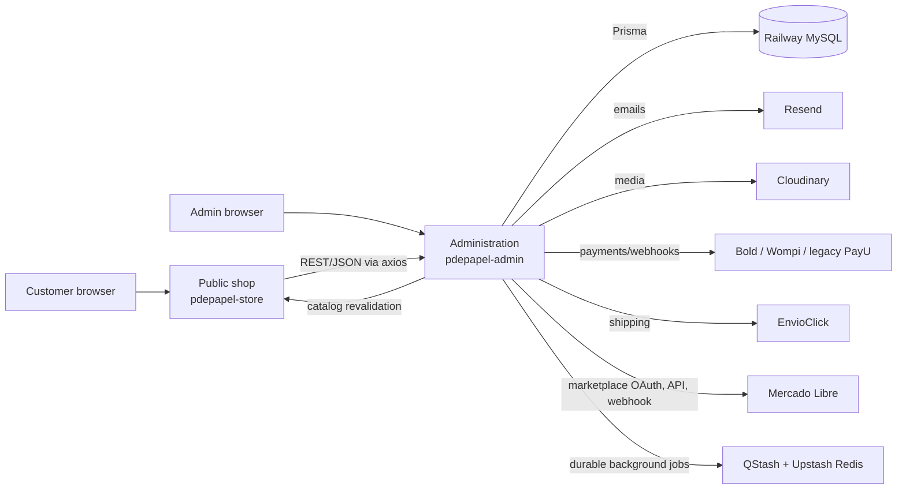
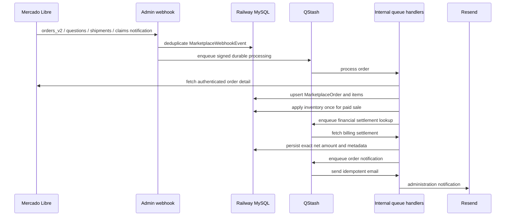

# P de Papel — Context for AI Agents

> **Purpose:** This is the durable handoff document for any AI agent working in this repository. Read it before changing code, environment configuration, the database, integrations, or deployment settings.
>
> **Do not put credentials, tokens, customer data, production database URLs, or private keys in this file.** Use the company password manager and the platform environment-variable settings instead.
>
> **Keep this document current.** After a material architecture, operational, migration, routing, payment, marketplace, or deployment change, update the relevant section in the same pull request or commit.

## 1. Business and product context

**P de Papel** is a Colombian e-commerce business focused on kawaii stationery, gifts, creative supplies, and accessories. The company serves customers in Colombia; customer-facing copy, navigation, SEO, product content, and routes must therefore be Spanish-first.

Business priorities:

- Make inventory trustworthy across the online shop, in-person sales, fairs, surprise capsules, and Mercado Libre.
- Preserve a polished, playful, accessible kawaii customer experience without sacrificing clarity, contrast, performance, or mobile usability.
- Keep financial and tax reports auditable: online orders, fair sales, marketplace sales, and supplier purchases need distinct and correct records.
- Avoid coupling customer-facing payment language to a specific provider. The preferred public label is **`Pago en línea`**; payment-provider icons may remain where they already provide useful recognition.
- Protect current customers and search ranking: the storefront has already migrated from IDs/English routes to Spanish slug-based canonical URLs. Existing URLs must continue to redirect safely.

Terminology used by the business:

- **Tienda en línea:** the public storefront (`papeleriapdepapel.com`). Do not call it “storefront” in Spanish customer-facing/admin copy.
- **Administración / panel:** the private dashboard and API (`admin.papeleriapdepapel.com`).
- **Feria:** an in-person selling event. It reserves stock before the event and records in-person sales.
- **Punto de venta:** the private mobile-friendly admin workflow for everyday in-person sales. It creates a paid `POINT_OF_SALE` order and strict physical-stock movements only after payment confirmation.
- **Cápsula sorpresa:** a random product sold at a fair. It must still be tracked by the actual packed product internally.
- **Publicación:** a Mercado Libre listing. A publication is not necessarily a sale.
- **Venta de Mercado Libre:** a paid Mercado Libre order/pack. It must record the amount actually collected by P de Papel, not merely the buyer-facing gross price.

## 2. Repository topology and deployment

This is a two-application repository, **not** an npm workspace. There is no root `package.json`.

| Folder | Role | Local development port | Database access | Production domain |
| --- | --- | ---: | --- | --- |
| `pdepapel-admin/` | Private admin dashboard, full REST API, Prisma schema, database owner, webhooks, cron jobs | `3001` | Direct via Prisma/MySQL | `admin.papeleriapdepapel.com` |
| `pdepapel-store/` | Public customer-facing Next.js app | `3000` | **None**; uses admin REST API | `papeleriapdepapel.com` |

Each application has its own `package.json`, `package-lock.json`, `node_modules`, Next config, test configuration, and Vercel project. Run npm commands from the application folder, never from the repository root.

Node.js 24 is the runtime baseline for local development, GitHub Actions, and Vercel. Both application `package.json` files declare `"engines": { "node": "24.x" }`; the root `.nvmrc` is the local convenience pin. Do not lower this version without a reviewed compatibility plan.

Both Vercel projects auto-deploy when `main` receives a push. A push to `main` is a production deployment action.

### High-level request flow



### Critical architectural rule

The public shop **never talks directly to MySQL**. It reads and writes through REST endpoints exposed by `pdepapel-admin`, usually through axios helpers in `pdepapel-store/actions/`. If a dynamic public page fails, investigate the admin API, its server environment, authentication, CORS, or data first—not only the public UI.

## 3. Current implementation snapshot

This section records the important recent decisions and must be updated after future production changes.

### Current baseline

- Latest deployed Mercado Libre listing-content expansion was committed as `f9a88d6` (`feat(admin): enhance Mercado Libre listing management`) and its matching manual migration was applied to Railway.
- `pdepapel-admin/prisma/manual-migrations/20260816_add_order_account_claims.sql` was applied to Railway on 2026-08-16. It adds the short-lived, hashed claim records used when a guest safely saves an order to a newly created or existing account.
- The production manual enum migration `pdepapel-admin/prisma/manual-migrations/20260807_add_marketplace_order_notification_action.sql` has already been applied to Railway. It added the outbox actions `SYNC_ORDER_FINANCIALS` and `SEND_ORDER_NOTIFICATION`.
- Mercado Libre was configured with the billing-read permission. After any permission change, token rotation, or client-secret rotation, the store owner must use **Reconectar Mercado Libre** in the admin panel so Mercado Libre issues a token with the correct scopes.
- QStash is used for Mercado Libre background processing and recovery. The UI should clearly distinguish “configured/active” from a real processing failure. QStash delay values must use explicit units such as `"30s"` or `"5m"`, never a bare number such as `"30"`.
- Marketplace listing content and prices are synchronized only after an explicit admin action. `SYNC_PRICE` updates the independent Mercado Libre price; `SYNC_LISTING_CONTENT` updates only the selected local photos, plain-text description, and configured attributes through QStash. Never make content synchronization automatic after a product edit.
- Shipment notifications are persisted independently of sales and use Mercado Libre's `/shipments/{id}/items` response to link a package to a single local sale. Do not rely on the order JSON containing `shipping`, and never guess a link for packages that contain multiple orders or an incomplete items response. An `orders_v2` cancellation also changes any still-pending/handling/ready-to-ship linked shipment to `cancelled`; it never restocks units automatically, because the physical return must be confirmed first.
- A Mercado Libre listing (or one of its variations) and an individual local product have a one-to-one relationship per marketplace connection. Import preview must not auto-select the same local product for multiple listings with a duplicated seller SKU; require the administrator to choose the single correct match and use distinct local products for the rest.
- The operations expansion is accompanied by `pdepapel-admin/prisma/manual-migrations/20260808_add_marketplace_operations.sql`, applied to Railway on 2026-08-08 after explicit approval. It adds marketplace question/shipment/claim records, reusable category templates, a local product-video library, minimum-margin guardrails, and the `SYNC_LISTING_STATUS`/`PUBLISH_LISTING` outbox actions.
- `pdepapel-admin/prisma/manual-migrations/20260808_add_marketplace_publication_profiles.sql` adds one editable quick-publication profile per local category. It was applied to Railway on 2026-08-09. Its matching code may now be deployed; every profile proposal remains manually editable and never auto-publishes.
- `pdepapel-admin/prisma/manual-migrations/20260810_add_marketplace_campaign_actions.sql` was applied to Railway on 2026-08-10. It adds the audit table for Product Ads campaign controls, recording the old configuration, explicit requested change, actor, Mercado Libre result, and failure reason; it does not alter listings, orders, stock, or existing campaigns.
- A Mercado Libre Client Secret was previously shared outside the intended secret store. Treat it as compromised: rotate it in Mercado Libre, update the Vercel production environment variable, redeploy, then reconnect Mercado Libre. Never record the value in Git, this file, terminal history, screenshots, email, or chat.

### Previously completed product decisions

- Public routes are Spanish canonical routes; old English routes redirect permanently.
- Product pages use slugs rather than product IDs. Product slug generation must add differentiators such as color/size **only when they are required to distinguish real sibling variants**. Do not create redundant slugs such as repeating a product name when there is no variant reason.
- Product and category slug aliases preserve old links. Never delete alias logic merely because the current canonical slug changed.
- Categories can be SEO-enabled and optionally featured. Their cards use category imagery and must retain an accessible high-contrast label treatment; white text directly over light imagery is not acceptable.
- Category landing pages are intentionally more focused than the general shop: do not present a category selector that invites a shopper to leave the current category. Product search within a category must be constrained to that category.
- Store route skeleton/loading behavior was improved to avoid showing only the header and footer before a page body arrives. Preserve route-level loading UI and avoid client-only data waterfalls that reintroduce this flash, especially for product detail and order detail after checkout.
- Rich product descriptions use Tiptap and are sanitized. The editor supports more expressive formatting (including color and emoji), but output must remain sanitized and safe for the product page.
- Order pages must not confuse an already-paid order’s historical purchased items with **current** catalog stock. A later stock depletion must not make a paid order appear to have failed or changed retroactively.
- Browser-facing API handlers use `pdepapel-admin/lib/cors.ts` to echo only the approved shop/admin origins, add `Vary: Origin`, and support the needed preflight methods. Never reintroduce `Access-Control-Allow-Origin: *` on a customer flow. Keep CORS and authorization separate: customer review authors and shipment tracking must derive the Clerk user from the authenticated token, never from a client-supplied user ID.
- Public product, category, and order loaders return `null` only for a genuine `404`. Other upstream failures throw `UpstreamServiceError` so route-level retry UI is shown instead of a false “not found” page. The quote screen follows the same distinction between an invalid link and a temporarily unavailable API.

## 4. Technology stack

Shared core:

- Next.js 14 App Router, React 18, TypeScript with strict type-checking.
- Clerk for authentication (`middleware.ts` in both apps).
- MySQL on Railway, Prisma 6 in the admin application.
- Tailwind CSS 3, Radix UI, shadcn-style components, `class-variance-authority`, `lucide-react`, and Framer Motion.
- `react-hook-form` plus Zod validation.
- Cloudinary for images/media.
- Resend plus React Email for email.
- Vitest for unit/component tests and Playwright for E2E tests.

Admin-specific:

- SWR, TanStack Table, Recharts.
- Tiptap 3 rich text.
- ExcelJS, `csv-writer`, and Papa Parse for spreadsheets; `@react-pdf/renderer` for PDFs.
- `qrcode.react` and `@zxing/browser` for QR/barcode workflows.
- Million.js wraps its Next configuration.
- Upstash Redis and QStash for durable Mercado Libre queue/outbox jobs.

Public-shop-specific:

- React Server Components and ISR.
- TanStack Query, Nuqs, Zustand.
- `next/image` optimization enabled (AVIF/WebP and cache controls).
- SEO with `schema-dts`, `app/sitemap.ts`, `app/robots.ts`, Open Graph and Twitter images.
- Vercel Analytics and Speed Insights.
- Consent-based Google Analytics 4 for customer-journey analysis; it is
  optional and must never be used to send customer contact, address, identity,
  or payment data.

## 5. Admin application (`pdepapel-admin`)

### Responsibility

The admin application is both the private dashboard and the backend. It owns:

- Prisma schema and all production data access.
- REST JSON APIs used by the dashboard and the public shop.
- Catalog, inventory, orders, payments, shipping, taxes, fairs, DIAN invoicing, marketplace, and business-intelligence logic.
- Incoming webhooks and admin-side cron tasks.
- Catalog revalidation requests to the public shop.
- Cross-origin API support has a default policy in `pdepapel-admin/middleware.ts`; browser-facing handlers must also use `lib/cors.ts` for their explicit responses and preflights, because route response headers can override middleware defaults. Allow only the approved production origins (`papeleriapdepapel.com` and the admin domain) plus the defined local development ports, echo the requesting allowed origin, and add `Vary: Origin`. CORS is not authentication; private routes must still enforce their existing authorization checks.

### Important directories

```text
pdepapel-admin/
├── app/
│   ├── (auth)/
│   ├── (root)/
│   ├── (dashboard)/[storeId]/(routes)/  # private Spanish admin screens
│   └── api/
│       ├── [storeId]/                    # authenticated per-store REST resources
│       ├── public/                       # public-shop-facing API
│       ├── webhook/                      # inbound external callbacks
│       ├── cron/                         # Vercel scheduled work
│       ├── integrations/                 # OAuth callbacks
│       └── internal/                     # signed internal/QStash endpoints
├── actions/                              # server-side loaders and analytics helpers
├── components/                           # shared dashboard UI
├── emails/                               # React Email templates
├── lib/                                  # domain logic and integrations
├── prisma/                               # schema, seed, scripts, manual migrations
├── scripts/                              # operational scripts
└── tests/                                # Vitest, integration, Playwright
```

### Dashboard resources

Dashboard route names are Spanish and include: `productos`, `categorias`, `pedidos`, `ventas-rapidas`, `inventario`, `movimientos-inventario`, `ferias`, `mercadolibre`, `reportes-tributarios`, `ofertas`, `cupones`, `aprovisionamiento`, `proveedores`, `clientes`, `envios`, `cotizaciones`, `configuracion`, and supporting catalog/BI resources.

Follow the established route shape when adding a resource:

```text
(dashboard)/[storeId]/(routes)/<resource>/
├── page.tsx                         # server page
├── server/                           # server-only Prisma data loaders
└── components/
    ├── client.tsx                    # SWR/table wrapper
    ├── columns.tsx                   # TanStack Table definitions
    ├── cell-action.tsx               # row action menu
    └── [id]/components/*-form.tsx    # form with react-hook-form + Zod
```

Large forms require particularly careful, scoped changes: product forms, product group forms, and the order form are high-impact.

### Core admin libraries

- Payments and finance: `lib/bold.ts`, `lib/bold-terminal.ts`, `lib/financial.ts`, `lib/order-totals.ts`, `lib/discount-engine.ts`.
- Shipping: `lib/envioclick.ts`, `lib/shipping-helpers.ts`, `lib/package-calculator.ts`, `lib/dane-api.ts`, `lib/shipment-export.ts`.
- Inventory: `lib/inventory.ts`, `lib/inventory-constants.ts`, `lib/point-of-sale.ts`, `lib/variant-generator.ts`, `lib/variant-combinations.ts`.
- SEO/catalog: `lib/slugify.ts`, `lib/product-slugs.ts`, `lib/category-slugs.ts`, `lib/product-identifiers.ts`, `lib/rich-text.ts`, `lib/product-description-templates.ts`.
- Store cache sync: `lib/revalidate-store.ts`, `lib/revalidation-alert.ts`, `lib/cache.ts`.
- Mercado Libre: `lib/mercadolibre/`.
- Tax/invoicing: `lib/tax-reports.ts`, `lib/tax-report-xlsx.ts`, `lib/invoicing/`.
- Fairs: `lib/fair-events.ts`, `lib/fair-reconciliation-import.ts`, `lib/fair-reconciliation-template-xlsx.ts`.
- Communication: `lib/email.ts`, `lib/resend.ts`, `lib/message-templates.ts`, `lib/reactivation.ts`.

### Admin webhooks and scheduled work

Current externally significant handlers include:

- `/api/webhook/bold`
- `/api/webhook/wompi`
- `/api/webhook/mercadolibre`
- `/api/webhook/envioclick`
- `/api/webhook/dian`
- `/api/integrations/mercadolibre/callback`
- `/api/cron/update-coupons` and `/api/cron/update-offers` (daily at `00:00`, defined in `pdepapel-admin/vercel.json`). Mercado Libre health checks run daily at `13:00 UTC` through `.github/workflows/admin-scheduled-tasks.yml`, keeping the project within Vercel's two-cron limit and separate from offer updates.

The Vercel config gives API handlers up to 60 seconds. Orders and checkout have 1024 MB memory and the same max duration. Do not make request handlers rely on long synchronous external workflows; enqueue durable work when appropriate.

## 6. Public shop (`pdepapel-store`)

### Responsibility

The public shop is the customer experience. It has no database connection and calls the admin API through helpers under `actions/`. It owns presentation, SEO metadata, ISR/cache tags, checkout UX, customer auth views, and revalidation endpoint handling.

### Important directories

```text
pdepapel-store/
├── app/
│   ├── (routes)/                       # public pages; Spanish canonical routes
│   ├── (public)/cotizacion/[token]/     # public quote view
│   └── api/
│       ├── revalidate/                  # admin cache-refresh callback
│       └── send/                        # contact/email action
├── actions/                             # axios calls to admin API
├── components/, hooks/, providers/
├── constants/, types/, lib/, emails/
└── tests/
```

### Customer route policy

Spanish routes are canonical. English folders/routes exist only for permanent compatibility redirects and must not become the canonical URL again.

Examples:

| Canonical Spanish route | Legacy English route |
| --- | --- |
| `/tienda` | `/shop` |
| `/producto/[slug]` | `/product/[slug]` |
| `/categoria/[slug]` | no canonical English use |
| `/carrito` | `/cart` |
| `/finalizar-compra` | `/checkout` |
| `/favoritos` | `/wishlist` |
| `/pedido/[orderId]` | `/order/[orderId]` |
| `/nosotros` | `/about` |
| `/contacto` | `/contact` |
| `/politicas/*` | `/policies/*` |

When creating a new customer-navigable route:

1. Create the Spanish canonical segment.
2. Add a permanent redirect from an existing/previous English segment in `next.config.mjs` when relevant.
3. Update route helpers, navigation, metadata, sitemap coverage, tests, and any structured data.
4. Do not remove older redirects or slug aliases without a deliberate SEO migration plan.
5. Clerk route configuration must use the same Spanish canonical paths: `/iniciar-sesion` and `/crear-cuenta`. Keep the public Clerk variables and `ClerkProvider` aligned with `STOREFRONT_ROUTES`, otherwise the mounted authentication form can remain empty. Auth route pages must redirect an already authenticated visitor on the server to the validated `redirect_url` (or `/`) rather than render an empty Clerk form.

### UX and rendering rules

- Prefer server data and route-level `loading.tsx`/skeleton UI over client-only fetches that leave a blank content area.
- Reuse the existing specialized admin form controls before adding a generic input: `CurrencyInput` for COP amounts, `PercentageInput` for percentages, `StockQuantityInput` for inventory, `CountInput` for bounded counts, `MeasurementInput` for dimensions, `QuantitySelector` for cart lines, `ImageUpload` for images, rich-text editor for product descriptions, and calendar/date controls for dates. If a domain-specific input does not exist, create one reusable component using the installed shadcn/Radix primitives instead of styling a one-off control inside a route.
- A first navigation from `/tienda` to a product must immediately display a coherent product skeleton/content frame—not just the persistent header and footer.
- Checkout-to-order-detail navigation must not flash a reset checkout state before the order page appears.
- Preserve responsive behavior. Header additions, category cards, drawers, dialogs, and tables must be checked at mobile, tablet, and desktop breakpoints.
- Category cards need strong readable contrast independent of the image content.
- Keep product description HTML sanitized; never render unsanitized external HTML with `dangerouslySetInnerHTML`.
- Treat mobile LCP as a release requirement. The critical first view must render without an entrance animation; animate only after the visitor changes a carousel slide or explicitly opens an interactive element.
- Treat mobile CLS as a release requirement too: loading fallbacks must reserve the same responsive aspect ratio, spacing, and expected card count as their resolved section. Never render a visible deterministic value (such as a price or header control) as `null` until hydration; keep an equivalent shell in the initial HTML instead.
- Keep the document's header offset stable. A fixed header may animate independently, but it must not rewrite `body` padding while the visitor scrolls, because that moves the entire document.
- Keep global client bundles lean: preview modals, cart details, chat, review forms, and newsletter form libraries must load only when the visitor opens or approaches them. Preserve their existing behavior once loaded.
- Use only the fonts and font weights that are actually used. Critical brand fonts may preload; decorative and secondary fonts must not compete with initial page content.
- Do not mark below-the-fold assets as `priority`. The floating WhatsApp library accepts only an image URL, so it must use its dedicated `96×96` local WebP avatar instead of a manually constructed `/_next/image` URL or the full source asset.
- Seasonal presentation is controlled by `Season` and `getCurrentSeason()` in `lib/date-utils.ts`, always using the `America/Bogota` calendar. The spooky presentation is active from September 30 through November 3; Christmas remains December 1 through January 7. On the home page, spooky season restyles the existing admin-curated `isFeatured` collection as **Favoritos de octubre** and Christmas as **Favoritos de Navidad**; no new catalog flag, data fetch, or admin workflow is required. New seasonal decoration must use optimized local assets, preserve the real P de Papel logo, remain `pointer-events-none`, and avoid client-side animation unless it is essential and mobile-safe. Christmas snowfall is a dynamically imported canvas effect (not GSAP): it must respect `prefers-reduced-motion`, pause by unmounting while the tab is hidden, stay non-interactive, use a low z-index below dialogs/privacy prompts, and keep the configured reduced particle/FPS budget.

### SEO and discovery rules

- Admin routes are private and must stay non-indexable; only the customer shop needs SEO work.
- Keep `app/sitemap.ts`, `app/robots.ts`, canonical metadata, redirects, product/category structured data, Open Graph images, and Twitter metadata aligned whenever customer routes change.
- Product/category aliases and permanent redirects protect existing links after the ID/English-to-slug/Spanish migration.
- Archived products should return the intended non-indexable behavior and remain covered by public health checks.
- Review Google Search Console sitemap/indexing, page inspection, performance, and Core Web Vitals after meaningful URL or catalog changes. See `docs/seguimiento-seo.md`.
- After an LCP or CLS release, verify Vercel Speed Insights on mobile by route after new real-user samples arrive. Field data is rolling and historical, so do not attribute an existing P75 value to an undeployed change or declare success from a local build alone.
- Product variant URLs remain individually canonical for direct visits, refreshes, sharing, and crawlers. Inside an already-open product group, change only the selected variant data and update the address bar with the native History API; do not use a full App Router navigation that flashes the route loading state. Keep the selector order based on the stable sibling payload, never on the currently selected variant.
- Grouped catalog cards must derive their route, stock, category metadata, and price range from the variants matching active catalog filters. Their initial route must point to the matching variant with the displayed lowest effective price; if a different variant is discounted, describe it as an option on offer rather than implying that the initial variant has that discount. Product-group create, edit, and delete actions must use the central catalog invalidation helper so the public shop, Redis cache, and marketplace stock sync remain consistent.

### Customer-journey analytics

- The public shop asks for explicit, revocable browser consent before loading
  Google Analytics 4. Preferences are versioned in browser local storage and
  can be reopened from the footer. Essential checkout and security functions do
  not depend on that consent.
- GA4 client events use the shared `lib/customer-analytics.ts` helper. Track
  ecommerce events such as product-list views, product views, add-to-cart,
  cart view, checkout, shipping/payment steps, and checkout errors. Never put
  email, phone, address, document number, raw search text, payment credentials,
  or any other personal data in event parameters.
- The GA4 bootstrap must keep Google's canonical queue format:
  `function gtag(){dataLayer.push(arguments);}`. Do not replace it with an
  arrow function that pushes a rest-parameter array; `gtag.js` may load but
  ignore queued commands and no events will reach GA4.
- The public checkout obtains the GA client ID only after analytics consent and
  sends it as optional checkout attribution. The admin persists it temporarily
  in `Order.analyticsClientId`; once the server sends the verified `purchase`
  event after a genuine `PAID` transition, it clears that client ID and records
  `analyticsPurchaseTrackedAt`. Point-of-sale, fair, admin-created, and
  unconsented orders are skipped.
- The confirmed-purchase event is sent from admin through the GA4 Measurement
  Protocol from the Bold/Wompi webhook or a manual paid transition. It is never
  emitted from a customer redirect. GA failure must be logged but must not roll
  back payment, stock, email, or order status.

## 7. Data model and database safety

### Prisma ownership and invariants

The Prisma schema is `pdepapel-admin/prisma/schema.prisma`.

- Database: MySQL hosted on Railway.
- `relationMode = "prisma"`: MySQL does **not** enforce foreign keys for these relations. Application code owns integrity, cascade-like behavior, and cleanup.
- Every relation column must have an explicit `@@index`; preserve the convention whenever adding a relation or high-selectivity filter.
- The system is modeled multi-store even though it is currently used as a single business. Respect `[storeId]` isolation in every query, endpoint, relation, uniqueness rule, and mutation.
- Do not use a product’s live `stock` as the authoritative historical quantity of an already-paid order. Order items and inventory movements are the audit record.

### Core model orientation

- `Store` is the tenant root.
- `Product` belongs to a `Category`, size, color, and design; it has `sku`, optional `gtin`, optional `mpn`, brand, acquisition cost, images, variants/grouping, supplier, kits, offers, movements, fairs, and marketplace links.
- `ProductSlugAlias` and `CategorySlugAlias` protect old public URLs.
- `Order` plus `OrderItem` is the unified sales record. Order types: `STANDARD`, `CUSTOM`, `QUOTATION`, `FESTIVAL`, and `POINT_OF_SALE`.
- Order statuses include draft/quotation states and active `PENDING`, `PAID`, `SENT`, and `CANCELLED` states. `paidAt` must be written when an order truly becomes paid, not during unrelated updates.
- `InventoryMovement` is the auditable stock ledger.
- Supplier/restock data supports purchases, inventory cost, and tax records.
- `TaxPurchase` represents a manually recorded supplier invoice, not merely a restock order.
- `FairEvent`, inventory items, sales, and capsules support in-person events.
- `MarketplaceConnection`, `MarketplaceListing`, `MarketplaceOrder`, `MarketplaceOrderItem`, `MarketplaceWebhookEvent`, and `MarketplaceOutboxEvent` implement marketplace sync.
- `Invoice` and `DianStatus` handle electronic invoicing flows.
- `OrderAccountClaim` lets a guest save an individual eligible order after sign-in; `CustomerWishlistItem` stores signed-in favorites; `CustomerAddress` is an explicit per-account delivery address book; `CouponRedemption` records the single account-level redemption of a welcome benefit.

### Product identifiers: do not conflate them

- **SKU:** P de Papel’s internal operational identifier. Use it for internal catalog links, manual barcode labels, fairs, inventory scans, and matching local products to existing Mercado Libre listings.
- **GTIN:** a standardized product barcode (EAN/UPC/GTIN-14) issued by GS1 or supplied by the manufacturer/authorized distributor. Do not invent a GTIN. It is useful for Google Merchant and Mercado Libre when legitimately available.
- **MPN:** manufacturer part number; only use the maker/supplier’s actual code.
- A barcode scanner can scan a printed internal SKU label even when there is no GTIN. The form’s GTIN field is not a generic barcode-label field.
- If the product has no legitimate GTIN, mark the applicable “no product identifier” option rather than fabricating one.

### Schema and migration protocol

1. Change `prisma/schema.prisma` in the admin app.
2. Run `npx prisma generate` and relevant type/unit/integration tests.
3. Create a reviewed migration/SQL change with a reversible/low-risk plan. The repository uses `prisma/manual-migrations/` for production changes; there is no automatic production migration runner.
4. Back up or review impact, then explicitly obtain approval before touching Railway production.
5. Apply the migration deliberately in Railway, verify schema and application behavior, and record the action in relevant operational documentation.
6. Never run integration tests or `prisma db push` against production/Railway.
7. Never hand-edit production data as a substitute for a migration, except for an explicitly approved, auditable repair procedure.

Known manual migration references:

- `20260805_add_tax_purchases.sql` — tax supplier-purchase table.
- `20260807_add_marketplace_order_notification_action.sql` — Mercado Libre outbox enum expansion; already applied to Railway.
- `20260808_add_marketplace_listing_content_sync.sql` — adds the `SYNC_LISTING_CONTENT` outbox action. Apply to Railway before deploying the related code.
- `20260809_add_point_of_sale.sql` — adds `POINT_OF_SALE`, `IN_PERSON_SALE`, and the `(storeId, gtin)` product lookup index. Apply to Railway before using the feature in production.
- `20260816_add_order_account_claims.sql` — creates the short-lived, hashed guest-order claim table; applied to Railway on 2026-08-16.
- `20260820_add_customer_account_benefits.sql` — adds separate email/device order claims, persisted account favorites, explicit account delivery addresses, and welcome-benefit redemptions. It must be applied to Railway before deploying the related code.

## 8. Catalog, SEO, and revalidation

### Canonical content policy

- Slugs—not IDs—are customer-facing identifiers for products and categories.
- Preserve old slug aliases and redirects so existing search/browser links do not become 404s.
- Use color/size in a slug only when the catalog has real variants needing differentiation. Avoid duplicated semantic tokens.
- For new SEO category pages, ensure they are reachable from relevant public navigation/card sections rather than only by direct URL.
- Category image is optional at data level. Do not make it mandatory if legitimate categories lack a good image; the UI must have a graceful image fallback.

### Store ISR revalidation contract

Catalog changes in administration notify the public shop through `POST /api/revalidate`.

- `REVALIDATION_SECRET` must be identical in both Vercel projects.
- It must be a single printable line: no leading/trailing quotes, spaces, or embedded newlines.
- A newline in `x-revalidate-secret` caused a production alert previously; the validation/normalization now rejects invalid header content rather than producing invalid requests.
- Revalidation alerts are rate-limited to at most one email per hour. Investigate admin/Vercel logs and ensure both Vercel projects use the same value if alerts appear.
- After a catalog mutation, verify both the admin mutation and the public-page cache refresh. A successful DB update with a stale public page is still a customer-visible defect.

See `docs/revalidacion-catalogo.md` and `docs/seguimiento-seo.md`.

## 9. Orders, payments, inventory, and shipping

### Payment policy

- **Bold** is the default online payment gateway.
- **Wompi** is the online-payment fallback.
- **PayU** is legacy/deprecated and must not be presented as a current customer payment choice unless a future, explicit migration reinstates it.
- Customer-facing generic text should say **`Pago en línea`**, not “pay with Bold”, “Wompi”, or “PayU”. Keep payment icons if they are already useful UI elements; this instruction is about text, not blindly removing visual marks.
- Bank transfer is manually confirmed by an admin after physical verification. A bank-transfer order must not move to `PAID` without that authorization.
- Webhook processing must be idempotent and validate the provider’s authenticity/state before changing an order. Do not mark paid from a client redirect alone.
- Payment confirmation emails must not say “Próximamente” for active payment methods.
- Guest checkout remains the default. A customer may voluntarily save only their current standard guest order after authentication through a short-lived, one-time `OrderAccountClaim`: the claim token is stored hashed, the original guest identifier is required to create it, and the authenticated Clerk primary email must exactly match the order email. Never mass-link or auto-link historical orders merely because an email matches.
- Account invitations must be optional and truthful. Signed-in customers can keep favorites across devices while guest favorites remain only on that device. A customer may explicitly save, update, select, or delete up to ten delivery addresses during a standard checkout; never auto-import guest or historical order addresses, and never expose an address through a public lookup. High-intent account prompts in cart, checkout, and order history may explain this convenience, but must never promise automatic address import or require registration to buy. A welcome discount may be shown only while its campaign is active and the server verifies the Clerk primary email, a first paid `STANDARD` order, and one redemption per account.

### Inventory policy

- Apply inventory changes through centralized inventory helpers and write an `InventoryMovement` for every meaningful adjustment.
- Product and product-group forms may set initial stock only for a new variant. A save for an existing product or variant must never derive an inventory movement from submitted form stock; use the dedicated inventory movement flow instead.
- Keep products available/blocked based on actual current stock, but show paid-order details from order snapshots rather than declaring a past purchase unavailable because current stock is zero.
- Handle concurrent availability checks atomically/defensively; never let delayed payment confirmation or a marketplace retry subtract stock twice.
- Kits/combos use component stock; do not treat a kit as unrelated independent stock without understanding existing kit logic.
- Every external/in-person sales workflow must either reserve stock before sale or reconcile with auditable movement entries afterward.
- Point-of-sale sales must use `lib/point-of-sale.ts`, which expands kits into physical components, atomically decrements every required product with `stock >= required`, creates the paid order and movements in one transaction, recalculates kits, and queues marketplace stock sync. Never replace it with resilient/partial inventory updates.
- Product QR labels use `PDP:<productId>` and are reusable for ordinary products. They are intentionally different from fair-capsule QR codes, which remain one unique code per sealed capsule.

### Shipping

- EnvioClick is the primary integration for quotes/guides/tracking, with manual shipping support.
- Colombian DANE data comes through the configured MiPaquete/DANE helpers.
- Do not break the checkout shipping quote/selection contract when changing product package fields, address validation, or order totals.

## 10. Fairs, in-person sales, and stock reconciliation

The fair module exists because in-person events otherwise create serious online-stock drift. It is a core inventory feature, not a side experiment.

### Everyday point-of-sale workflow

1. Use **Ventas → Punto de venta** for ordinary cash or already-confirmed transfer sales.
2. Print reusable product labels from the same page. Search by name/SKU/GTIN, choose the number of copies, and scan `PDP:<productId>` labels later with a phone or Bluetooth scanner.
3. Confirm cash/transfer only after the money was received. The service creates a paid `POINT_OF_SALE` order, a matching `IN_PERSON_SALE` movement for every physical product, and immediately refreshes online/marketplace availability.
4. Point-of-sale orders are audit records and cannot be edited or deleted in the generic Orders API. Use an auditable return/manual adjustment for a correction.
5. Point-of-sale sales are included in tax exports as **Venta presencial**. See `pdepapel-admin/docs/punto-de-venta.md` for the nontechnical guide.

### Normal fair workflow

1. Create a fair in **Ventas en feria**.
2. Reserve each product’s physical quantity before leaving. Reservation removes it from online availability, creates auditable movements, and queues the corresponding Mercado Libre stock update.
3. For surprise capsules, use a reserved product with acquisition cost, define margin/price, create **one unique QR per capsule**, print and attach it. The QR identifies the capsule internally without revealing the product to the buyer. Capsule labels use the `STANDARD_40` A4 print format to preserve scanning reliability.
4. Reusable point-of-sale product labels use `PDP:<productId>` and can be printed as `COMPACT_65` (38.1 × 21.2 mm) or `STANDARD_40` (48 × 28 mm). Both layouts require A4 inkjet label sheets, A4 at 100% scale, and a one-sheet scan/alignment test before a batch.
5. Open the event and use the mobile-friendly admin page/phone camera, a Bluetooth scanner, or manual SKU/GTIN entry.
5. Record paid fair sales once with cash or transfer. The result is a paid `FESTIVAL` order and inventory is not allowed to exceed the reserved amount.
6. At the end, physically count unsold, damaged, and lost stock. Reconcile and close the event; closing is irreversible. Returned stock goes back online, damaged/lost stock remains audited, and affected Mercado Libre listings are refreshed.

### Reconciling a past fair

When sales were already registered as orders but physical stock differs:

1. Use **Movimientos de Inventario → Conciliar feria anterior**.
2. Download a fresh template the same day.
3. Fill only the editable physical-count, cause, note, reviewed, and authorization fields; do not edit gray reference fields.
4. Review the uploaded file before applying; fix every validation error first.
5. Apply only explicitly authorized rows. The import creates stock adjustments/movements and refreshes affected Mercado Libre listing stock; it does not create or alter sales orders.
6. If stock changed since template download or an event remains open, start again from a new template/close the active event first.

Operational docs:

- `pdepapel-admin/docs/ventas-en-feria.md`
- `pdepapel-admin/docs/conciliar-inventario-feria-anterior.md`

## 11. Tax reporting and supplier purchases

The **Reportes tributarios** module supports any operating year, not just 2025.

- Exported `.xlsx` has **Ventas** and **Compras** sheets.
- Sales include orders in `PAID` or `SENT` (including fair and point-of-sale sales as **Venta presencial**) plus Mercado Libre sales in `PAID` with a settled `netAmount`. The report identifies each sale channel and records the net amount actually received from Mercado Libre; paid sales without settlement remain visibly pending and are not totalled or exported.
- Admin chooses whether sales are filtered by sale/creation date or actual payment-confirmation date (`paidAt`). The exported column indicates the selected basis.
- Purchases are manually recorded supplier invoices (`TaxPurchase`), with invoice number, company/supplier name, value, and invoice date. A restock order number is not a fiscal invoice number.
- The UI uses pagination for tax tables; preserve it to avoid unbounded slow tables.

For historic second-half 2025 reporting, use the fiscal guidance in `pdepapel-admin/docs/reportes-tributarios.md`. Do not alter `paidAt` just to satisfy a report date range; fix data only if a real payment-date bug is proven.

## 12. Mercado Libre integration

### Strategic rules

- Mercado Libre prices are deliberately independent from the public-shop price because commissions, shipping subsidies, and taxes affect marketplace margin. Never automatically overwrite one channel’s price from the other.
- P de Papel inventory is the source of truth. A listing’s available quantity is local stock minus its configured safety buffer.
- Existing Mercado Libre listings can predate this integration. Importing a publication does not create a local product, alter public-shop pricing, or immediately change stock until the admin confirms the link/sync.
- A publication is not a sale. Do not create orders/movements for a listing import.
- A Mercado Libre paid sale must be idempotently applied exactly once. Its marketplace data and inventory movement must be auditable.
- Do not automatically restore stock merely because a sale is canceled/returned. An admin must first confirm the physical return.

### Configuration and ownership

- Mercado Libre application must be owned by the principal P de Papel seller account in Colombia (`MCO`), not a personal developer, collaborator, or operator account.
- OAuth redirect URL: `https://admin.papeleriapdepapel.com/api/integrations/mercadolibre/callback`
- Production webhook URL: `https://admin.papeleriapdepapel.com/api/webhook/mercadolibre`
- OAuth should use Authorization Code / server-side Client Secret as implemented. Do not enable PKCE until the implementation is deliberately updated for it.
- Required granular scopes: user read, publication/synchronization read-write, **pre/post-sale communications read-write**, sale billing read, and sale/shipping read. **Product Ads is opt-in:** its advertising permission is read-write. P de Papel may query and, after an explicit owner confirmation, pause, activate, or adjust an existing campaign's daily budget, target ROAS, or strategy. It must never create campaigns, add ads, or perform automatic campaign writes. Do not request unrelated business-metrics, promotions, or VIS permissions.
- After changing scopes, Client Secret, or other authorization-sensitive config, reconnect from the admin UI to obtain a fresh token.

### Required environment configuration

Configure only in the **admin Vercel project**, never in the public-shop project:

- `MERCADOLIBRE_CLIENT_ID`
- `MERCADOLIBRE_CLIENT_SECRET`
- `MERCADOLIBRE_OAUTH_REDIRECT_URI`
- `MERCADOLIBRE_TOKEN_ENCRYPTION_KEY` (stable Base64 32-byte key; changing it makes stored encrypted tokens unreadable)
- `QSTASH_TOKEN`
- `QSTASH_CURRENT_SIGNING_KEY`
- `QSTASH_NEXT_SIGNING_KEY`
- `ADMIN_WEB_URL`

`QSTASH_URL` is not required by the current code path; the QStash SDK uses its configured service defaults plus `QSTASH_TOKEN`. Do not add unnecessary variables without also validating/documenting their use.

The GitHub Actions repository secret `PDEPAPEL_ADMIN_CRON_SECRET` must equal the admin Vercel `CRON_SECRET`. It authorizes only the protected Mercado Libre health endpoint; never place it in workflow files, repository variables, or logs.

### Architecture



Relevant implementation areas:

- OAuth/config/encryption: `lib/mercadolibre/config.ts`, `oauth.ts`, `oauth-state.ts`, `crypto.ts`, `client.ts`.
- Listing draft/publish/import: `listings.ts`, `import-listings.ts`, and `app/api/[storeId]/marketplaces/mercadolibre/listings/**`.
- Product Ads: `lib/mercadolibre/product-ads.ts`, the overview route, and `app/api/[storeId]/marketplaces/mercadolibre/advertising/campaigns/[campaignId]/route.ts`. It uses Mercado Libre's current MCO advertiser/campaign-search endpoints with API versions 1 and 2 and the current campaign `PUT /marketplace/advertising/{site}/product_ads/campaigns/{campaignId}` endpoint. Do not use retired legacy campaign endpoints. `MarketplaceCampaignAction` is the audit trail for every explicit owner-requested pause, activation, or settings update.
- Webhook/order processing: `webhook.ts`, `webhook-processor.ts`, `order-sync.ts`, and `app/api/webhook/mercadolibre/route.ts`.
- Outbox/QStash: `outbox.ts`, `queue.ts`, and signed routes under `app/api/internal/marketplaces/mercadolibre/**`.
- Finance/email: `order-financials.ts`, `order-notification.ts`, and `emails/mercadolibre-order-notification.tsx`.
- Admin UI: `app/(dashboard)/[storeId]/(routes)/mercadolibre/`.

### Listing publication and imports

For a new publication, an admin selects a local product, marketplace-specific price, safety buffer, suggested/reviewable Mercado Libre category, properties, images, and publication state. Publish only after human review; never bulk-publish catalog items automatically.

- An admin chooses the exact local product photos that are sent to Mercado Libre. The first selected image is the intended cover. Only use public images belonging to that local product; do not insert arbitrary remote URLs.
- The pre-publication fee calculator uses Mercado Libre's `listing_prices` response. It is an estimate for decision-making only: shipping debits, taxes, refunds, campaigns, and the final settlement can change the actual net amount.
- The category attributes endpoint drives the admin form's required fields. Keep the advanced `CODE=Value` area for exceptional attributes, but do not make admins discover standard requirements manually.
- Mercado Libre performance is informative: show its quality score and pending actions, but never auto-change titles, photos, category, attributes, logistics, or promotions from those suggestions.
- Category templates are reusable only for the selected Mercado Libre category and save the approved technical attributes, safety buffer, and minimum margin. Applying one still requires an admin to review the draft before publication.
- Quick-publication profiles are explicitly linked to one local product category and propose the Mercado Libre category, technical attributes, product photos, safety buffer, target profit, and independent marketplace price for future products in that local category. Every proposed value remains manually editable; a profile must never publish automatically or modify an existing listing.
- The price proposal may target acquisition cost plus the configured profit after Mercado Libre's current estimated sale fee. It excludes shipping debit, taxes, refunds, campaigns, and the final settlement; label it as an estimate, not net income or a guaranteed margin.
- The listing form is a concise four-step wizard: product/price, category/photos, technical attributes, and final review. It validates each step, loads required attributes before the technical step, and can save a draft or publish directly after a single explicit confirmation.
- The operations panel has reviewable question-response suggestions. An admin must read/edit and explicitly send every buyer answer; no automatic messages are sent.
- Bulk publication, pause/activate, and content/price/stock updates are capped at 20 selected listings and run through the idempotent QStash outbox after an explicit confirmation. Never bulk-publish the entire catalog automatically.
- The minimum-margin field is an early warning before variable marketplace costs; actual profitability uses settled net collected minus recorded acquisition cost.
- Do not add a video or Clips step to the publication wizard until Mercado Libre offers a supported, verified MCO API capable of uploading it from P de Papel. When Mercado Libre quality returns a clip recommendation, the listing manager may open the local product-video library and the trusted Mercado Libre upload link. The final Mercado Libre upload stays manual and must never be reported as automatic or successful until Mercado Libre itself confirms it.
- Product Ads uses an explicit on-demand 30-day query, so it adds no polling, QStash jobs, or Vercel cron executions. Campaign writes are immediate, owner-confirmed, and audited; they can only pause, activate, or alter the campaign's documented budget/ROAS/strategy. Never claim attributed revenue is profit: it excludes product cost, Mercado Libre fees, shipment debits, taxes, and refunds. Financial/tax reporting must continue to use each settled `netAmount`.

For existing publications:

1. Run preview/import from **Ventas → Mercado Libre → Publicaciones**.
2. Match by local SKU when possible.
3. If Mercado Libre has no matching SKU, the admin must manually choose the correct local product.
4. Never guess a product mapping.
5. Preserve marketplace price; it must not rewrite the public-shop price.

### Paid sales, settlement, and emails

For every paid Marketplace Order, record **net collected by P de Papel**, not gross buyer price.

- Financial source: Mercado Libre sale-billing/order-details endpoint.
- Calculation: buyer total minus Mercado Libre charges, shipping debited from the operation, and applicable taxes. The code distinguishes actual debits/refunds rather than relying on an estimated commission.
- If the billing detail is unavailable, partial, rate-limited, or not yet settled, retain a **Liquidación pendiente** state and retry through the outbox. Never display gross as business income in its place.
- The outbox actions `SYNC_ORDER_FINANCIALS` and `SEND_ORDER_NOTIFICATION` make settlement and email durable/idempotent. They use separate QStash lanes so a sale alert is never held behind stock, listing, or billing work for the same connection.
- Administrative Mercado Libre sale email is sent as soon as the order is first confirmed as paid and includes a direct admin link to the sales record. When the exact net settlement is not yet available, the email must clearly say `Liquidación neta: pendiente de Mercado Libre`; it must never estimate or display gross as income. Settlement continues independently through its durable retry flow.
- Queue the administrative sale email only when the order first becomes `PAID`; later `orders_v2` or shipment updates for an already-paid order must not create a delayed "new sale" notification. Include the recorded payment date so the email remains accurate if delivery is later.
- Administrative emails must name their actual source: order/payment state in P de Papel, EnvíoClick shipment update, Mercado Libre payment confirmation or daily health check, and catalog revalidation alert. Do not present an operational summary or logistics update as a new sale.
- Historical manually reconciled sales are protected from automatic financial overwrite with `metadata.source === "HISTORICAL_RECONCILIATION"`.
- The Mercado Libre **Dinero** card is owner-only and on demand. Its refresh can write only `metadata.financials.moneyReleaseStatus`, `moneyReleaseDate`, and `releaseStatusCheckedAt` for at most 10 paid, settled orders once per 24 hours; it must never overwrite `netAmount`, charges, taxes, historical reconciliation metadata, inventory, or initiate a withdrawal. Mercado Libre does not expose the seller's Mercado Pago account balance through this connection, so P de Papel shows only settled net amounts and per-sale release dates. Do not poll it, add cron jobs, infer availability from gross sales, or turn it into an automatic withdrawal flow. The external Mercado Pago link is the only withdrawal path and must remain a human confirmation.

Known real reconciliation reference: a previous Mercado Libre sale had gross COP 69,000, commission COP 13,110, shipping COP 8,500, taxes COP 933, and net COP 46,457. Tests protect this calculation pattern. Do not hard-code this example into live financial logic.

### Reporting treatment

- Settled Mercado Libre sales contribute their `netAmount` to revenue totals, tax export, daily/monthly financial summaries, average ticket, product/category rankings, and stockout velocity. Product profitability subtracts the actual local acquisition cost from the allocated net settlement.
- Do not create a duplicate internal `Order` for a marketplace sale. Marketplace records remain separate for idempotent stock and settlement handling.
- Never add a paid-but-unsettled marketplace sale as gross revenue. Surface it as pending until the billing endpoint supplies the settlement.
- Customer intelligence, CRM/re-engagement, and P de Papel shipping-guide workflows intentionally use direct shop orders only, because Mercado Libre does not supply a customer relationship suitable for those flows.

### Historical Mercado Libre reconciliation

Use the historical sale feature only for paid sales that occurred before webhook processing was activated.

1. In Mercado Libre, verify the sale is paid and copy the sale/pack number.
2. In admin, use **Ventas → Mercado Libre → Ventas de Mercado Libre** and inspect the sale. Inspection changes nothing.
3. Confirm each local product mapping and ensure the stock has not already been manually decremented.
4. Enter the real charges/shipping/taxes shown by Mercado Libre.
5. Reconcile once. The system records marketplace order/items, net amount, an inventory movement, listing relationship, and stock-sync follow-up.
6. Never reconcile an already-manually-discounted sale: that would double-decrement stock.

### Marketplace troubleshooting checklist

1. Confirm admin Vercel deployment includes all required variables.
2. Confirm Mercado Libre connection status in admin. Reconnect after scope/token/secret change.
3. Verify the `orders_v2` topic uses the exact production webhook URL.
   Once the operations expansion is deployed and the token is reconnected, also enable `questions`, `shipments`, `claims`, and `claims_actions` on that same URL.
4. Confirm the QStash schedule is active and queue signing keys match Vercel.
5. Inspect `MarketplaceWebhookEvent` and `MarketplaceOutboxEvent` status/attempts/errors before manually retrying anything.
6. For 401/403 financial errors, verify the **Facturación de una venta → Lectura** scope, then reconnect.
7. For a missing local product link, stop automatic inventory application and let an admin map the publication/product manually.
8. Never edit marketplace-order stock/financial fields in the database to “fix” a queue issue; fix/retry the audited workflow.

Full configuration runbook: `pdepapel-admin/docs/mercadolibre.md`.

## 13. Environment and secrets

### General rules

- `.env`, `.env.local`, `.env.test`, `.env.e2e.local`, Vercel environment-variable screens, Railway connection strings, OAuth secrets, signing keys, payment keys, and encryption keys are secrets. Do not commit, print, paste, or redact-insufficiently-log them.
- The admin validates baseline environment variables at build time with `@t3-oss/env-nextjs` in `pdepapel-admin/lib/env.mjs`, imported by `next.config.mjs`. Add required new baseline variables there or builds may fail/variables may be undocumented.
- Some integration modules deliberately read optional configuration through `process.env` to let the integration report “not configured” in UI instead of blocking the entire admin build. Follow the module’s established pattern and add coverage/documentation.
- Client-visible `NEXT_PUBLIC_*` values are public by design; never prefix a secret that way.

### Admin baseline environment categories

- Clerk: secret and public keys/routes.
- Database: `DATABASE_URL`.
- Cross-app URLs: `FRONTEND_STORE_URL`, `ADMIN_WEB_URL`.
- Cloudinary: cloud name/API credentials/public cloud name.
- Payments: Wompi values plus Bold runtime variables; retain legacy PayU vars only as long as active code requires them.
- Email: `RESEND_API_KEY`.
- Cron/internal authentication: `CRON_SECRET`, `INTERNAL_API_SECRET`.
- Shipping/data: EnvioClick, MiPaquete, Upstash Redis cache variables.
- Store revalidation: `REVALIDATION_SECRET` (must equal public app value).
- Mercado Libre/QStash values listed in Section 12.
- GA4 server purchase tracking (optional): `GA4_MEASUREMENT_ID` and
  `GA4_API_SECRET`. The API secret belongs only to the admin Vercel project.

### Public-shop baseline environment categories

- Clerk secret/public keys/routes.
- Resend API key.
- `NEXT_PUBLIC_API_URL` pointing to the admin API.
- Legacy PayU public variables currently remain in the validated contract; do not remove them without removing or migrating dependent code/config.
- `REVALIDATION_SECRET` server-side value matching admin.
- Optional public analytics ID: `NEXT_PUBLIC_GA_MEASUREMENT_ID`. It is a public
  identifier, not a secret.

### Local vs production

- Local environment files must never be committed.
- Test database configuration must end with `pdepapel_test`; test helpers reject unsafe targets deliberately.
- Clerk authenticated E2E must use development/staging test keys (`sk_test_`), never live credentials.
- Production environment changes require a new Vercel deployment to take effect.

## 14. Testing and validation

### Test layers

- **Unit/component (Vitest):** pure domain logic, route behavior, payment signatures, slug logic, dates, inventory, QStash/marketplace handling, UI behavior.
- **Integration (admin):** real Prisma against isolated local MySQL Docker DB only.
- **E2E (Playwright):** public navigation/SEO and authenticated admin smoke/fair flows. Public production checks are read-only after deployment.
- **CI:** GitHub Actions runs quality checks on pull requests and pushes to `main`; public health checks run after successful production deployments and weekly; the protected Mercado Libre health review runs daily from `admin-scheduled-tasks.yml`.

### Commands

Run from the stated app folder.

```bash
# pdepapel-store
npm run lint
npm run type-check
npm run test:unit
npm run test:coverage
npm run test:e2e

# pdepapel-admin
npm run lint
npm run build                 # production build and type-check gate
npm run test:unit
npm run test:coverage
npm run test:db:up
npm run test:db:push
npm run test:integration
npm run test:db:down
npm run test:e2e
npm run test:e2e:admin
npm run test:e2e:fair-events
npx prisma generate
```

### Safety traps

- Admin DB integration tests require local Docker MySQL and `TEST_DATABASE_URL` that is local and ends in `pdepapel_test`. Never target Railway/production.
- Store Playwright defaults to production (`https://papeleriapdepapel.com`) for read-only public checks. Override with `E2E_BASE_URL` for non-production.
- Store Playwright has desktop Chrome and Pixel 5 projects. Keep public visual/navigation regressions covered at both breakpoints, including no unintended horizontal scroll on home, shop, and category pages.
- Do not run a real purchase flow against production. For safe purchase E2E use a non-production URL and set `E2E_PURCHASABLE_PRODUCT_SLUG`.
- Admin Playwright creates its own app on port `3101`; authenticated tests require Clerk Agent Tasks plus an isolated test user and test database.
- Each Prisma integration test must create and clean up its own data.
- For any bug fix, first add a regression test that would have failed before the fix whenever practical.
- After testing with a local server, explicitly stop it. After Docker integration tests, run `npm run test:db:down` to free memory and remove test data.

### Current quality expectations

- Run the most specific tests for changed domain code first, then broader relevant checks.
- Run `git diff --check` before handoff.
- For a Prisma/schema change, run `npx prisma generate`, type validation, and integration tests before proposing deployment.
- Do not fix unrelated warnings/errors during focused work. Existing lint warnings should be noted unless they block the requested change.

## 15. Deployment and Git workflow

### Mandatory workflow

1. Read root and app-level agent context/instructions.
2. Inspect the smallest relevant surface and existing tests before editing.
3. Make focused changes that follow existing patterns.
4. Run local/relevant validation and start a local server or request the user to test it.
5. Stop all local servers and test containers when done.
6. Explain results and remaining operational steps.
7. **Do not push unless the user explicitly approves.** A push to `main` deploys both Vercel projects that have relevant changed files.

When user approval is granted:

1. Stage only intended files; never stage `.env*`, generated scratch, local `AGENTS.md`/`CLAUDE.md` files unless the user explicitly requests them, or other unknown local artifacts.
2. Use English commit messages.
3. Commit/push to the current approved branch (normally `main`).
4. Confirm the remote push succeeded; Vercel then deploys automatically.
5. State any human follow-up needed: migrations, Vercel variables, OAuth reconnect, webhook registration, etc.

### Scratch/artifact policy

- `tmp/` and `outputs/` are gitignored scratch paths and are safe for temporary work; do not commit their contents.
- `output/` (singular) is tracked and may contain deliberate artifacts such as PDF guides. Do not delete or treat it as disposable without inspection.
- Generated customer/admin guides should be rendered/visually checked before delivery. Keep only requested finalized artifacts.

## 16. Accessibility, UX, and content rules

- Spanish is the default language for all customer and admin UI. API/internal code can remain English where already conventional.
- Use existing Tailwind/shadcn/Radix patterns; keep controls keyboard-accessible and labels explicit.
- Do not place text over imagery without a tested contrast layer. Category image cards must remain readable for light/pastel images.
- Preserve responsive layout patterns from neighboring components. Check header navigation carefully—small changes can break tablet/mobile menus.
- Payment terminology must remain provider-neutral in customer/admin explanatory copy: use `Pago en línea`.
- Remove obsolete “Próximamente”/“coming soon” copy when the feature is active.
- Product descriptions may be kawaii and expressive but must have clean semantic HTML, safe links, legible color choices, and sanitization.
- Prefer clear empty, pending, retry, and error states over ambiguous green/neutral cards that look successful while reporting an error.

## 17. Common failures and their root cause

| Symptom | Most likely cause | Safe first response |
| --- | --- | --- |
| Shop page lacks data | Admin API/server env/upstream endpoint issue | Check admin API response and Vercel logs before changing public UI. |
| Catalog changes do not appear publicly | Revalidation secret mismatch/invalid header or ISR cache | Verify identical single-line `REVALIDATION_SECRET` in both Vercel projects and inspect `/api/revalidate` logs. |
| Admin redirects in a loop | Clerk/session/cookie/domain middleware configuration | Inspect `middleware.ts`, public route matchers, Clerk URLs, domain config, and cookies; do not clear auth logic blindly. |
| Order paid unexpectedly | Webhook/manual update/payment-state bug | Audit provider event, signature, payment details, admin actions, and `paidAt`; do not infer from current stock or redirect URL. |
| Paid order shows unavailable products | UI is reading current stock rather than order snapshot | Fix presentation to preserve historical order truth. |
| Mercado Libre sale lacks net amount | Billing permissions/token missing or settlement unavailable | Verify billing-read scope, reconnect, inspect outbox; leave net pending and retry—do not substitute gross. |
| Mercado Libre queue error about duration | QStash delay has no time unit | Use valid durations such as `30s`, `5m`, or `6h`. |
| Marketplace sale would decrement twice | Manual reconciliation plus automatic process, or non-idempotent retry | Inspect `MarketplaceOrder`, inventory status, webhook/outbox keys before doing anything. |
| Fair created online stock mismatch | Stock was not reserved/reconciled | Use fair reservation before event or approved reconciliation template afterward. |
| Tax purchases empty | Supplier invoices were never recorded | Add actual invoice records in tax reports; restock orders are not fiscal invoices. |
| Production build fails after env change | Admin strict env schema/config mismatch | Update `lib/env.mjs` only when the variable must be mandatory; verify all Vercel environments. |

## 18. Agent checklist by change type

### New public page or URL

- [ ] Spanish canonical route exists.
- [ ] Legacy English/old route redirects permanently where relevant.
- [ ] Route helper/navigation link updated.
- [ ] Metadata, canonical, JSON-LD, Open Graph/Twitter, sitemap, robots implications reviewed.
- [ ] Mobile/desktop/loading/error state tested.
- [ ] Relevant public E2E/redirect checks added or updated.

### Product/category/stock change

- [ ] Store scoping and archival state are honored.
- [ ] Slug and alias behavior preserve old URLs.
- [ ] Public revalidation is triggered and tested.
- [ ] Inventory movement/audit behavior remains correct.
- [ ] Paid historical orders do not depend on current stock for display.
- [ ] Category page filters/search remain category-scoped.

### Payment/order change

- [ ] Idempotency and provider-signature/state validation considered.
- [ ] `paidAt` changes only when payment is actually confirmed.
- [ ] Bank transfer stays manual-confirmation only.
- [ ] Customer copy stays provider-neutral (`Pago en línea`).
- [ ] Payment email/order detail UI remains accurate.
- [ ] Regression tests cover the previous failure mode.

### Prisma/database change

- [ ] Multi-store constraints and manual relation indexes are included.
- [ ] `npx prisma generate` succeeds.
- [ ] Local isolated integration migration/test succeeds.
- [ ] Reviewed manual production migration exists if needed.
- [ ] Production execution is explicitly approved and verified.
- [ ] No production data is used by tests.

### Mercado Libre change

- [ ] No marketplace/public-shop price coupling introduced.
- [ ] Listing/product mapping requires human confirmation when SKU absent/ambiguous.
- [ ] Webhook/outbox work is idempotent and signed.
- [ ] Inventory applies once and exception paths do not partially subtract.
- [ ] Net settlement is exact or marked pending—never gross revenue by default.
- [ ] Email waits for known net settlement.
- [ ] Required Vercel variables, scopes, webhook topic, and reconnect step documented.
- [ ] Question responses, listing status changes, and publication actions require explicit human confirmation.
- [ ] Claim/return notifications remain review-only; no automatic refund or physical stock restock occurs.

### Fair/in-person inventory change

- [ ] Reservation, sale, and closing/reconciliation states remain auditable.
- [ ] Capsule QR semantics remain one QR per capsule.
- [ ] No double stock mutation between fair module and generic inventory adjustments.
- [ ] Spreadsheet template validation prevents stale/unapproved updates.

## 19. Useful operational documents

- `docs/testing.md` — full test setup and safety restrictions.
- `docs/revalidacion-catalogo.md` — public catalog cache-refresh configuration.
- `docs/seguimiento-seo.md` — post-migration Search Console/SEO monitoring.
- `pdepapel-admin/docs/mercadolibre.md` — Mercado Libre application, OAuth, QStash, webhook, listing, and reconciliation runbook.
- `pdepapel-admin/docs/guia-uso-mercadolibre.md` — nontechnical daily Mercado Libre guide for publishing, profiles, sales, dispatches, historical reconciliation, and Product Ads decisions. Its printable PDF is `output/pdf/guia-practica-mercadolibre-p-de-papel.pdf`; regenerate it with `pdepapel-admin/scripts/generate-mercadolibre-guide-pdf.py` using the bundled Python runtime when that guide changes.
- `pdepapel-admin/docs/ventas-en-feria.md` — nontechnical fair/event operation guide.
- `pdepapel-admin/docs/punto-de-venta.md` — nontechnical guide for reusable product labels and ordinary in-person sales.
- `pdepapel-admin/docs/conciliar-inventario-feria-anterior.md` — previous-fair inventory reconciliation guide.
- `pdepapel-admin/docs/reportes-tributarios.md` — tax export and supplier-invoice rules.

## 20. Definition of done for an agent task

Do not call a task complete merely because code compiles locally. For a production-impacting change, completion means:

1. The root cause is addressed with a focused change that respects the architecture and business rules above.
2. Relevant automated tests pass and new regression tests exist for changed/previously broken critical behavior where feasible.
3. Responsive/UI/SEO/cache/inventory/payment impacts have been considered for the changed surface.
4. No secrets, temporary files, unrelated changes, accidental generated outputs, or local agent-instruction files are staged.
5. Required migrations and external-console actions are documented in plain steps.
6. Local servers/test containers are stopped to release resources.
7. The user has explicitly approved any production push.
8. After deployment, any required webhook/OAuth/cache/production smoke verification is completed or clearly handed to the owner.
