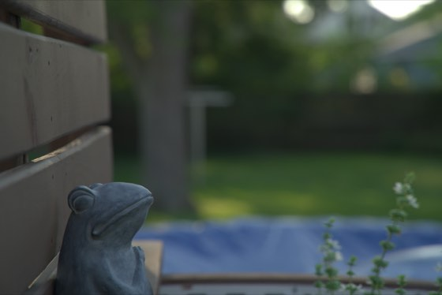
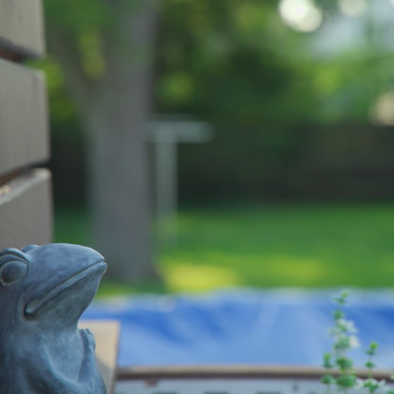

# Revelado automático de las fotos de producto

Paula dispara en RAW (`.ARW`) con la Sony a6400. Esto revela esas fotos solas:
ella copia los RAW a una carpeta, y salen los JPEG **ya cuadrados y con el
color puesto**, listos para subir al panel.

**Dónde para esto:** en la carpeta `salida`. Las fotos **las sube Paula a
mano** por el panel, como siempre, mirándolas antes. Es un alto a propósito,
para que ninguna foto rara llegue sola a la tienda.

Esto no es parte de la tienda ni del panel: vive aparte, en `tools/`, y no
toca ningún despliegue.

---

## 1. Instalar (una sola vez, en cada computador)

Hace falta **RawTherapee**, que es gratis y de código abierto:

```bash
brew install --cask rawtherapee
```

Para comprobar que quedó bien:

```bash
/Applications/RawTherapee.app/Contents/MacOS/rawtherapee-cli --version
```

Debe responder algo como `RawTherapee, version 5.13, command line.`

> Si `brew` no existe todavía en el computador, se instala primero Homebrew
> desde <https://brew.sh>. Node ya está instalado (es el mismo que usan la
> tienda y el panel).

---

## 2. Las carpetas

La primera vez que se ejecuta, se crean solas dentro de
**`~/Fotos P de Papel/`** (o sea, en la carpeta personal):

| Carpeta      | Para qué                                                      |
|--------------|---------------------------------------------------------------|
| `entrada`    | Aquí se copian los `.ARW` de la tarjeta                        |
| `salida`     | Aquí aparecen los JPEG listos para subir                        |
| `procesadas` | Aquí se guardan los RAW ya revelados (**no se borran nunca**)  |
| `fallidas`   | Aquí van los RAW que dieron error, para mirarlos               |

---

## 3. Cómo se usa en el día a día

Antes de empezar a pasar fotos, abrir la Terminal y dejar corriendo:

```bash
cd "ruta/al/repositorio/pdepapel/tools/photo-pipeline"
node procesar-fotos.mjs
```

Queda vigilando y escribiendo lo que hace. Ahora sí, copiar los `.ARW` de la
tarjeta a `entrada`. Cada foto se revela sola y aparece en `salida` a los
pocos segundos.

Espera a que cada archivo **termine de copiarse** antes de tocarlo, así que
se pueden arrastrar todas de una vez sin miedo.

Al terminar, **Ctrl+C** para parar. Dice cuántas hizo y cuántas fallaron.

Si prefiere copiar primero todas las fotos y revelarlas después, de una
sola vez:

```bash
node procesar-fotos.mjs --una-vez
```

Procesa lo que haya y termina.

### Si algo sale mal

El programa avisa en pantalla, con el nombre del archivo y el motivo. Esas
fotos quedan en `fallidas` (no se pierden). Lo más común:

- **«Error loading file»**: el archivo se copió a medias o está dañado.
  Vuelve a copiarlo de la tarjeta.
- **«No encuentro RawTherapee»**: falta el paso 1.

---

## 4. Cambiar el color y la luz

El perfil que viene puesto —`perfiles/producto-cuadrado.pp3`— tiene un
arranque **neutro**: balance de blancos y exposición automáticos. **No es
todavía el look de P de Papel.** Ese hay que dejarlo una vez, mirando fotos
de verdad, y después queda para siempre.

Cómo se hace, entre Paula y Christian, una sola tarde:

1. Abrir **RawTherapee** (la aplicación, no la Terminal).
2. Abrir una foto de producto representativa, de las normales, ni la más
   clara ni la más oscura.
3. Ajustar hasta que se vea como debe verse: exposición, balance de blancos,
   contraste, saturación, lo que haga falta. Es el mismo trabajo que hoy se
   hace a mano, pero **una sola vez**.
4. Cuando esté, en la pestaña de la izquierda buscar el botón de **guardar el
   perfil de procesado** (el icono de diskette bajo la lista de ajustes) y
   guardarlo encima de `perfiles/producto-cuadrado.pp3`, reemplazándolo.
5. **Importante:** después de guardar, abrir ese archivo y comprobar que la
   sección `[Crop]` siga con estos valores. Si RawTherapee la cambió, hay que
   dejarla así:

   ```ini
   [Crop]
   Enabled=true
   X=1000
   Y=0
   W=4016
   H=4016
   FixedRatio=true
   Ratio=1:1
   ```

6. Probar con dos o tres fotos (`node procesar-fotos.mjs --una-vez`) y mirar
   el resultado antes de darlo por bueno.

A partir de ahí, todas las fotos salen con ese look.

---

## 5. Cómo encuadrar para que el recorte no corte el producto

Esta es la parte que depende de Paula, y es la que hace que todo lo demás
funcione.

**El recorte es cuadrado, centrado y fijo.** No piensa, no busca el producto:
siempre quita **1000 píxeles por la izquierda y 1000 por la derecha**, y deja
el cuadrado del centro.

**Es así a propósito.** En septiembre de 2026 se probó un recorte
«inteligente», de los que buscan el producto solos (`g_auto` de Cloudinary),
con fotos de verdad del catálogo. Falló en **la mitad**: a un planillero le
dejó solo la pinza y llenó el resto de hojas verdes del fondo, a una
cartuchera le cortó la cremallera, y en una foto con dos blocs de notas borró
justo el que diferenciaba un producto de otro. Un recorte que se equivoca la
mitad de las veces y nadie revisa es peor que recortar a mano. Por eso este
es tonto: es predecible, y con el encuadre correcto no se equivoca nunca.

### La regla

> **Deja aire a los lados.** El producto tiene que caber en el cuadrado del
> centro, no tocar los bordes izquierdo ni derecho.

En la pantalla de la cámara: imagina un cuadrado en el centro del encuadre y
mete el producto ahí dentro, con un poco de margen. Lo que quede a los lados
se va a perder.

### Un ejemplo de verdad

Estas dos son la misma foto, antes y después del recorte:

| Como salió de la cámara (3:2) | Como queda al recortar (1:1) |
|---|---|
|  |  |

La ranita está pegada al borde izquierdo, así que el recorte **le corta la
cara**. Si estuviera un poco más al centro, cabría entera. Con un producto
pasaría exactamente igual.

### Pistas rápidas

- Producto **alargado y acostado** (una cartuchera, una regla): es el caso
  más peligroso, porque lo ancho es lo que se recorta. Aléjate un paso o
  ponlo en diagonal.
- Producto **vertical** (un cuaderno de pie): suele caber sin problema.
- **Dos productos en la misma foto**: mejor no. Si uno queda fuera del
  cuadrado, esa foto no sirve para el que quedó cortado.
- Ante la duda, **aléjate un poco**. Sobra encuadre; nunca falta.

---

## 6. Detalles para Christian

- **Sin dependencias.** Es Node pelado (`procesar-fotos.mjs`), sin
  `package.json` ni `node_modules`. No hay nada que instalar ni actualizar.
- **Por qué sondeo y no `fs.watch`:** hay que esperar a que el archivo deje
  de crecer de todos modos (una tarjeta SD no copia al instante), y
  `fs.watch` es poco de fiar en volúmenes extraíbles en macOS. Se mira la
  carpeta cada 3 segundos y se procesa un archivo cuando mide igual dos
  veces seguidas.
- **Los RAW no se borran nunca**, se mueven a `procesadas/`. Si ya hay uno
  con ese nombre, el nuevo queda como `DSC00087-2.ARW`.
- **Los errores se apartan** a `fallidas/` en vez de dejarlos en `entrada/`.
  Si se quedaran, se reintentarían cada 3 segundos para siempre y el registro
  se llenaría del mismo error.
- **Red de seguridad del recorte:** el `[Crop]` del perfil trae las
  coordenadas del sensor de la a6400 (6016×4016 → cuadrado de 4016 desde
  X=1000). Si algún día entra una foto de otro tamaño, el JPEG no saldría
  cuadrado; el programa lo detecta, lo recorta al centro con `sips` (que
  viene en macOS) y lo deja anotado en el registro.
- **Opciones** (`--ayuda` las lista): `--entrada`, `--salida`,
  `--procesadas`, `--fallidas`, `--perfil`, `--una-vez`.
- **No hay arranque automático** (launchd) a propósito: para v1 basta con
  abrir la Terminal antes de una sesión de fotos. Si termina siendo molesto,
  se añade después.
